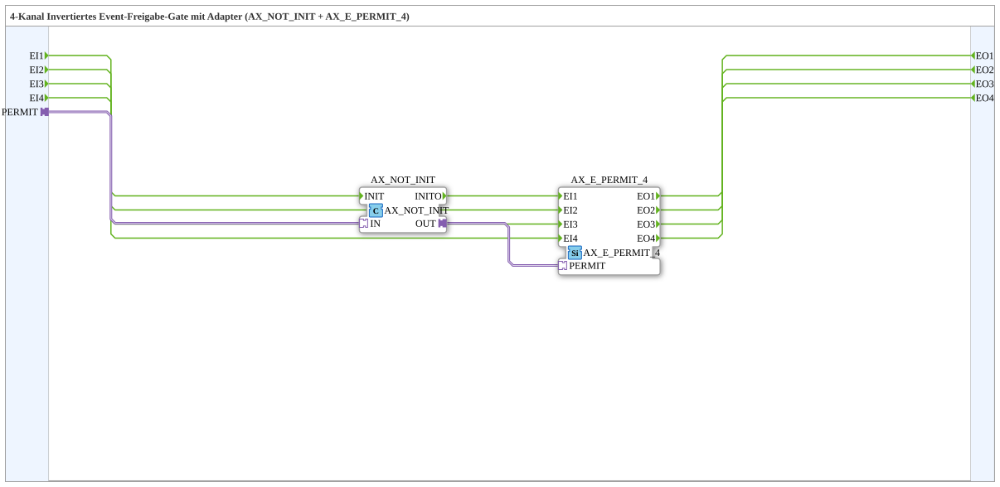

# AX_E_PERMIT_INVERT_4

* * * * * * * * * *

## Introduction

The **AX_E_PERMIT_INVERT_4** is a 4-channel inverted event permit gate implemented as a subapplication type. It combines the adapter logic block **AX_NOT_INIT** with the 4-channel event gate **AX_E_PERMIT_4**.  

The subapplication receives four independent event inputs and forwards them to four event outputs only when the external adapter-based permit signal is inactive. The incoming `PERMIT` adapter is inverted first, so the internal event gate sees the negated permission value. This provides a simple and reusable way to suppress or enable event streams using an active-low adapter signal.

## Interface Structure

### **Event Inputs**

| Name | Type    | Description               |
|------|---------|---------------------------|
| EI1  | Event   | Event input channel 1     |
| EI2  | Event   | Event input channel 2     |
| EI3  | Event   | Event input channel 3     |
| EI4  | Event   | Event input channel 4     |

### **Event Outputs**

| Name | Type    | Description               |
|------|---------|---------------------------|
| EO1  | Event   | Event output channel 1    |
| EO2  | Event   | Event output channel 2    |
| EO3  | Event   | Event output channel 3    |
| EO4  | Event   | Event output channel 4    |

### **Data Inputs**

None.

### **Data Outputs**

None.

### **Adapters**

| Name     | Type                                | Description                          |
|----------|-------------------------------------|--------------------------------------|
| `PERMIT` | `adapter::types::unidirectional::AX` | Inverted enable signal for all event channels |

## Functionality

The subapplication uses two internal function blocks:

- **AX_NOT_INIT** inverts the adapter signal connected to its input.
- **AX_E_PERMIT_4** passes or blocks event inputs depending on the permit signal at its adapter socket.

The external `PERMIT` adapter is connected to `AX_NOT_INIT.IN`. The inverted adapter output `AX_NOT_INIT.OUT` is then connected to `AX_E_PERMIT_4.PERMIT`.  

Each event input is directly wired to the corresponding event input of `AX_E_PERMIT_4`, and each internal event output is connected to the corresponding external event output:

- `EI1` → `AX_E_PERMIT_4.EI1` → `EO1`
- `EI2` → `AX_E_PERMIT_4.EI2` → `EO2`
- `EI3` → `AX_E_PERMIT_4.EI3` → `EO3`
- `EI4` → `AX_E_PERMIT_4.EI4` → `EO4`

As a result:

- If the external `PERMIT` signal is **false**, the internal permit becomes **true**, and incoming events are forwarded to the outputs.
- If the external `PERMIT` signal is **true**, the internal permit becomes **false**, and incoming events are blocked.

## Technical Features

- Four independent event channels.
- Single common adapter socket for centralized event gating.
- Active-low permit behavior due to internal signal inversion.
- Implemented as a subapplication network using `AX_NOT_INIT` and `AX_E_PERMIT_4`.
- No data inputs or outputs are required.
- Designed for use in IEC 61499-compliant systems with unidirectional adapter types.
- Easy to reuse and integrate into larger 4diac applications.

## State Overview

The subapplication itself does not contain an explicit state machine. Its behavior is determined by the combined logic of the internal function blocks.  

The effective state depends on the current value of the `PERMIT` adapter signal:

| External `PERMIT` | Internal permit | Event forwarding |
|-------------------|-----------------|------------------|
| `false`           | `true`          | Enabled          |
| `true`            | `false`         | Disabled         |

The internal `AX_E_PERMIT_4` gate handles the actual per-channel event passing based on this internal permit state.

## Application Scenarios

- **Active-low event enabling**: When the permit signal is used as a disable or inhibit flag, events are passed only while the flag is inactive.
- **Central gating of multiple event streams**: A single adapter signal can control four independent event paths at once.
- **Conditional event propagation**: Events can be forwarded or suppressed depending on external system states such as ready signals, safety conditions, or operating modes.
- **Composite subapplication design**: Useful as a reusable building block inside larger 4diac applications that require inverted permit logic.

## Comparison with Similar Blocks

| Block                     | Behavior                                                |
|---------------------------|---------------------------------------------------------|
| `AX_E_PERMIT_4`           | Passes events while the permit adapter signal is true.  |
| `AX_E_PERMIT_INVERT_4`    | Passes events while the permit adapter signal is false. |
| `AX_NOT_INIT`             | Inverts an adapter signal and is used here to negate the permit input before the event gate. |

The main difference to the standard `AX_E_PERMIT_4` is the integrated inversion. This removes the need to manually insert an inverter block in the application network when an active-low permission is required.

## Conclusion

The **AX_E_PERMIT_INVERT_4** subapplication provides a compact and reusable solution for 4-channel event gating with an inverted adapter-based permit signal. By combining `AX_NOT_INIT` and `AX_E_PERMIT_4`, it offers a clear, structured way to block or forward multiple event streams using a single active-low control signal. It is especially useful in IEC 61499 applications where conditional event propagation and centralized gating are required.
