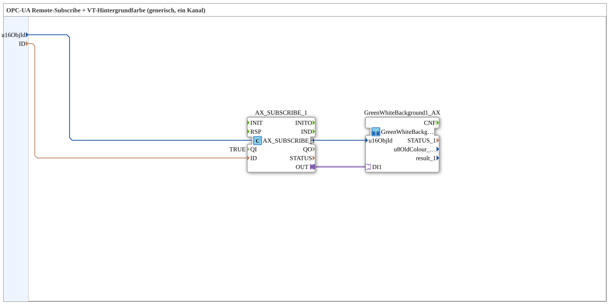

# AX_SUBSCRIBE_BG_OPC

* * * * * * * * * *

## Introduction

The **AX_SUBSCRIBE_BG_OPC** subapplication is a generic, single-channel solution that combines an OPC-UA remote subscription with a visualization (VT) background color change mechanism. It is designed for industrial HMI scenarios where a background rectangle of a VT screen needs to be dynamically recolored based on data received from an OPC-UA server. The subapp encapsulates the subscription logic and the background-color transformation into a single reusable component, hiding the internal complexity from the application engineer.

## Interface Structure

The subapplication exposes a minimal interface consisting of two data inputs. It has no event inputs, event outputs, data outputs, or adapter sockets at its external boundary. All internal communication is handled within the encapsulated network.

### **Event Inputs**

None. The subapplication does not expose any event inputs at its interface level. Triggering is handled internally through the embedded subscribe function block.

### **Event Outputs**

None. No event outputs are provided at the subapplication boundary.

### **Data Inputs**

| Name     | Data Type | Description                                                        |
|----------|-----------|--------------------------------------------------------------------|
| `u16ObjId` | `UINT`    | Object ID of the VT background rectangle. Default value is `ID_NULL`. |
| `ID`     | `WSTRING` | OPC-UA remote-subscribe address (the server node or subscription identifier). |

### **Data Outputs**

None. The subapplication produces no direct data outputs; its result is realized through the internal adapter connection to the background-color subapplication.

### **Adapters**

No external adapters are exposed. Internally, the OPC-UA subscription function block `AX_SUBSCRIBE_1` uses an adapter-type output (`OUT`) which is connected to the `DI1` adapter socket of the embedded `GreenWhiteBackground1_AX` subapplication.

## Functionality

The subapplication performs the following operations:

1. **Subscription Setup** – The internal function block `AX_SUBSCRIBE_1` (type `adapter::net::AX_SUBSCRIBE_1`) is configured with its `QI` parameter set to `TRUE`, enabling the subscription immediately upon activation.
2. **Address Provision** – The external `ID` input (the OPC-UA subscribe address) is forwarded to the `ID` input of the `AX_SUBSCRIBE_1` function block.
3. **Object Identification** – The external `u16ObjId` input is passed to the `u16ObjId` input of the embedded `GreenWhiteBackground1_AX` subapplication, identifying which VT background rectangle is to be affected.
4. **Color Change Propagation** – The adapter connection from `AX_SUBSCRIBE_1.OUT` to `GreenWhiteBackground1_AX.DI1` transports the subscription result (e.g., a numeric value or status) to the background-color logic, which then alters the fill color of the specified VT rectangle accordingly.

The two data connections (`ID → AX_SUBSCRIBE_1.ID` and `u16ObjId → GreenWhiteBackground1_AX.u16ObjId`) are marked as invisible (`Visible = false`) in the diagram, reducing visual clutter in the engineering environment.

## Technical Features

- **Generic Single-Channel Design** – The subapp is parameterized solely through its two data inputs, making it reusable for any OPC-UA node address and any VT rectangle object ID.
- **Embedded Subscription Logic** – The OPC-UA subscription FB is internally instantiated with a set enable input, eliminating the need for external event wiring.
- **Adapter-Based Coupling** – Communication between the subscription FB and the background-color FB is performed via an adapter connection (`OUT` to `DI1`), enabling type-safe links between the internal components.
- **Hidden Internal Wiring** – All internal connections are marked invisible to keep the subapp representation clean in the overall application diagram.
- **Default Object ID** – The `u16ObjId` input defaults to `ID_NULL`, allowing the subapp to be instantiated before a concrete object ID is assigned.

## State Overview

Since `AX_SUBSCRIBE_BG_OPC` is a composite subapplication rather than a stateful function block, it does not define its own explicit state machine. However, the internal `AX_SUBSCRIBE_1` FB is expected to implement the standard OPC-UA subscription states:

- **Initialization** – With `QI = TRUE`, the FB begins establishing the subscription to the given OPC-UA address.
- **Subscribed** – The subscription is active and data updates are propagated through the adapter output.
- **Error / Disconnected** – If the server is unreachable or the subscription fails, the FB signals an error condition (internally handled, not exposed externally).

The `GreenWhiteBackground1_AX` subapplication receives the subscription value via `DI1` and updates the background color based on the received data, typically switching between green (active/OK) and white (inactive/fault).

## Application Scenarios

Typical use cases for this subapplication include:

- **Machine Status Indication** – In a machine HMI, a background rectangle is colored green when the OPC-UA node reports the machine as running, and white when it is stopped or in an error state.
- **Remote Variable Monitoring** – Monitoring a single OPC-UA variable (e.g., a production counter threshold) and visually reflecting its state on a VT screen.
- **Generic HMI Building Blocks** – Reuse in larger applications where multiple instances of the subapp are placed, each bound to a different OPC-UA address and a different VT rectangle, allowing rapid assembly of status displays.
- **SCADA-Style Dashboards** – Simple visual alarming where the background color of a label or area changes based on values read from a remote automation controller.

## Comparison with Similar Blocks

| Feature                         | AX_SUBSCRIBE_BG_OPC                     | Direct FB Pairing (AX_SUBSCRIBE + GreenWhiteBackground)                |
|---------------------------------|------------------------------------------|------------------------------------------------------------------------|
| **Integration Effort**          | Low – only two inputs need configuring    | Higher – requires manual wiring of adapter connections and parameters   |
| **Reusability**                 | High – encapsulated as a self-contained unit | Medium – each instance must be reconnected individually              |
| **Interface Complexity**        | Minimal (2 data inputs)                  | Multiple connections and event wiring                                  |
| **Error Handling**              | Handled internally by the subscribe FB    | Depends on the immediate FB configuration                              |
| **Visual Clarity**              | Clean – internal wiring hidden            | Cluttered – all connections visible                                   |
| **Flexibility**                 | Limited to one channel per instance       | More flexible when individual FBs are used in complex networks          |

## Conclusion

The **AX_SUBSCRIBE_BG_OPC** subapplication provides a compact, ready-to-use building block for OPC-UA-driven background color changes in visualization screens. By encapsulating the subscription logic and the color-change logic behind a simple two-input interface, it significantly reduces engineering effort and improves the readability of application diagrams. Its generic design makes it suitable for a wide range of single-channel monitoring and status indication scenarios in industrial automation HMI environments.
