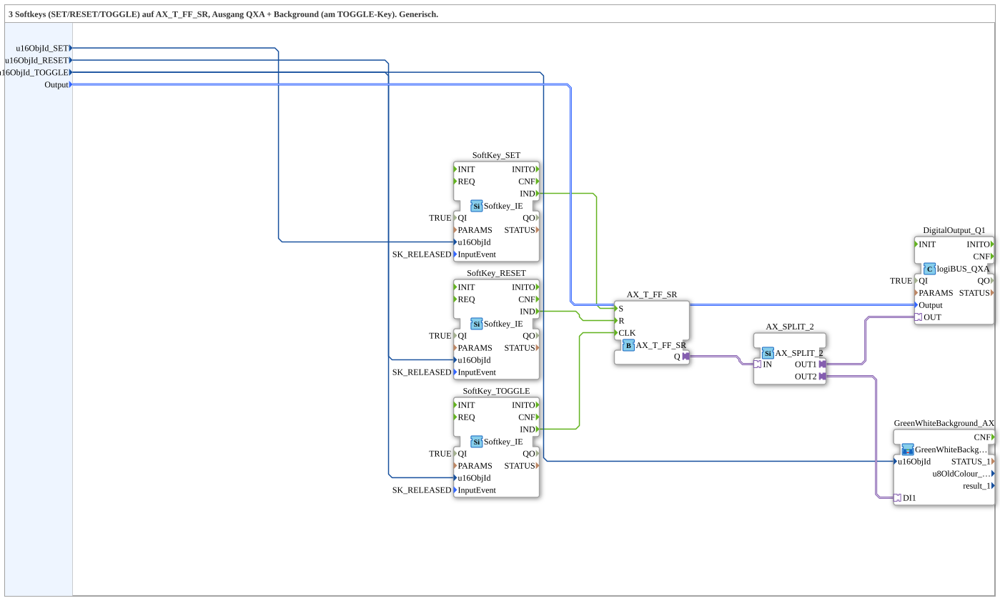

# AX_SoftkeySR_TO_QXA_BG

* * * * * * * * * *

## Introduction

`AX_SoftkeySR_TO_QXA_BG` is a reusable 4diac subapplication that combines three softkeys with a SET/RESET/TOGGLE flip-flop function and a digital QXA output. It also integrates a green/white background indication that follows the same state, making it suitable for HMI or machine control applications where visual feedback is required.

The subapplication is generic: the softkey object IDs and the output selector are provided as configuration inputs. This allows the same subapplication to be reused in different ISOBUS or logiBUS-based control layouts without internal changes.

## Interface Structure

The subapplication exposes only data inputs. There are no event inputs, event outputs, data outputs, or adapter sockets/plugs at the subapplication boundary.

### **Event Inputs**

None.

### **Event Outputs**

None.

### **Data Inputs**

| Name | Type | Initial Value | Comment |
|---|---|---|---|
| `u16ObjId_SET` | `UINT` | `ID_NULL` | Object ID of the SET softkey |
| `u16ObjId_RESET` | `UINT` | `ID_NULL` | Object ID of the RESET softkey |
| `u16ObjId_TOGGLE` | `UINT` | `ID_NULL` | Object ID of the TOGGLE softkey, also used for the green/white background |
| `Output` | `logiBUS::io::DQ::logiBUS_DO_S` | `logiBUS_DO::Invalid` | Identifies the output, `Output_Q1..Q8` |

### **Data Outputs**

None.

### **Adapters**

No adapter interface is exposed by the subapplication. All adapter connections are internal.

## Functionality

The subapplication contains three `Softkey_IE` instances named `SoftKey_SET`, `SoftKey_RESET`, and `SoftKey_TOGGLE`. Each is configured with `QI = TRUE` and `InputEvent = SK_RELEASED`, so a softkey action is triggered when the assigned softkey is released.

The internal event flow is:

- `SoftKey_SET.IND` is connected to `AX_T_FF_SR.S`
- `SoftKey_RESET.IND` is connected to `AX_T_FF_SR.R`
- `SoftKey_TOGGLE.IND` is connected to `AX_T_FF_SR.CLK`

This means:

- Pressing the configured SET softkey sets the flip-flop output `Q` to `TRUE`.
- Pressing the configured RESET softkey resets the flip-flop output `Q` to `FALSE`.
- Pressing the configured TOGGLE softkey toggles the flip-flop output `Q`.

The flip-flop output `Q` is then passed to `AX_SPLIT_2`, which duplicates the signal to two destinations:

1. `DigitalOutput_Q1.OUT`, a `logiBUS_QXA` digital output.
2. `GreenWhiteBackground_AX.DI1`, a subapplication of type `MyLib::sys::GreenWhiteBackground1_AX`.

The same `u16ObjId_TOGGLE` value is also connected to the background subapplication. Therefore, the TOGGLE softkey is used both to toggle the QXA output and to provide the associated visual background feedback.

The internal wiring is fully encapsulated. From the outside, the application only requires the three softkey object IDs and the desired QXA output selector.

## Technical Features

- Encapsulates three softkey input FBs, one SET/RESET/TOGGLE flip-flop, one signal splitter, one QXA digital output, and one background feedback subapplication.
- Uses `SK_RELEASED` as the softkey activation behaviour.
- Generic object IDs are used with default value `ID_NULL`, so they can be assigned per integration.
- Generic output selector is used with default value `logiBUS_DO::Invalid`.
- Internal `QI` inputs of the softkey FBs are set to `TRUE`, so the subapplication is ready to operate when integrated.
- No external events are required; operation is controlled through softkey events internally mapped to the flip-flop logic.
- The same state is propagated to both the QXA digital output and the green/white background subapplication.

## State Overview

The central state logic is performed by `AX_T_FF_SR`.

| Condition | `Q` State | Effect |
|---|---|---|
| SET softkey released | `TRUE` | QXA output and background become active |
| RESET softkey released | `FALSE` | QXA output and background become inactive |
| TOGGLE softkey released | Toggles | QXA output and background change to the opposite state |

All state changes occur on softkey release events, which prevents unintended multiple triggers during a single physical press.

## Application Scenarios

- Machine HMI panels where three softkeys are assigned to SET, RESET, and TOGGLE functions.
- ISOBUS/logiBUS control tasks requiring a simple boolean QXA output.
- Applications where a green/white background indication should follow the state of the output.
- Reusable subapplication in larger control programs where multiple softkey-controlled outputs are needed.
- Generic integration into different machine layouts by configuring object IDs and output selectors externally.

## Comparison with Similar Blocks

Compared to a manually wired network of `Softkey_IE` FBs and a flip-flop, this subapplication provides a clean and reusable interface. The internal event and adapter connections are already defined, which reduces integration effort.

Compared to a simple SR flip-flop without a toggle function, `AX_SoftkeySR_TO_QXA_BG` adds a dedicated TOGGLE softkey input and therefore supports cyclic output switching from a single key.

Compared to fixed softkey implementations, this subapplication is generic. The object IDs and the QXA output can be configured, making it suitable for different HMI layouts without changing the internal logic.

## Conclusion

`AX_SoftkeySR_TO_QXA_BG` is a compact, reusable subapplication for softkey-based SET/RESET/TOGGLE control of a QXA digital output. It combines the input handling, flip-flop state logic, output selection, and background feedback in a single encapsulated component. Its generic data interface makes it flexible for various machine control and HMI applications.
