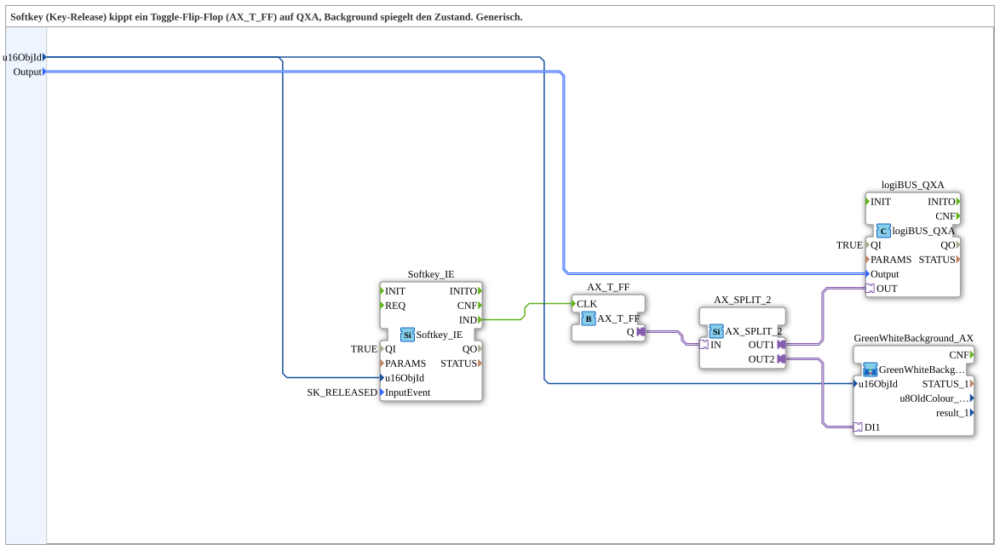

# AX_SoftkeyToggle_TO_QXA_BG

* * * * * * * * * *

## Introduction

`AX_SoftkeyToggle_TO_QXA_BG` is a composite 4diac subapplication that implements a softkey release toggle for a QXA output and synchronizes an HMI background with the toggled state. It is generic: the softkey object ID and the QXA output channel are supplied as data inputs.

The internal network combines:

- `Softkey_IE` for detecting a configured softkey release event,  
- `AX_T_FF` as a toggle flip-flop,  
- `AX_SPLIT_2` to distribute the toggle state,  
- `logiBUS_QXA` to drive the selected output,  
- `GreenWhiteBackground_AX` to visualize the state in the background.

## Interface Structure

The subapplication exposes only two data inputs. It has no event inputs, no event outputs, no data outputs, and no public adapter endpoints.

### **Event Inputs**

None.

### **Event Outputs**

None.

### **Data Inputs**

| Name | Type | Initial Value | Comment |
|------|------|---------------|---------|
| `u16ObjId` | `UINT` | `ID_NULL` | Object ID of the softkey to be used. |
| `Output` | `logiBUS::io::DQ::logiBUS_DO_S` | `logiBUS_DO::Invalid` | Identifies the QXA output channel (`Output_Q1` ... `Output_Q8`). |

### **Data Outputs**

None.

### **Adapters**

The subapplication does not expose any adapter sockets or plugs. Internally, unidirectional adapters are used for the toggle state flow:

- `AX_T_FF.Q` → `AX_SPLIT_2.IN`
- `AX_SPLIT_2.OUT1` → `logiBUS_QXA.OUT`
- `AX_SPLIT_2.OUT2` → `GreenWhiteBackground_AX.DI1`

## Functionality

The subapplication is triggered by a softkey release. `Softkey_IE` is configured with `QI = TRUE` and `InputEvent = SK_RELEASED`; it monitors the object ID given by `u16ObjId`. When the configured softkey is released, `Softkey_IE` emits the `IND` event. This event clocks the `AX_T_FF` toggle flip-flop. Each clock pulse changes the state of the toggle. The current toggle state is output on the adapter `Q`.

`AX_SPLIT_2` forwards the same toggle state to two consumers:

1. `logiBUS_QXA.OUT`, which writes the state to the selected QXA output channel (`Output`).
2. `GreenWhiteBackground_AX.DI1`, which updates the background visualization according to the state.

Thus, a single key release toggles the actual output and keeps the HMI background in sync.

## Technical Features

- Composite `SubAppType` reusable as a library element.
- Generic softkey identification via `u16ObjId`.
- Generic QXA output selection via `Output`.
- Internal event handling: no external event inputs required.
- Hard-coded `QI = TRUE` on `Softkey_IE`; the input is always enabled.
- Key-release detection using `SK_RELEASED`, so the toggle reacts on release, not on press.
- `AX_T_FF` provides the bistable toggle memory.
- `AX_SPLIT_2` provides a clean one-to-two adapter state distribution.
- `logiBUS_QXA` is enabled with `QI = TRUE` and drives the selected output.
- `GreenWhiteBackground_AX` receives the same state to show the HMI background.
- Internal data connections are marked invisible in the 4diac diagram for readability.

## State Overview

The main state is the internal toggle state of `AX_T_FF`.

| Condition | Event Path | Result |
|-----------|------------|--------|
| No softkey release | — | Toggle state remains unchanged. |
| Configured softkey released | `Softkey_IE.IND` → `AX_T_FF.CLK` | Toggle state changes from `0` to `1` or from `1` to `0`. |
| Toggle state updated | `AX_T_FF.Q` → `AX_SPLIT_2.IN` | Both QXA output and background receive the new state. |

The subapplication does not define an explicit reset input or initial state in the XML; the startup behavior depends on the default/reset behavior of `AX_T_FF`.

## Application Scenarios

- Machine control panels where a softkey toggles a latching output.
- Operator buttons on HMI screens that must show the current state as a colored background.
- Generic output toggling for QXA modules, with flexible configuration of softkey and output channel.
- Reusable library subapplication for projects using `isobus` softkey handling and `logiBUS` digital outputs.

## Comparison with Similar Blocks

- **Compared with a direct `Softkey_IE` → `logiBUS_QXA` connection:** The direct connection only follows the momentary softkey state. `AX_SoftkeyToggle_TO_QXA_BG` adds a toggle flip-flop, so the output remains latched after each release.
- **Compared with the same toggle without background:** This subapplication additionally drives `GreenWhiteBackground_AX`, so visualization and output always show the same state.
- **Compared with a fixed-softkey implementation:** The use of `u16ObjId` and `Output` makes the subapplication generic; no modification is needed when a different softkey or QXA channel is used.

## Conclusion

`AX_SoftkeyToggle_TO_QXA_BG` is a compact and reusable 4diac subapplication that combines softkey release detection, a toggle flip-flop, QXA output control, and background visualization in one generic component. It reduces wiring effort and improves consistency between the physical/logical output state and the HMI background display.
