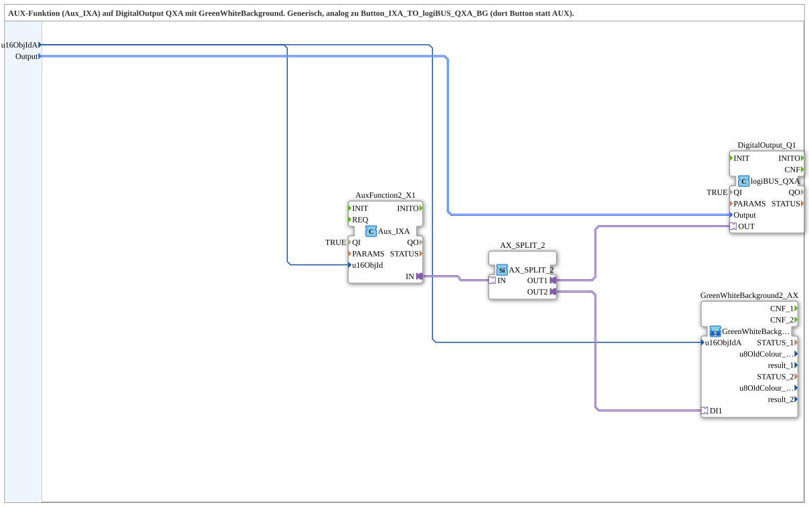

# AuxIXA_TO_logiBUS_QXA_BG

* * * * * * * * * *

## Introduction

The `AuxIXA_TO_logiBUS_QXA_BG` subapplication is a generic, reusable composite function block that connects an AUX (auxiliary) input event from the ISOBUS UT system to a digital output on a logiBUS QXA module. It also incorporates a green/white background color control for visual indication. The subapp is designed to be instantiated wherever an AUX input needs to drive a digital output with color feedback, following the same pattern as the `Button_IXA_TO_logiBUS_QXA_BG` but using an AUX function block instead of a button.

## Interface Structure

The subapplication exposes only data inputs; no explicit event inputs/outputs or adapters are visible at its boundary.

### **Event Inputs**

None.

### **Event Outputs**

None.

### **Data Inputs**

| Name | Type | Initial Value | Comment |
|------|------|---------------|---------|
| `u16ObjIdA` | `UINT` | `ID_NULL` | Object ID of the AUX input |
| `Output` | `logiBUS::io::DQ::logiBUS_DO_S` | `logiBUS_DO::Invalid` | Selects the physical output (Q1..Q8) |

### **Data Outputs**

None.

### **Adapters**

The subapplication does not expose any adapters; all internal adapter connections are encapsulated.

## Functionality

The subapplication receives an AUX object ID (`u16ObjIdA`) and an output selection (`Output`). Internally, it performs the following steps:

1. The `AuxFunction2_X1` block (type `isobus::UT::io::Auxiliary::IN::Aux_IXA`) is configured with `QI = TRUE` and processes the AUX input based on the provided object ID. It generates an event on its `IN` adapter when the AUX input is activated.
2. The `AX_SPLIT_2` block (type `adapter::events::unidirectional::AX_SPLIT_2`) splits the incoming event into two parallel event connections.
3. One event output (`OUT1`) goes to the `DigitalOutput_Q1` block (type `logiBUS::io::DQ::logiBUS_QXA`), which drives the selected logiBUS digital output (based on the `Output` data input).
4. The other event output (`OUT2`) goes to the `GreenWhiteBackground2_AX` subapplication, which presumably handles the green/white background color logic for the display.
5. The `u16ObjIdA` is also connected to `GreenWhiteBackground2_AX` to keep the color logic synchronized with the AUX object.

The subapp thus provides a complete mapping from an AUX input to a physical digital output with visual feedback on the user interface.

## Technical Features

- **Reusability**: The subapp is generic and can be used multiple times in a project, only needing the object ID and output selector to be configured.
- **Event-driven**: Uses adapter-based event propagation for efficient and clear signal flow.
- **Separation of concerns**: The AUX input handling, event splitting, and color logic are modular and can be replaced or extended individually.
- **Compatibility**: Internally uses standard ISOBUS and logiBUS function blocks, ensuring interoperability.

## State Overview

Although the subapp does not define an explicit state machine, the internal blocks may have their own states. The AUX function block likely includes filtering and debouncing mechanisms, while the digital output block handles energizing/de-energizing of the physical output. The background color subapplication manages visual states (green/white) based on the AUX activity.

## Application Scenarios

- **Agricultural machinery**: Mapping AUX buttons to digital outputs (e.g., valve control, lighting) with simultaneous color indication on the in-cab display.
- **Generic ISOBUS UT implementations**: Wherever a simple AUX-to-output conversion with green/white feedback is required.
- **Rapid prototyping**: The subapp can be dropped into a network and configured without needing to redesign the logic.

## Comparison with Similar Blocks

- **Button_IXA_TO_logiBUS_QXA_BG**: Similar structure but uses a button input instead of an AUX object. This subapp replaces the button block with `Aux_IXA`.
- **Direct connection to logiBUS_DO**: A simpler approach would directly connect an event to the logiBUS output, but without color feedback and without the flexibility of an object ID mapping.

## Conclusion

The `AuxIXA_TO_logiBUS_QXA_BG` subapplication provides a clean, reusable solution for integrating AUX inputs with digital outputs and visual feedback in ISOBUS-based systems. Its modular architecture makes it easy to maintain and adapt for various use cases, ensuring consistent behavior across different machines.
