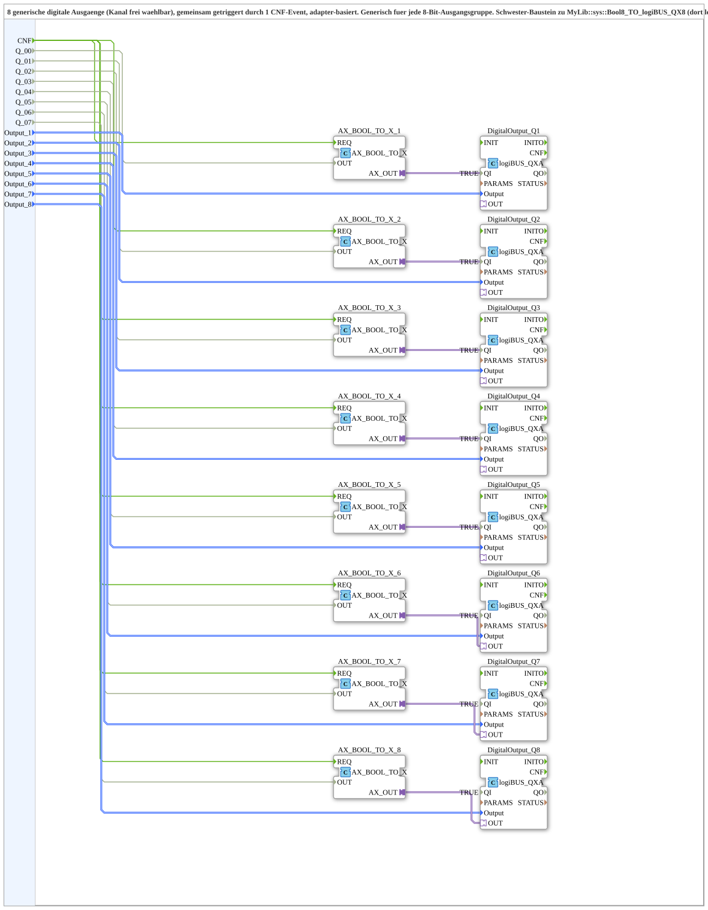

# Bool8_TO_logiBUS_QXA8

* * * * * * * * * *
## Introduction
The `Bool8_TO_logiBUS_QXA8` is a generic composite function block (subapplication) designed to convert eight Boolean input signals into eight digital output channels of a logiBUS system. It provides a flexible, adapter-based solution where each output channel can be freely assigned to any of the eight Boolean inputs via configuration parameters. All outputs are triggered simultaneously by a single event, ensuring synchronized updates across the entire group.

The block is particularly useful in control applications that require multiple digital outputs (e.g., relays, LEDs, solenoid valves) to be driven from a central logic controller, with the ability to remap outputs without changing the block's internal structure.

## Interface Structure

### **Event Inputs**
- **CNF** (Event): Common trigger event. When this event arrives, all eight Boolean inputs are read and their corresponding digital outputs are updated in the same processing cycle.

### **Event Outputs**
- None.

### **Data Inputs**
- **Q_00** … **Q_07** (BOOL): These eight Boolean inputs carry the logic values that are to be written to the selected output channels.
- **Output_1** … **Output_8** (logiBUS::io::DQ::logiBUS_DO_S): Channel selectors. Each parameter identifies the physical output channel (e.g., "Output_Q1" … "Output_Q8") to which the associated Boolean input (Q_00 → Output_1, Q_01 → Output_2, …) is routed. The value must be a valid logiBUS output identifier; setting it to `logiBUS_DO::Invalid` disables that output.

### **Data Outputs**
- None.

### **Adapters**
- None exposed at the interface level. Adapter connections are internal to the subapplication, linking the Boolean conversion blocks to the output driver blocks.

## Functionality
The subapplication internally instantiates eight pairs of function blocks:

- **AX_BOOL_TO_X_1** … **AX_BOOL_TO_X_8** (type: adapter::conversion::unidirectional::AX_BOOL_TO_X): These convert each Boolean input into an adapter-compatible signal (unidirectional data plug).
- **DigitalOutput_Q1** … **DigitalOutput_Q8** (type: logiBUS::io::DQ::logiBUS_QXA): These are the actual digital output driver blocks that communicate with the logiBUS hardware.

On each `CNF` event, all eight conversion blocks receive the event and simultaneously fetch their corresponding Boolean input values. Each converted value is then passed via an adapter connection to its associated digital output block. The digital output block uses the `Output_n` parameter to determine which physical channel to write to (or to ignore the value if the output is disabled).

Since all conversion blocks are triggered by the same event, the entire group of outputs is updated in a single, atomic operation, ensuring temporal consistency among the eight channels.

## Technical Features
- **8-channel design**: Supports eight independent digital outputs.
- **Free channel mapping**: Each Boolean input can be routed to any available output channel using the `Output_n` parameters, allowing flexible reconfiguration without changing wiring.
- **Single‑event triggering**: A common `CNF` event triggers all outputs simultaneously, simplifying synchronization and reducing event overhead.
- **Adapter‑based conversion**: Utilizes unidirectional adapter conversions, promoting modularity and compatibility with various logiBUS output types.
- **Generic and reusable**: The block is designed generically for any 8‑bit output group; it can be instantiated multiple times for different hardware configurations.

## State Overview
This subapplication is combinational in nature; it does not maintain any internal state. Each activation of the `CNF` event directly maps the current Boolean inputs to the configured physical outputs. There is no feedback or memory function, and the block's behavior is completely deterministic based on the input values and channel selection parameters.

## Application Scenarios
Typical use cases include:

- **Industrial control panels**: Driving eight relays or contactors from a PLC’s logic, with the ability to assign each Boolean signal to a specific relay.
- **Lighting or LED groups**: Controlling multiple lamps individually via a central control system, where each lamp can be remapped to a different Boolean input as needed.
- **Factory automation**: Setting up quick‑change output configurations for different manufacturing cells without modifying the underlying control logic.
- **Prototyping and testing**: Allowing developers to experiment with different output assignments in a simulation environment before deployment.

## Comparison with Similar Blocks
The `Bool8_TO_logiBUS_QXA8` is the sister block of `MyLib::sys::Bool8_TO_logiBUS_QX8`. The main difference lies in the type of digital output driver used:

- **Bool8_TO_logiBUS_QX8** uses the `logiBUS_QX` block, which directly interfaces with logiBUS output modules without an adapter layer.
- **Bool8_TO_logiBUS_QXA8** uses the `logiBUS_QXA` block, which includes an adapter interface. This makes it more flexible when the hardware requires a specific adapter connection or when additional signal conditioning is needed.

Compared to other generic 8‑output blocks, this subapplication offers the distinct advantage of per‑output channel selection combined with a common trigger, whereas many simpler blocks either fix the output mapping or require separate events for each channel.

## Conclusion
The `Bool8_TO_logiBUS_QXA8` subapplication provides a robust and flexible solution for driving eight digital outputs over a logiBUS network. Its design emphasizes modularity, ease of reconfiguration, and synchronized updates. By leveraging adapter‑based conversions and a single trigger event, it simplifies complex output management tasks and can be seamlessly integrated into a wide range of industrial and automation projects. Its sister relationship with the `QXA`‑free variant ensures that developers can choose the appropriate level of abstraction for their specific hardware requirements.