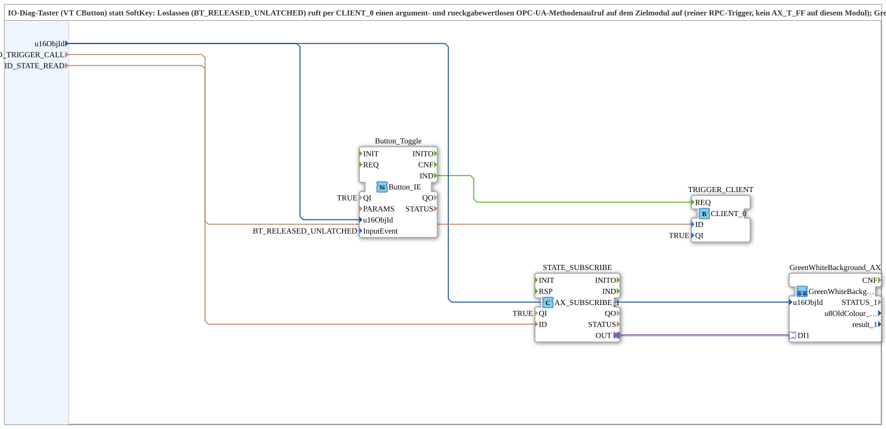

# Button_Toggle_RPC_TO_Remote_BG_OPC

* * * * * * * * * *

## Introduction

The **Button_Toggle_RPC_TO_Remote_BG_OPC** subapplication implements a remote toggle control for IO‑Diag buttons on a machine operator panel. When the operator releases the button (activation code `BT_RELEASED_UNLATCHED`), the subapp initiates an argument-less and return-value-less OPC‑UA method call on a remote target module via a `CLIENT_0` communication function block. The remote flip‑flop state is continuously monitored through a subscription and visually represented by a GreenWhiteBackground indicator. The subapp is designed for IO‑Diag DataMask buttons (e.g. VT CButton) and follows the same protocol as its softkey counterpart, differing only in the button input type.

## Interface Structure

### **Event Inputs**

None. The subapplication does not expose any event inputs; all event handling is performed internally by the embedded function blocks.

### **Event Outputs**

None. The subapplication does not expose any event outputs.

### **Data Inputs**

| Name | Type | Description |
|------|------|-------------|
| `u16ObjId` | UINT | Object ID for the button and the visual background element. Initial value is `ID_NULL`. |
| `ID_TRIGGER_CALL` | WSTRING | Remote method address (with `ACTION=CALL_METHOD`) used for the argument-less trigger method invocation on the target module. |
| `ID_STATE_READ` | WSTRING | Locally monitored address (BOOL, with `ACTION=READ`) for the flip‑flop state, which is written remotely by the target module. |

### **Data Outputs**

None. The subapplication does not expose any data outputs.

### **Adapters**

None exposed at the subapplication interface. Adapter connections are entirely internal.

## Functionality

The subapplication provides a complete remote toggle workflow in a single reusable package:

1. **Button Input Handling** – The embedded `Button_IE` function block (type `isobus::UT::io::Button::Button_IE`) is configured with `QI=TRUE` and `InputEvent=BT_RELEASED_UNLATCHED`. It detects the physical button release on the IO‑Diag mask and generates an event on its `IND` output.

2. **Remote Trigger Invocation** – The button release event (`Button_Toggle.IND`) is connected to the `REQ` input of the `TRIGGER_CLIENT` function block (type `iec61499::net::CLIENT_0`). `TRIGGER_CLIENT` uses the address provided via `ID_TRIGGER_CALL` to perform an OPC‑UA `CALL_METHOD` operation on the remote target module. Since the call is argument-less and return-value-less, it acts purely as an RPC trigger – no local flip‑flop (AX_T_FF) logic is executed on this module.

3. **State Subscription** – The `STATE_SUBSCRIBE` function block (type `adapter::net::AX_SUBSCRIBE_1`) continuously reads the remote boolean state from the address specified by `ID_STATE_READ` (with `ACTION=READ`). Its output adapter is connected to the `DI1` input of the `GreenWhiteBackground_AX` subapplication.

4. **Visual Feedback** – The `GreenWhiteBackground_AX` subapplication (type `MyLib::sys::GreenWhiteBackground1_AX`) receives the remote flip‑flop state and renders it as a green or white background on the associated IO‑Diag element, giving the operator immediate visual confirmation of the remote toggle state.

The `u16ObjId` input is distributed internally to both the button (`Button_Toggle.u16ObjId`) and the background (`GreenWhiteBackground_AX.u16ObjId`), ensuring that both the input element and the visual indicator reference the same object instance.

## Technical Features

- **IEC 61499‑2 compliant** subapplication type with a cleanly encapsulated networking layer.
- **OPC‑UA remote method invocation** via `iec61499::net::CLIENT_0` with `CALL_METHOD` action, supporting argument-less, return-value-less calls (pure RPC trigger).
- **Subscription-based state monitoring** using `adapter::net::AX_SUBSCRIBE_1` for continuous polling of the remote boolean state.
- **Activation code configuration** – the button is preconfigured with `BT_RELEASED_UNLATCHED`, meaning the trigger is fired on the release transition (unlatched), preventing repeated triggers while the button is held.
- **Unified object identification** – a single `u16ObjId` parameter links both the button and the background visualization to the same target object.
- **Hidden internal connections** – all internal data connections are marked as non-visible, keeping the subapplication interface clean and focused on the three essential configuration inputs.
- **Standard library components** – uses standard 4diac function blocks and adapters, facilitating maintenance and reuse.

## State Overview

The subapplication itself is stateless – it delegates all stateful behavior to its internal blocks. The logical state flow can be described as follows:

| Stage | Component | Behavior |
|-------|-----------|----------|
| **Idle** | `Button_IE` | Waits for the physical button to be released; no event is generated while the button is pressed or held. |
| **Trigger** | `Button_Toggle.IND` | Fires on the release transition (`BT_RELEASED_UNLATCHED`). The event is forwarded to `TRIGGER_CLIENT.REQ`. |
| **Remote Call** | `TRIGGER_CLIENT` | Executes the OPC‑UA `CALL_METHOD` on the target module using `ID_TRIGGER_CALL`. The remote module toggles its internal flip‑flop state. |
| **State Read** | `STATE_SUBSCRIBE` | Continuously reads the remote boolean value from `ID_STATE_READ` and forwards it through the adapter to the background visualization. |
| **Visualization** | `GreenWhiteBackground_AX` | Displays the current remote state: green when active, white when inactive. |

There is no internal state machine in the subapp; the behavior is fully event-driven and data-driven by the remote system.

## Application Scenarios

- **IO‑Diag control panels** – Used on data masks with physical buttons (VT CButton) to toggle remote functions such as record enable/release on camera modules (e.g. Q06/Q08 left/right recording toggle).
- **Remote machine control** – Where operator panel buttons need to trigger actions on distributed PLC or edge modules via OPC‑UA without embedding complex logic in the panel itself.
- **Visual state feedback** – Ideal when the operator needs immediate confirmation of a remote toggle state through a colored background indicator (green/white) on the same IO‑Diag element.
- **Reusable RPC trigger pattern** – Suitable for any scenario where a button press should issue a remote method call and the result should be visualized locally, following a standard 4diac pattern.

## Comparison with Similar Blocks

The main counterpart is the **Softkey_Toggle_RPC_TO_Remote_BG_OPC** subapplication, which follows an identical protocol and internal architecture. The key differences are:

| Aspect | Button_Toggle_RPC_TO_Remote_BG_OPC | Softkey_Toggle_RPC_TO_Remote_BG_OPC |
|--------|-----------------------------------|-------------------------------------|
| **Input element** | `Button_IE` (IO‑Diag button / VT CButton) | Softkey (`Softkey_IE`) |
| **Activation code** | `BT_RELEASED_UNLATCHED` (release-triggered) | Softkey-specific activation logic |
| **Use case** | Physical buttons on an IO‑Diag DataMask | Softkeys on a SoftKeyMask |
| **Protocol & RPC** | Identical (CLIENT_0, CALL_METHOD) | Identical |
| **State visualization** | Identical (GreenWhiteBackground) | Identical |

Both variants share the same networking, subscription, and visualization mechanics, making them interchangeable from a protocol perspective – only the input front-end differs.

## Conclusion

The **Button_Toggle_RPC_TO_Remote_BG_OPC** subapplication provides a robust, reusable solution for remote toggle control via OPC‑UA RPC calls, triggered by physical IO‑Diag buttons. It separates the button input handling from the remote communication and visualization logic, keeping the subapplication interface minimal (three inputs) while encapsulating all complex networking inside. Its design follows the IEC 61499 standard and integrates seamlessly with standard 4diac library components, making it suitable for a wide range of industrial operator panel scenarios where a button press must toggle a remote state and provide immediate visual feedback.
