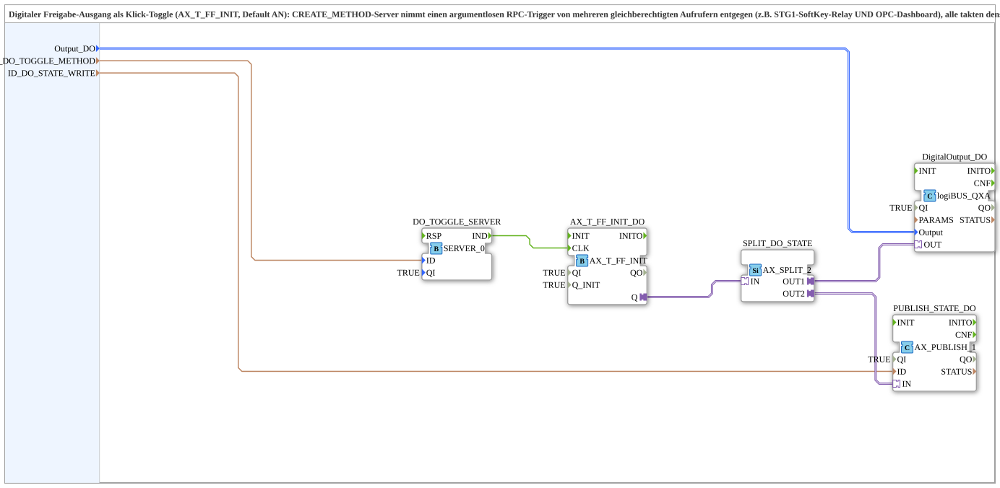

# DO_TOGGLE_RPC_QXA_OPC





* * * * * * * * * *
## Introduction

The **DO_TOGGLE_RPC_QXA_OPC** subapplication implements a digital enable output as a click-toggle (flip-flop) that can be triggered by multiple, independent, equal-right callers via an OPC UA RPC method. Typical callers are a local soft-key relay (STG1) and a remote OPC UA dashboard. Every trigger event toggles the internal state; the current state is the single source of truth for both the physical digital output and the remotely published status value. The design deliberately omits any OR-merge logic after the flip-flop, so that the flip-flop output alone determines the physical channel and the published state. This makes the block generic and reusable for any digital toggle output in emergency-operation or street-mode scenarios that require multi-access control.

## Interface Structure

The subapplication exposes only input variables; all events, adapters, and data processing are encapsulated internally.

### **Event Inputs**

None. All event handling is performed inside the subapplication via an embedded OPC UA server (SERVER_0) and the internal event connections.

### **Event Outputs**

None.

### **Data Inputs

| Name | Type | Initial Value | Description |
|------|------|---------------|-------------|
| `Output_DO` | `logiBUS::io::DQ::logiBUS_DO_S` | `logiBUS_DO::Invalid` | Configuration/description of the physical enable output channel. Drives the digital output as a click-toggle with default state **ON**. |
| `ID_DO_TOGGLE_METHOD` | `WSTRING` | – | OPC UA method node address (ACTION=CREATE_METHOD) for the argumentless toggle trigger. This address is shared by all callers; every caller clocks the same flip-flop. |
| `ID_DO_STATE_WRITE` | `WSTRING` | – | OPC UA variable node address (ACTION=WRITE) used to publish the actual enable state (`AX_T_FF_INIT.Q`). This address is subscribed by remote clients. |

### **Data Outputs**

None.

### **Adapters**

None exposed at the subapplication interface.

## Functionality

The subapplication is built around five internal function blocks:

1. **DO_TOGGLE_SERVER** (`iec61499::net::SERVER_0`) – an OPC UA server endpoint that listens for the method call addressed by `ID_DO_TOGGLE_METHOD`. The incoming request event (`IND`) is forwarded directly to the clock input of the toggle flip-flop and – without any processing – immediately back to the server (`RSP`).

2. **AX_T_FF_INIT_DO** (`adapter::events::unidirectional::AX_T_FF_INIT`) – a toggle flip-flop. Its parameter `Q_INIT=TRUE` sets the default enable state to **ON**. Each event arriving at its `CLK` input flips the state.

3. **SPLIT_DO_STATE** (`adapter::events::unidirectional::AX_SPLIT_2`) – fans out the flip-flop output to two identical copies.

4. **DigitalOutput_DO** (`logiBUS::io::DQ::logiBUS_QXA`) – the physical digital output driver; receives `OUT1` from the split and applies it to the channel configured by `Output_DO`.

5. **PUBLISH_STATE_DO** (`adapter::net::AX_PUBLISH_1`) – publishes `OUT2` as the current enable state to the OPC UA variable addressed by `ID_DO_STATE_WRITE`.

The event chain for a single toggle request is:

```
DO_TOGGLE_SERVER.IND ───┬─► AX_T_FF_INIT_DO.CLK   (state flips)
                        └─► DO_TOGGLE_SERVER.RSP   (immediate acknowledgement)
```

After the flip, the new state propagates through `SPLIT_DO_STATE` to both the physical output and the remote publish. Because no intermediate OR logic exists, the flip-flop output is the **sole authoritative state**, and both consumers always see exactly the same value.

## Technical Features

- **Single source of truth**: `AX_T_FF_INIT.Q` directly and exclusively drives both the physical output and the published OPC UA variable. There is no merging or arbitration logic on the data path.
- **Multi-caller capability**: Any number of OPC UA clients can invoke the same trigger method; they all clock the same flip-flop, so no data-level synchronization or merge block is required.
- **Argumentless remote trigger**: The RPC method takes no arguments. The server acknowledges immediately without further processing.
- **Race-free RSP handling**: The response event (`RSP`) is wired directly back to the indication event (`IND`) of the server FB. This is mandatory: if the response is not sent, FORTE’s `onServerMethodCall` blocks the OPC UA server thread for up to 4 seconds (`scmMethodCallTimeoutInNanoSeconds`). During that time, open62541’s global service mutex is held, which is also required by every `AX_PUBLISH_1` running on any other FORTE thread. The consequence would be that the physical output reacts immediately (no lock needed), but every OPC UA status message – not only for this block – would stall for up to 4 seconds.
- **Robust default state**: With `Q_INIT=TRUE`, the output is ON at initialization, which is the safe default for enable-type outputs.
- **Invalid channel protection**: The `Output_DO` input is initialized to `logiBUS_DO::Invalid`; the physical output driver guards against an unconfigured channel.

## State Overview

The toggle state machine has two stable states, both reflected simultaneously on the physical output and the published variable:

| State | Physical Output | Published Variable | Meaning |
|-------|-----------------|--------------------|---------|
| ON (initial) | Active (1) | TRUE | Enable active / output released |
| OFF | Inactive (0) | FALSE | Enable inhibited / output blocked |

Each valid trigger event on the OPC UA method transitions between these two states. No internal intermediate states exist; the transition is atomic from the perspective of both consumers.

## Application Scenarios

- **Emergency-operation enable switches** (Not-Bedienung): A physical soft-key relay on a machine panel and a remote OPC UA dashboard shall both be able to toggle the same safety-related enable output. Every operator action has equal priority; no single side is master.
- **Street-mode or mode-selection toggles**: A digital output that alternates between two operating modes (e.g., manual/semi-automatic, street/workshop) and must be operable from multiple control rooms.
- **Distributed HMI panels**: Multiple HMI clients subscribe to the published state variable, ensuring all screens display the identical, unmodified flip-flop state.
- **Generic reuse**: The block can be instantiated with different `Output_DO` channel configurations and OPC UA address strings for any equipment that requires a remote-toggleable, locally-published digital enable.

## Comparison with Similar Blocks

| Feature | DO_TOGGLE_RPC_QXA_OPC (this block) | TOGGLE_RPC_MERGE_QXA_OPC (analogous block with merge) |
|---------|-----------------------------------|--------------------------------------------------------|
| Trigger handling | Single method, multiple callers all clock one flip-flop | Method triggers are merged via an OR gate before the flip-flop |
| Source of truth | Flip-flop output only | Merged combination of flip-flop output and trigger inputs |
| Data path after toggle | Straight split to output and publish | Additional OR logic on the data path |
| Complexity | Lower – fewer blocks, fewer connections | Higher – additional merge FB required |
| Use case | Truly independent callers, no data arbitration needed | Callers that may drive the output directly without toggling |

The absence of the merge block in this subapplication eliminates a potential source of divergence between the physical output and the published state. It is the recommended variant whenever all callers are purely toggle-style (click on / click off) and none shall force an absolute output level.

## Conclusion

**DO_TOGGLE_RPC_QXA_OPC** provides a clean, reliable, and reusable pattern for a remote-toggleable digital enable output that is simultaneously published to OPC UA clients. Its architecture guarantees that the locally measured physical state and the remotely observed state are always identical, because both derive from a single flip-flop with no additional logic in between. The direct RSP-to-IND wiring avoids OPC UA server thread blocking and ensures that remote publications continue to work fluently even under concurrent method calls. With its generic configuration interface (physical channel descriptor and two OPC UA address strings), the block can be dropped into any 4diac application that requires multi-operator click-toggling of a digital output.