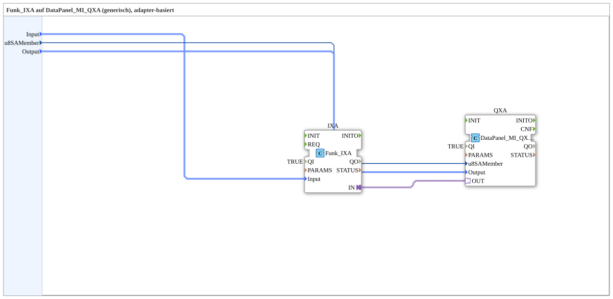

# Funk_IXA_TO_DataPanel_MI_QXA

* * * * * * * * * *
## Introduction
The **Funk_IXA_TO_DataPanel_MI_QXA** is a generic, adapter-based subapplication that bridges a Funk (wireless) digital input to a DataPanel MI QXA output. It encapsulates the necessary internal function blocks and the type-safe adapter connection between the wireless input receiver and the data panel output controller. The subapplication is designed for reuse: by changing only its data inputs, different input keys, output channels, and node addresses can be selected without modifying the internal structure.

## Interface Structure
The subapplication exposes only data inputs. It has no event inputs, event outputs, data outputs, or externally visible adapters.

### **Event Inputs**
None.

### **Event Outputs**
None.

### **Data Inputs**
| Name | Type | Initial Value | Comment |
|------|------|---------------|---------|
| `Input` | `Funk::io::DI::Funk_DI_S` | `Funk_DI::Invalid` | Identifies the input digital input key (e.g., `DigitalInput_Key_01`, etc.) |
| `u8SAMember` | `USINT` | `MI::MI_00` | Node SA address in the range 224..239 |
| `Output` | `DataPanel::io::MI::DQ::DataPanel_MI_DO_S` | `Invalid` | Identifies the output digital output (e.g., `DigitalOutput_1A`..`8B` and `Input_Power_Port_5`..`8`) |

### **Data Outputs**
None.

### **Adapters**
The subapplication does not expose any adapters on its interface. Internally, one adapter connection is established between the two embedded function blocks:

- `IXA.IN` → `QXA.OUT`

This internal adapter connection carries the wireless input signal from the Funk receiver to the DataPanel output controller in a type-safe manner.

## Functionality
The subapplication implements a direct signal path from a selected Funk input to a selected DataPanel output. The internal network consists of two function blocks:

1. **IXA** (type `Funk::io::DI::Funk_IXA`) – receives the configured `Input` selection and produces the adapter output signal `IN`.
2. **QXA** (type `DataPanel::io::MI::DQ::DataPanel_MI_QXA`) – receives the `u8SAMember` node address and the `Output` channel selection, and accepts the adapter input `OUT`.

The data flow is:
- `Input` → `IXA.Input` – defines which wireless input key is monitored.
- `u8SAMember` → `QXA.u8SAMember` – sets the node SA (substation address) in the 224..239 range.
- `Output` → `QXA.Output` – defines which DataPanel digital output (or power port) is actuated.
- `IXA.IN` → `QXA.OUT` – the adapter connection routes the signal from the wireless receiver to the output controller.

Both embedded FBs are enabled with their `QI` parameter set to `TRUE`. The `PARAMS` parameter of `IXA` is set to an empty string (with visibility disabled), keeping the internal configuration hidden.

## Technical Features
- **Generic adapter-based design**: The subapplication can be instantiated multiple times for different input/output combinations without internal modifications.
- **Encapsulated logic**: All internal wiring and adapter connections are hidden, reducing the risk of incorrect manual wiring.
- **Type-safe adapter connection**: The internal `IXA.IN` → `QXA.OUT` connection ensures compatibility between the Funk input adapter and the DataPanel output adapter.
- **Configuration via data inputs**: The entire behavior is controlled by three data inputs (`Input`, `Output`, `u8SAMember`), which can be bound to constant values or runtime variables.
- **No event interface**: The subapplication operates purely on data, simplifying integration into larger IEC 61499 networks.
- **Enabled by default**: Both internal FBs have `QI` set to `TRUE`, meaning the subapplication is operational immediately after instantiation.

## State Overview
The subapplication itself does not contain a state machine or event-triggered logic. Its behavior is purely combinatorial with respect to its data inputs: the selected input key, output channel, and node address are forwarded directly to the internal FBs. Any state handling is performed by the embedded function blocks (`Funk_IXA` and `DataPanel_MI_QXA`), which manage their own internal states and diagnostics. Users of this subapplication do not need to manage any additional states.

## Application Scenarios
- **Wireless key switching**: Connect a wireless digital input (e.g., a key switch) to a DataPanel digital output for remote or wireless activation of loads.
- **Generic I/O mapping**: Use the same subapplication to map multiple different Funk inputs to different DataPanel outputs by simply changing the `Input` and `Output` selection values.
- **Building automation**: Integrate wireless sensors or switches with central DataPanel output modules for flexible lighting, HVAC, or security control.
- **Modular control panels**: Simplify the creation of control-panel logic by reusing this subapplication for every radio-controlled output channel.

## Comparison with Similar Blocks
- **vs. direct FB wiring**: Compared to manually wiring `Funk_IXA` and `DataPanel_MI_QXA` together, this subapplication encapsulates the adapter connection and exposes only the essential configuration parameters, significantly reducing wiring effort and error potential.
- **vs. an application-specific FB**: Unlike a dedicated, hard-coded function block, this subapplication is generic and can be instantiated with different parameter values, making it more flexible and reusable across projects.
- **vs. event-driven blocks**: This subapplication has no event interface, which makes it simpler to use, but it is not suitable for time-critical or sequence-dependent logic that requires explicit event synchronization.
- **vs. other mapping subapps**: This subapplication is specifically tailored for the Funk-to-DataPanel adapter pair; other mapping subapps for different device families would have a different internal structure and interface.

## Conclusion
**Funk_IXA_TO_DataPanel_MI_QXA** offers a clean, reusable, adapter-based solution for bridging Funk wireless inputs to DataPanel MI QXA outputs. Its minimal interface – three data inputs – and fully encapsulated internal signal path make it easy to integrate and configure. The generic design ensures that the same subapplication can be leveraged across a wide range of wireless I/O mapping scenarios, improving consistency and maintainability in 4diac-based automation projects.