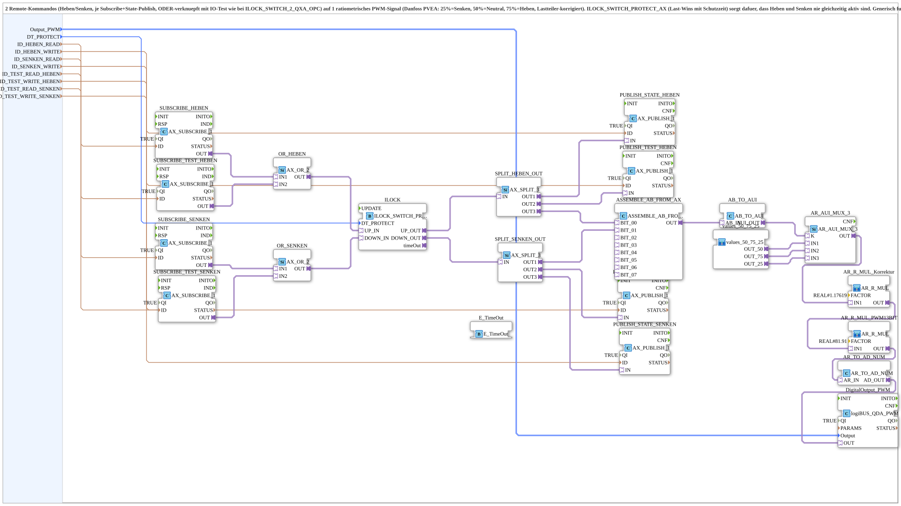

# HebenSenken_ILOCK_QDA_PWM_OPC

* * * * * * * * * *
## Introduction

The **HebenSenken_ILOCK_QDA_PWM_OPC** subapplication combines two remote commands – **Raise** (Heben) and **Lower** (Senken) – with existing IO-test signals and generates a single ratiometric PWM output signal. The subapp is designed for Danfoss PVEA actuators with a three-stage PWM channel, where:

- **25%** duty cycle = Lower (Senken)
- **50%** duty cycle = Neutral
- **75%** duty cycle = Raise (Heben)

Each remote command path consists of a Subscribe adapter (for the actual control command) OR-combined with an existing IO-test Subscribe signal, followed by a Publish adapter for state feedback behind the interlock. An **ILOCK_SWITCH_PROTECT_AX** interlock block applies a *last-wins* strategy with a configurable protection time (`DT_PROTECT`) to guarantee that Raise and Lower are never active simultaneously. The selected duty cycle is then corrected by a load-divider compensation factor and scaled to a 13-bit PWM range before being forwarded to a physical PWM output.

The subapp is generic and can be reused with any PVEA actuator equipped with a ratiometric three-stage PWM channel.

## Interface Structure

The subapplication exposes only data inputs. It does not provide any event inputs, event outputs, or adapter interfaces at its boundary; all event and adapter communication occurs internally within the subapp network.

### **Event Inputs**

None. The subapp provides no event inputs; all triggering is handled internally via the subscribe/publish adapter pattern.

### **Event Outputs**

None. The subapp provides no event outputs.

### **Data Inputs**

| Name | Type | Description |
|------|------|-------------|
| `Output_PWM` | `logiBUS::io::DQ::logiBUS_DO_S` | Physical PWM output: 25/50/75% duty cycle, ratiometric. Default: `logiBUS_DO::Invalid` |
| `DT_PROTECT` | `TIME` | Protection deadtime before direction changes. Default: `T#300ms` |
| `ID_HEBEN_READ` | `WSTRING` | Actual function command for Raise (Subscribe). |
| `ID_HEBEN_WRITE` | `WSTRING` | Actual function feedback for Raise, *behind* the ILOCK (Publish). |
| `ID_SENKEN_READ` | `WSTRING` | Actual function command for Lower (Subscribe). |
| `ID_SENKEN_WRITE` | `WSTRING` | Actual function feedback for Lower, *behind* the ILOCK (Publish). |
| `ID_TEST_READ_HEBEN` | `WSTRING` | Existing IO-test Subscribe address for Raise (e.g., `STG2_Q0x_READ`), OR-combined with `ID_HEBEN_READ` before the ILOCK. |
| `ID_TEST_WRITE_HEBEN` | `WSTRING` | Existing IO-test Publish address for Raise, *behind* the ILOCK (e.g., `STG2_Q0x_WRITE`). |
| `ID_TEST_READ_SENKEN` | `WSTRING` | Existing IO-test Subscribe address for Lower, OR-combined with `ID_SENKEN_READ` before the ILOCK. |
| `ID_TEST_WRITE_SENKEN` | `WSTRING` | Existing IO-test Publish address for Lower, *behind* the ILOCK. |

### **Data Outputs**

None. Status and feedback information are published via the internal adapter network using the configured Publish addresses (`ID_HEBEN_WRITE`, `ID_SENKEN_WRITE`, `ID_TEST_WRITE_HEBEN`, `ID_TEST_WRITE_SENKEN`).

### **Adapters**

None exposed at the interface level. All adapter communication is internal to the subapp network.

## Functionality

The subapp processes two independent command sources and merges them into a single PWM output according to the following flow:

1. **Command acquisition**: The four Subscribe adapters (`SUBSCRIBE_HEBEN`, `SUBSCRIBE_TEST_HEBEN`, `SUBSCRIBE_SENKEN`, `SUBSCRIBE_TEST_SENKEN`) receive the actual function commands and the IO-test commands. Each pair is combined with an `AX_OR_2` OR block, so either the real command or the IO-test command can activate the corresponding direction.

2. **Interlock protection**: The OR outputs (`OR_HEBEN.OUT`, `OR_SENKEN.OUT`) are fed into `ILOCK_SWITCH_PROTECT_AX`. This block implements a *last-wins* strategy with a user-configurable protection time (`DT_PROTECT`). It ensures that the Raise and Lower signals can never be active simultaneously. The internal `timeOut` event of the ILOCK is connected to an `E_TimeOut` FB, which provides the timing for the protection interval.

3. **Signal distribution**: The protected ILOCK outputs (`UP_OUT`, `DOWN_OUT`) are split via `AX_SPLIT_3` blocks:
   - `SPLIT_HEBEN_OUT`: OUT1 publishes the state to `PUBLISH_STATE_HEBEN`, OUT2 publishes to `PUBLISH_TEST_HEBEN`, and OUT3 provides the Raise bit to the assembly block.
   - `SPLIT_SENKEN_OUT`: OUT1 provides the Lower bit to the assembly block, OUT2 publishes to `PUBLISH_TEST_SENKEN`, and OUT3 publishes to `PUBLISH_STATE_SENKEN`.

4. **Selection logic**: The two bits (`BIT_00` for Raise, `BIT_01` for Lower) are assembled by `ASSEMBLE_AB_FROM_AX` into a 2-bit pattern, which is converted to an unsigned integer value by `AB_TO_AUI`. This value is used as the selector input `K` of the `AR_AUI_MUX_3` multiplexer. The MUX selects among three reference duty cycles provided by the `values_50_75_25` subapp:
   - `IN1` → 50% (Neutral)
   - `IN2` → 75% (Raise)
   - `IN3` → 25% (Lower)

   Since the ILOCK prevents both bits from being set simultaneously, a 3-way MUX is sufficient (the invalid 4th state cannot occur).

5. **Scaling and conversion**: The selected duty-cycle value passes through two `AR_R_MUL` multiplication stages:
   - **Correction factor** (`FACTOR = REAL#1.17619`, which equals 1/0.8502) compensates for the load-divider characteristics.
   - **PWM scale factor** (`FACTOR = REAL#81.91`, which equals 8191/100) maps the percentage value to the 13-bit PWM range (0…8191).
   
   The resulting analog value is converted by `AR_TO_AD_NUM` into a digital number, which drives the `logiBUS_QDA_PWM` block (`DigitalOutput_PWM`) that generates the physical PWM signal on the configured `Output_PWM` channel.

6. **Feedback publishing**: The ILOCK-protected states are published back via four `AX_PUBLISH_1` adapters (`PUBLISH_STATE_HEBEN`, `PUBLISH_TEST_HEBEN`, `PUBLISH_STATE_SENKEN`, `PUBLISH_TEST_SENKEN`) to the respective feedback addresses, ensuring that external systems only see the actual (interlock-protected) commands, not the raw inputs.

## Technical Features

- **Interlock with protection time**: The `ILOCK_SWITCH_PROTECT_AX` block applies a *last-wins* arbitration and enforces a deadtime (`DT_PROTECT`, default 300 ms) between direction changes, preventing mechanical and hydraulic stress on the actuator.
- **OR-combined command sources**: Each direction can be triggered either by the actual function command or by an IO-test command, allowing test and operation modes without changing the network topology.
- **State feedback behind the ILOCK**: Published states reflect the *actual* actuator commands after interlock protection, so downstream monitoring always sees the real effective command.
- **Ratiometric PWM scaling**: The duty cycles are corrected for load-divider nonlinearity (factor 1.17619 = 1/0.8502) and scaled to a 13-bit PWM resolution (factor 81.91 = 8191/100).
- **Generic 3-stage PWM generation**: Works with any PVEA-type actuator requiring a ratiometric PWM channel with three defined levels.
- **Configurable via data inputs**: All addresses (`ID_*`) and timing parameters (`DT_PROTECT`) are exposed as data inputs, making the subapp parametrizable without internal modification.

## State Overview

The subapp can be in one of the following operating states:

| State | Condition | MUX Input | PWM Duty Cycle | Description |
|-------|-----------|-----------|----------------|-------------|
| **Neutral** | Neither Raise nor Lower active | IN1 (50%) | 50% | Actuator is idle; no direction command present. |
| **Raise** | Raise command active (after ILOCK) | IN2 (75%) | 75% | Actuator moves upward (Heben). |
| **Lower** | Lower command active (after ILOCK) | IN3 (25%) | 25% | Actuator moves downward (Senken). |
| **Protection** | Direction change during `DT_PROTECT` | Held at previous state | Held at previous level | ILOCK holds the last command until the protection time elapses; the new command takes effect afterwards. |

The interlock ensures that the combination *Raise+Lower* (both bits set) can never occur; hence the 3-way MUX is sufficient.

## Application Scenarios

- **PVEA actuator control**: Directly controlling Danfoss PVEA hydraulic actuators that accept a ratiometric PWM signal with three discrete duty-cycle levels for Raise/Neutral/Lower.
- **Remote HMI control with IO-test integration**: Industrial systems where a remote operator station (via OPC/network subscribes) and a local IO-test panel both need to control the same actuator, with the IO-test acting as an override or backup.
- **Direction-safe switching**: Applications where simultaneous Raise and Lower commands must be impossible due to safety requirements – e.g., crane or lifting systems, agricultural machinery, or mobile hydraulics.
- **Actuator state feedback**: Systems that require publication of the *actual* (protected) command state for visualization, logging, or supervisory control.

## Comparison with Similar Blocks

The subapp follows the same pattern as `ILOCK_SWITCH_2_QXA_OPC` (which also OR-combines real commands with IO-test signals and applies `ILOCK_SWITCH_PROTECT_AX` interlock protection). However, the key difference is the output stage:

- **`ILOCK_SWITCH_2_QXA_OPC`** typically produces two discrete digital outputs (QXA) for Raise and Lower.
- **`HebenSenken_ILOCK_QDA_PWM_OPC`** merges the two command bits into a *single ratiometric PWM signal* using a 3-way MUX, compensation scaling, and a PWM output stage. This reduces the output pins from two digital channels to one analog PWM channel and is specifically tailored for PVEA actuators that accept proportional PWM control.

The interlock core remains identical, ensuring consistent protection behavior across both variants.

## Conclusion

The `HebenSenken_ILOCK_QDA_PWM_OPC` subapplication provides a robust, generic solution for controlling three-stage PVEA actuators via a single ratiometric PWM signal. It integrates remote function commands and IO-test signals with interlock protection and configurable deadtime, guaranteeing that Raise and Lower can never be active simultaneously. The built-in load-divider correction and 13-bit PWM scaling ensure accurate and repeatable actuator positioning. With its fully parametrizable addresses and timing, the subapp can be reused across different machines and communication layouts without internal changes, making it a valuable component for hydraulic actuation systems requiring safe and flexible command handling.