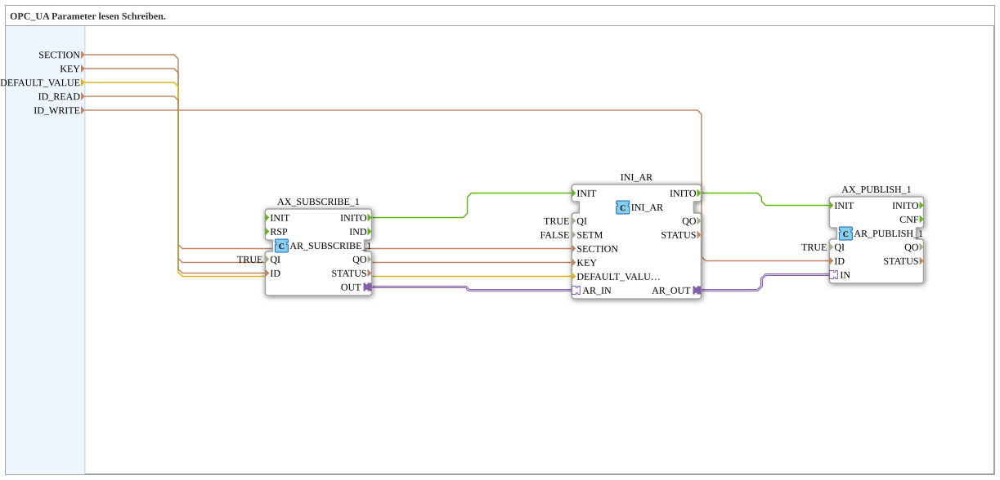

# INI_OPC_PARAM

* * * * * * * * * *

## Introduction

`INI_OPC_PARAM` reads and writes a REAL parameter via OPC UA and stores it persistently in the INI file (`settings.ini`). A client can set a new value using `ID_READ`; the currently stored value is published using `ID_WRITE`. After a restart, the last stored value (or `DEFAULT_VALUE`, if none exists) is automatically loaded and published again.

## Function Blocks (FBs) Used

### Sub-Blocks: INI_OPC_PARAM

- **Type**: SubAppType

- **Internal FBs Used**:

- **AX_SUBSCRIBE_1**: `adapter::net::AR_SUBSCRIBE_1` (`QI=TRUE`) — subscribes to new values from the OPC UA client (`ID_READ`).

- **INI_AR**: `eclipse4diac::storage::INI_AR` (`QI=TRUE`, `SETM=FALSE`) — persistently stores the value in the INI file under `SECTION`/`KEY`, with `DEFAULT_VALUE` as the initial value.

- **AX_PUBLISH_1**: `adapter::net::AR_PUBLISH_1` (`QI=TRUE`) — publishes the current value via OPC UA (`ID_WRITE`).

- **How it works**: A value received via OPC UA is forwarded to `INI_AR`, stored there, and the value (newly received or loaded at startup) is then published again via `AX_PUBLISH_1`.

## Program Flow and Connections

1. **Initialization Chain**: `AX_SUBSCRIBE_1.INITO` → `INI_AR.INIT` → `INI_AR.INITO` → `AX_PUBLISH_1.INIT`.

2. **Parameters**: `SECTION` → `INI_AR.SECTION`; `KEY` → `INI_AR.KEY`; `DEFAULT_VALUE` → `INI_AR.DEFAULT_VALUE`; `ID_READ` → `AX_SUBSCRIBE_1.ID`; `ID_WRITE` → `AX_PUBLISH_1.ID`.

3. **Adapter Chain**: `AX_SUBSCRIBE_1.OUT` → `INI_AR.AR_IN` (new value from the client) → `INI_AR.AR_OUT` → `AX_PUBLISH_1.IN` (saved/current value back to the client).

## Technical Features

- **`SETM=FALSE`**: `INI_AR` only saves on an explicit write event via `AR_IN`, not on every cycle.

- **Sequential Initialization**: `AX_SUBSCRIBE_1.INITO` → `INI_AR.INIT` → `INI_AR.INITO` → `AX_PUBLISH_1.INIT` ensures that the stored value is loaded before being published.

- **No Dedicated Adapter Output**: Unlike `INI_OPC_PARAM_AR`, this block does not provide the stored value as a plug for other blocks in the calling network—it serves exclusively for OPC UA connectivity.

## Application Scenarios

- A numerical parameter (e.g., setpoint) editable via OPC UA/Web client that must be retained across restarts but is not used further on the local network.

## Comparison with Similar Function Blocks

`INI_OPC_PARAM_AR` extends this function block with an additional `AR` plug (`OUT`) for local use of the stored value. `INI_OPC_PARAM_ATM` additionally provides a `TIME` conversion, and `INI_OPC_PARAM_AX` is the BOOL variant with a `AX` output.

## Summary

`INI_OPC_PARAM` combines OPC UA read/write access with persistent INI storage of a REAL parameter without making the value available locally as an adapter.

---

### 🌐 Related topic subpages on ms-muc-docs.de

- [🌐 Eclipse 4diac IDE & color reference on ms-muc-docs.de](https://www.ms-muc-docs.de/iec-61499/eclipse-4diac/)
