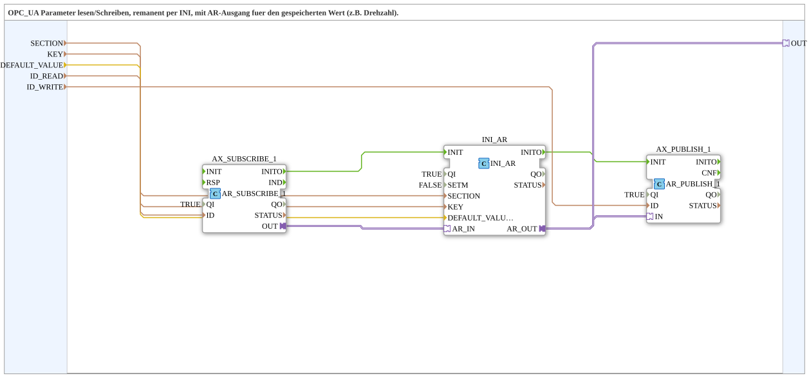

# INI_OPC_PARAM_AR

* * * * * * * * * *

## Introduction

`INI_OPC_PARAM_AR` extends [`INI_OPC_PARAM`](./INI_OPC_PARAM.md) with an additional `AR` adapter output (`OUT`), which provides the currently stored/loaded value directly for further use in the calling network—e.g., for a locally adjustable rotational speed that should be editable via OPC UA and also used directly in the same application.

## Function Blocks (FBs) Used

### Sub-Blocks: INI_OPC_PARAM_AR

- **Type**: SubAppType
- **Internal FBs Used**:

- **AX_SUBSCRIBE_1**: `adapter::net::AR_SUBSCRIBE_1` (`QI=TRUE`) — subscribes to new values from the OPC UA client (`ID_READ`).

- **INI_AR**: `eclipse4diac::storage::INI_AR` (`QI=TRUE`, `SETM=FALSE`) — persistently stores the value in the INI file under `SECTION`/`KEY`, with `DEFAULT_VALUE` as the initial value.

- **AX_PUBLISH_1**: `adapter::net::AR_PUBLISH_1` (`QI=TRUE`) — publishes the current value via OPC UA (`ID_WRITE`).

- **Functionality**: Identical to `INI_OPC_PARAM`, except that `INI_AR.AR_OUT` is directly routed to the plugin `OUT`.

## Program Flow and Connections

1. **Initialization Chain**: `AX_SUBSCRIBE_1.INITO` → `INI_AR.INIT` → `INI_AR.INITO` → `AX_PUBLISH_1.INIT`.

2. **Parameters**: `SECTION` → `INI_AR.SECTION`; `KEY` → `INI_AR.KEY`; `DEFAULT_VALUE` → `INI_AR.DEFAULT_VALUE`; `ID_READ` → `AX_SUBSCRIBE_1.ID`; `ID_WRITE` → `AX_PUBLISH_1.ID`.

3. **Adapter Chain**: `AX_SUBSCRIBE_1.OUT` → `INI_AR.AR_IN` → `INI_AR.AR_OUT` → `AX_PUBLISH_1.IN` **and** → `OUT` (plug into the SubApp interface).

## Technical Features

- **One output, two destinations**: `INI_AR.AR_OUT` simultaneously feeds the OPC UA publish adapter and the external `OUT` plug—both receive the same value without any additional splitting, as these are two separate adapter connections from the same source.

- Otherwise identical to [`INI_OPC_PARAM`](./INI_OPC_PARAM.md) (see there for details on `SETM`/initialization sequence).

## Application Scenarios

- A REAL parameter (e.g., speed setpoint) that can be edited via OPC UA/web client and is stored persistently, and which must also be directly passed to other components in the same network.

## Comparison with Similar Building Blocks

Compared to [`INI_OPC_PARAM`](./INI_OPC_PARAM.md), the only difference is the additional `AR` plugin, `OUT`. [`INI_OPC_PARAM_ATM`](./INI_OPC_PARAM_ATM.md) additionally converts the value to `TIME`, and [`INI_OPC_PARAM_AX`](./INI_OPC_PARAM_AX.md) is the BOOL variant.

## Summary

`INI_OPC_PARAM_AR` is `INI_OPC_PARAM` with an additional `AR` output for local reuse of the persistently stored parameter.

---

### 🌐 Related topic subpages on ms-muc-docs.de

- [🌐 Eclipse 4diac IDE & Color Reference on ms-muc-docs.de](https://www.ms-muc-docs.de/iec-61499/eclipse-4diac/)
