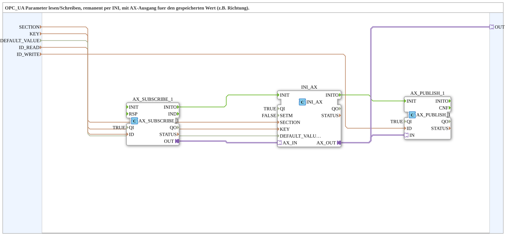

# INI_OPC_PARAM_AX

* * * * * * * * * *

## Introduction

`INI_OPC_PARAM_AX` is the BOOL variant of [`INI_OPC_PARAM_AR`](./INI_OPC_PARAM_AR.md): Instead of a REAL value, a BOOL parameter (e.g., a direction or operating mode switch) is read/written via OPC UA, permanently stored in the INI file, and made available as the `AX` adapter for local use.

## Function Blocks (FBs) Used

### Sub-Blocks: INI_OPC_PARAM_AX

- **Type**: SubAppType
- **Internal FBs Used**:

- **AX_SUBSCRIBE_1**: `adapter::net::AX_SUBSCRIBE_1` (`QI=TRUE`) — subscribes to new BOOL values from the OPC UA client (`ID_READ`).

- **INI_AX**: `eclipse4diac::storage::INI_AX` (`QI=TRUE`, `SETM=FALSE`) — persistently stores the BOOL value in the INI file under `SECTION`/`KEY`, with `DEFAULT_VALUE` as the initial value.

- **AX_PUBLISH_1**: `adapter::net::AX_PUBLISH_1` (`QI=TRUE`) — publishes the current value via OPC UA (`ID_WRITE`).

- **Functionality**: Structurally identical to `INI_OPC_PARAM_AR`, but with `AX` adapters (`AX_SUBSCRIBE_1`/`INI_AX`/`AX_PUBLISH_1`) instead of `AR` adapters, matching the BOOL data type of `DEFAULT_VALUE`.

## Program Flow and Connections

1. **Initialization Chain**: `AX_SUBSCRIBE_1.INITO` → `INI_AX.INIT` → `INI_AX.INITO` → `AX_PUBLISH_1.INIT`.
2. **Parameters**: `SECTION` → `INI_AX.SECTION`; `KEY` → `INI_AX.KEY`; `DEFAULT_VALUE` (BOOL) → `INI_AX.DEFAULT_VALUE`; `ID_READ` → `AX_SUBSCRIBE_1.ID`; `ID_WRITE` → `AX_PUBLISH_1.ID`.
3. **Adapter Chain**: `AX_SUBSCRIBE_1.OUT` → `INI_AX.AX_IN` → `INI_AX.AX_OUT` → `AX_PUBLISH_1.IN` **and** → `OUT` (plug into the SubApp interface).

## Technical Features

- **BOOL instead of REAL**: The only functional difference to `INI_OPC_PARAM_AR` is the data type (`DEFAULT_VALUE` is `BOOL` here) and the corresponding `AX` adapter types instead of `AR`.

- Otherwise identical to [`INI_OPC_PARAM_AR`](./INI_OPC_PARAM_AR.md) (initialization sequence, `SETM=FALSE`, one output with two destinations).

## Application Scenarios

- Retentively stored BOOL parameters (e.g., direction of rotation, operating mode switch) that should be editable via OPC UA/Web client and additionally reused locally as a `AX` adapter.

## Comparison with Similar Function Blocks

`INI_OPC_PARAM_AX` is to [`INI_OPC_PARAM_AR`](./INI_OPC_PARAM_AR.md) as `AX` is to `AR`: same structure, different data type. [`INI_OPC_PARAM`](./INI_OPC_PARAM.md) and [`INI_OPC_PARAM_ATM`](./INI_OPC_PARAM_ATM.md) are the REAL-based variants (without and with additional `TIME` conversion, respectively).

## Summary

`INI_OPC_PARAM_AX` is the BOOL variant of the `INI_OPC_PARAM` family: OPC UA read/write access, persistent INI storage, and a local `AX` output for a Boolean parameter.

---

### 🌐 Related topic subpages on ms-muc-docs.de

- [🌐 Eclipse 4diac IDE & Color Reference on ms-muc-docs.de](https://www.ms-muc-docs.de/iec-61499/eclipse-4diac/)
