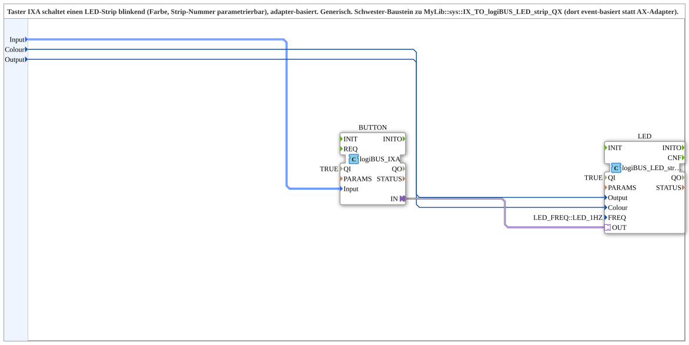

# IXA_TO_logiBUS_LED_strip_QXA

* * * * * * * * * *
## Introduction
The `IXA_TO_logiBUS_LED_strip_QXA` is a generic composite subapplication that integrates a logiBUS push button (via the `logiBUS_IXA` function block) with an LED strip controller (`logiBUS_LED_strip_QXA`). It provides a simple, adapter-based mechanism to control an LED strip's blinking state, color, and output line based on a digital input. The subapplication is designed to be reusable across different logiBUS configurations, allowing the mapping of any input to a specific LED strip with configurable parameters.

## Interface Structure
This subapplication exposes only data inputs; it has no event inputs, event outputs, data outputs, or adapter interfaces at its boundary. All communication between internal blocks is handled internally.

### **Event Inputs**
None.

### **Event Outputs**
None.

### **Data Inputs**
| Name   | Type                          | Initial Value         | Comment                                      |
|--------|-------------------------------|-----------------------|----------------------------------------------|
| Input  | `logiBUS::io::DI::logiBUS_DI_S` | `Invalid`             | Identify the Input Input_I1..I8              |
| Colour | `UINT`                        | `LED_COLOURS::LED_GREEN` | This identify the Colour.                    |
| Output | `USINT`                       | (default 0)           | Identify the Output Number of Strip          |

### **Data Outputs**
None.

### **Adapters**
None (externally exposed).

## Functionality
The subapplication routes its external data inputs to two internal function blocks:

- **BUTTON** (type `logiBUS::io::DI::logiBUS_IXA`): Receives the `Input` data and has its `QI` parameter set to `TRUE`.
- **LED** (type `logiBUS::io::DO_LED::logiBUS_LED_strip_QXA`): Receives `Colour` and `Output` data and has `QI=TRUE` and `FREQ=LED_FREQ::LED_1HZ` configured.

An internal adapter connection links `BUTTON.IN` to `LED.OUT`, enabling the button to send state/event information directly to the LED controller via an adapter interface. This design decouples the event handling from the data path, allowing the LED strip to respond to button actions (e.g., toggling, blinking) while maintaining a simple parameterized configuration.

## Technical Features
- **Adapter-based communication**: The internal connection via `BUTTON.IN` → `LED.OUT` uses an adapter, providing a flexible and type-safe link between the button and the LED controller.
- **Parameterization**: The `Colour` and `Output` data inputs allow runtime configuration of the LED color and the specific strip number.
- **Generic input mapping**: The `Input` data input accepts any `logiBUS_DI_S` value, making the subapplication adaptable to various button/input assignments.
- **Preconfigured internal blocks**: Both internal FBs have their `QI` set to `TRUE`, and the LED frequency is preset to 1 Hz, ensuring immediate operation upon deployment.

## State Overview
The subapplication itself does not implement a dedicated state machine. Instead, it relies on the internal behavior of the `logiBUS_IXA` and `logiBUS_LED_strip_QXA` blocks, which manage their own operational states. The subapplication serves as a static wiring and parameterization layer, passing data and adapter signals to the appropriate endpoints.

## Application Scenarios
- **Building automation**: Connect a physical button (e.g., a wall switch) to control a colored LED strip on a specific output line, with configurable color and blinking frequency.
- **Status indication**: Use a button to toggle the blinking of an LED strip to indicate system states (e.g., alarm, readiness) without requiring additional logic.
- **Generic I/O mapping**: Serve as a reusable component in larger logiBUS networks to map arbitrary inputs to LED outputs, reducing development effort for similar tasks.

## Comparison with Similar Blocks
The subapplication is described as a "sister block" to `MyLib::sys::IX_TO_logiBUS_LED_strip_QX`. The primary difference is that the sister block uses an event-based interface, whereas this subapplication uses an adapter-based internal connection. This distinction affects integration patterns:

- **Adapter-based** (this block): More suitable for structured data exchange and when the button and LED controller need to share additional information beyond simple event triggers.
- **Event-based** (sister block): More lightweight for simple trigger scenarios, but may require additional event handling logic.

Both achieve similar functionality but cater to different architectural preferences.

## Conclusion
`IXA_TO_logiBUS_LED_strip_QXA` provides a clean, parameterized solution for connecting a logiBUS input to a blinking LED strip. Its adapter-based design offers flexibility and easy integration into existing systems, while the explicit data inputs enable runtime customization of color and output line. As a generic, reusable component, it simplifies the development of building automation and indicator applications, making it a valuable asset in the MyLib::sys library.