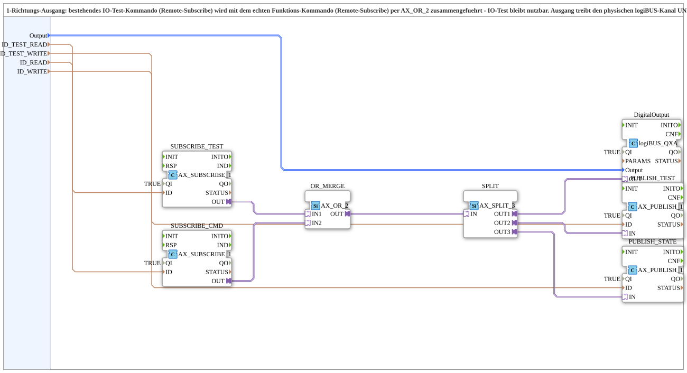

# MERGE_SWITCH_1_QXA_OPC

* * * * * * * * * *

## Introduction

`MERGE_SWITCH_1_QXA_OPC` drives a single (non-double-acting) logiBUS output from two OPC UA sources: the existing I/O test command (remote subscribe) and the actual function command (also remote subscribe, e.g., from a soft key/AUX via `Softkey_Aux_IXA_TO_Remote_WRITE_BG_OPC`). Both are combined using a level OR gate, so the existing I/O test remains usable while the actual function can simultaneously control the same output. For double-acting actuators (left/right, up/down), use `ILOCK_SWITCH_2_QXA_OPC` instead.

## Function Blocks (FBs) Used

### Sub-Blocks: MERGE_SWITCH_1_QXA_OPC

- **Type**: SubAppType
- **Internal FBs Used**:

- **SUBSCRIBE_TEST** / **SUBSCRIBE_CMD**: each `adapter::net::AX_SUBSCRIBE_1` (`QI=TRUE`) — subscribe to the existing I/O test command (`ID_TEST_READ`) or the actual function command (`ID_READ`), respectively.

- **OR_MERGE**: `adapter::booleanOperators::AX_OR_2` — combines both subscribe sources using a level OR operation.

- **SPLIT**: `adapter::events::unidirectional::AX_SPLIT_3` — distributes the combined signal to the physical output and two feedback channels.

- **DigitalOutput**: `logiBUS::io::DQ::logiBUS_QXA` (`QI=TRUE`) — physical digital output.

- **PUBLISH_TEST** / **PUBLISH_STATE**: each `adapter::net::AX_PUBLISH_1` (`QI=TRUE`) — report the resulting state to the existing I/O test monitoring (`ID_TEST_WRITE`) or to the actual function feedback (`ID_WRITE`, e.g., `GreenWhiteBackground` on the soft key).

- **How it Works**: Two independent remote subscribe sources are combined via `AX_OR_2` and jointly drive the physical output as well as two separate feedback channels.

## Program Flow and Connections

1. `ID_TEST_READ` → `SUBSCRIBE_TEST.ID`; `ID_READ` → `SUBSCRIBE_CMD.ID` (Data connections, hidden).

2. `SUBSCRIBE_TEST.OUT` → `OR_MERGE.IN1`; `SUBSCRIBE_CMD.OUT` → `OR_MERGE.IN2`.

3. `OR_MERGE.OUT` → `SPLIT.IN` → `SPLIT.OUT1` → `DigitalOutput.OUT` (physical output), `SPLIT.OUT2` → `PUBLISH_TEST.IN`, `SPLIT.OUT3` → `PUBLISH_STATE.IN`.

4. Parameters: `Output` → `DigitalOutput.Output`; `ID_TEST_WRITE` → `PUBLISH_TEST.ID`; `ID_WRITE` → `PUBLISH_STATE.ID`.

## Technical Features

- **Two Separate Feedback Nodes**: The resulting state is reported back to two separate OPC UA nodes, independent of the respective command node (`ID_TEST_WRITE` for the existing I/O diagnostic display, `ID_WRITE` for the actual function feedback). Command and status nodes must never share the same OPC UA node—otherwise, the subscribe node will interpret its own publish echo as a new command, and the output will be stuck.

- **Level OR instead of Edge Logic**: Unlike latching button blocks (e.g., `Button_IXA_TO_logiBUS_QXA_BG_OPC_LATCHING`), this block uses a simple, continuous OR (`AX_OR_2`)—suitable for a command that is held (not toggled).

- **Generic for Simple Outputs**: Applicable to any simple, non-double-acting output controlled by a module without its own VT.

## Application Scenarios

- Physical outputs whose existing I/O test channel should remain usable even after the actual function is implemented, without the two command sources blocking each other.

- Simple, non-double-acting actuators (e.g., strobe light, lighting) that can be controlled by both the I/O test and an actual operating function (SoftKey/AUX).

## Comparison with Similar Function Blocks

For double-acting actuators (left/right, up/down) where the two directions must be mutually exclusive, use `ILOCK_SWITCH_2_QXA_OPC` — `MERGE_SWITCH_1_QXA_OPC` does not have an interlock because it only controls a single output direction.

## Summary

`MERGE_SWITCH_1_QXA_OPC` combines an I/O test command and a real function command into a single, simple output using a level OR logic gate and reports the status separately to both monitoring paths.

---

### 🌐 Related topic subpages on ms-muc-docs.de

- [🌐 Eclipse 4diac IDE & Color Reference on ms-muc-docs.de](https://www.ms-muc-docs.de/iec-61499/eclipse-4diac/)
