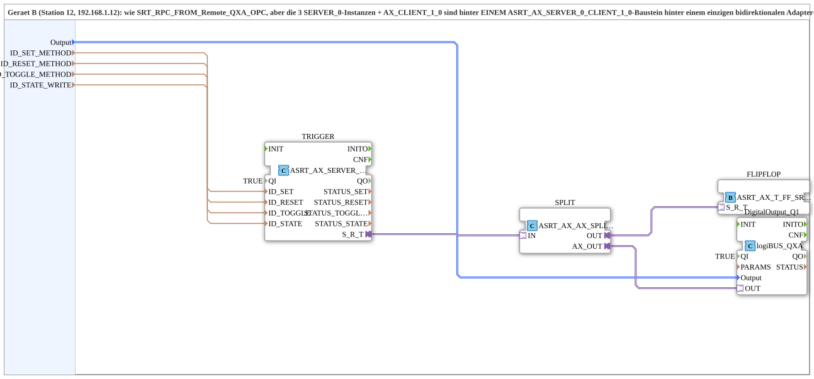

# SRT_RPC_FROM_Remote_QXA_OPC_Adapter

* * * * * * * * * *

## Introduction

The **SRT_RPC_FROM_Remote_QXA_OPC_Adapter** is a subapplication (SUB-style) that provides remote control of a digital output (QXA) via a single bidirectional adapter connection. It is intended for Device B (Station 12, 192.168.1.12) and is structurally an optimized variant of the SRT_RPC_FROM_Remote_QXA_OPC subapplication: instead of exposing multiple server/client instances separately, all protocol handling is bundled behind one `ASRT_AX_SERVER_0_CLIENT_1_0` block, and the incoming adapter stream is split to drive both the digital output and a Set/Reset/Toggle flip-flop logic. The communication protocol itself is embedded in the MyLib::sys composite type, not in the device resource.

## Interface Structure

### **Event Inputs**

None. The subapplication does not expose any event inputs; all triggering is handled internally via the adapter stream and method calls.

### **Event Outputs**

None.

### **Data Inputs**

| Name | Type | Initial Value | Description |
|------|------|---------------|-------------|
| `Output` | `logiBUS::io::DQ::logiBUS_DO_S` | `logiBUS_DO::Invalid` | Identifies which physical output (Q1..Q8) is to be controlled. |
| `ID_SET_METHOD` | `WSTRING` | – | Local method address (ACTION=CREATE_METHOD) used for the Set method call, invoked remotely by Device A via CALL_METHOD. |
| `ID_RESET_METHOD` | `WSTRING` | – | Local method address used for the Reset method call, invoked remotely by Device A via CALL_METHOD. |
| `ID_TOGGLE_METHOD` | `WSTRING` | – | Local method address used for the Toggle method call, invoked remotely by Device A via CALL_METHOD. |
| `ID_STATE_WRITE` | `WSTRING` | – | Remote target address (BOOL, ACTION=WRITE) for writing back the flip-flop state to Device A. |

### **Data Outputs**

None.

### **Adapters**

The subapplication exposes no interface-level adapter ports. All adapter communication is performed internally through the `TRIGGER` block, which bundles the server/client functionality. No external adapter is visible at the subapplication boundary.

## Functionality

The subapplication processes an incoming bidirectional adapter stream that carries Set, Reset, and Toggle commands from a remote device (Device A). The internal flow is as follows:

1. **TRIGGER** (`adapter::net::ASRT_AX_SERVER_0_CLIENT_1_0`) – receives the remote command stream over its `S_R_T` adapter port. Its data inputs are bound to the subapplication's method address variables (`ID_SET_METHOD`, `ID_RESET_METHOD`, `ID_TOGGLE_METHOD`, `ID_STATE_WRITE`) to enable remote method invocation. The block is permanently enabled via `QI = TRUE`.

2. **SPLIT** (`adapter::events::bidirectional::ASRT_AX_AX_SPLIT`) – takes the incoming stream from `TRIGGER.S_R_T` and splits it into two parallel paths:
   - `OUT` → forwarded to the flip-flop logic
   - `AX_OUT` → forwarded to the digital output block

3. **FLIPFLOP** (`adapter::events::bidirectional::ASRT_AX_T_FF_SR_2`) – implements the Set/Reset/Toggle flip-flop behavior. It consumes the `OUT` path from the splitter and maintains the internal state. The current state is written back to Device A using the `ID_STATE_WRITE` remote address.

4. **DigitalOutput_Q1** (`logiBUS::io::DQ::logiBUS_QXA`) – receives the `AX_OUT` path from the splitter and drives the physical output selected by the `Output` data input. This block is also permanently enabled (`QI = TRUE`).

The data flow ensures that the same incoming command stream simultaneously updates both the flip-flop state and the physical output, while maintaining a single bidirectional adapter connection to the remote controller.

## Technical Features

- **Single bundled adapter connection**: All three server instances and one client instance are consolidated behind a single `ASRT_AX_SERVER_0_CLIENT_1_0` block, reducing connection complexity at the subapplication boundary.
- **Method-based remote control**: Set, Reset, and Toggle operations are exposed as local methods (CREATE_METHOD) and invoked remotely via CALL_METHOD, with addresses supplied through WSTRING inputs.
- **Bidirectional state synchronization**: The flip-flop state is written back to the remote device via a configurable target address (`ID_STATE_WRITE`), enabling closed-loop monitoring.
- **Signal splitting**: The `ASRT_AX_AX_SPLIT` block distributes the incoming adapter stream to two consumers without losing information.
- **SUB-style architecture**: Protocol logic is contained within the MyLib::sys composite type, keeping the device resource free from protocol-specific configuration.
- **Output selection**: The physical output (Q1..Q8) is selected at runtime via the `Output` data input.

## State Overview

The internal state machine is governed by the `ASRT_AX_T_FF_SR_2` flip-flop, which combines Set (S), Reset (R), and Toggle (T) semantics:

- **Set**: Forces the flip-flop output to TRUE.
- **Reset**: Forces the flip-flop output to FALSE.
- **Toggle**: Inverts the current flip-flop output.

The flip-flop state is kept consistent with the physical output `DigitalOutput_Q1` because both are driven by the same split adapter stream. The current state is reported back to the remote device via the write address provided in `ID_STATE_WRITE`.

## Application Scenarios

- **Remote I/O control over LAN**: Device A (a controller or HMI) issues Set/Reset/Toggle commands to Device B over an Ethernet link, controlling a discrete digital output on Device B.
- **Distributed automation cells**: Suitable for stations where a single bidirectional channel must carry both control commands and status feedback for a flip-flop-driven actuator.
- **PLC-to-PLC communication**: Can be used in multi-device production lines where a central PLC manages outputs on peripheral stations via structured method calls.
- **Reusable subapplication**: Because the protocol stack is embedded in a composite type, the subapplication can be instantiated multiple times within the same device or across devices without resource-level modifications.

## Comparison with Similar Blocks

Compared to its predecessor **SRT_RPC_FROM_Remote_QXA_OPC**, this subapplication offers the following differences:

| Aspect | SRT_RPC_FROM_Remote_QXA_OPC | SRT_RPC_FROM_Remote_QXA_OPC_Adapter |
|--------|-----------------------------|---------------------------------------|
| Adapter ports | Three separate SERVER_0 instances plus one AX_CLIENT_1_0 | One bundled `ASRT_AX_SERVER_0_CLIENT_1_0` behind a single bidirectional port |
| Signal distribution | Dedicated wiring per function | Centralized splitting via `ASRT_AX_AX_SPLIT` |
| Flip-flop integration | Separate logic paths | Shared adapter stream feeding both output and flip-flop |
| Resource footprint | Higher (more connections) | Lower (reduced connection count) |

The bundled approach reduces wiring overhead and makes the subapplication easier to integrate into larger systems.

## Conclusion

The **SRT_RPC_FROM_Remote_QXA_OPC_Adapter** subapplication provides a compact, protocol-encapsulated solution for remote digital output control with flip-flop semantics. By bundling server/client functionality behind a single adapter connection and using a splitter to feed both the output stage and the state logic, it achieves a clean and efficient design. Its method-based RPC architecture and state write-back capability make it well suited for distributed automation environments where centralized control of remote I/O is required.
