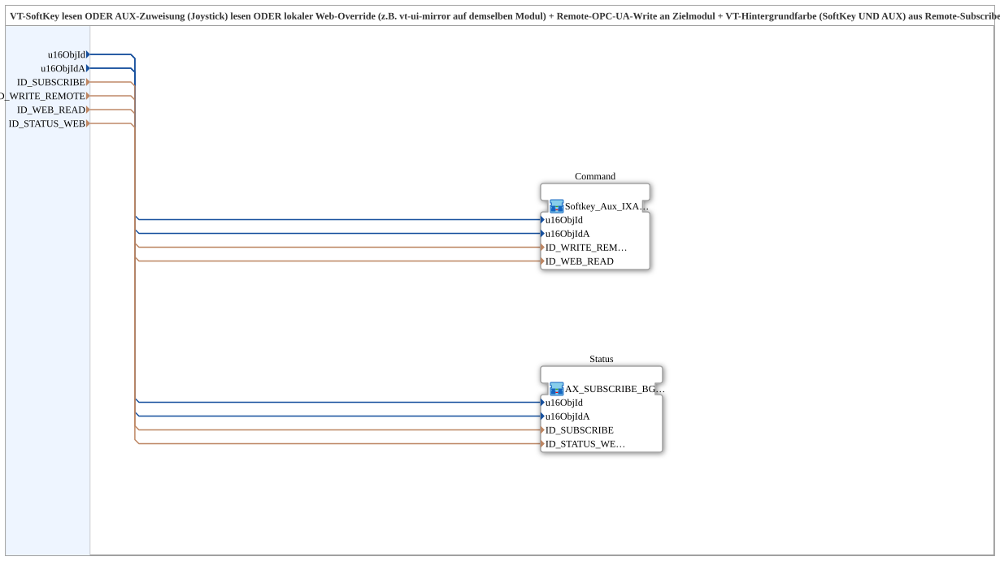

# Softkey_Aux_IXA_TO_Remote_WRITE_BG_OPC

* * * * * * * * * *

## Introduction

`Softkey_Aux_IXA_TO_Remote_WRITE_BG_OPC` reads a VT softkey OR an AUX assignment (joystick) OR a local web override and writes the result to a target module via remote OPC UA write. Additionally, the VT background color (softkey AND AUX) is set using a remote subscribe from the target module. This is intended for functions without a local physical output, where the control interface is located on one module (e.g., STG1), but the actuator is on a different module without its own VT connection.

``Softkey_Aux_IXA_TO_Remote_WRITE_BG_OPC`` reads a VT softkey OR an AUX assignment (joystick) OR a local web override and writes the result to a target module via remote OPC UA write. Since version 1.2, the function block is a thin-walled wrapper that places two independently reusable sub-blocks side by side: [`Softkey_Aux_IXA_TO_Remote_WRITE`](./Softkey_Aux_IXA_TO_Remote_WRITE.md) (command) and [`AX_SUBSCRIBE_BG3_WEB_OPC`](./AX_SUBSCRIBE_BG3_WEB_OPC.md) (status). The external interface remains unchanged.

## Function Blocks (FBs) Used

### Sub-blocks: Softkey_Aux_IXA_TO_Remote_WRITE_BG_OPC

- **Type**: SubAppType
- **Internal FBs Used**:

- **Command** (SubApp, `MyLib::sys::Softkey_Aux_IXA_TO_Remote_WRITE`): SoftKey OR Aux OR local web override → Remote write to the target module.

- **Status** (SubApp, `MyLib::sys::AX_SUBSCRIBE_BG3_WEB_OPC`): Remote Subscribe → Background color on SoftKey AND Aux + local web republish.

- **Functionality**: Both sub-components run independently; they only share the same `u16ObjId`/`u16ObjIdA` values so that the command and status display operate on the same VT object.

## Program Flow and Connections

1. `u16ObjId` → `Command.u16ObjId` and `Status.u16ObjId`; `u16ObjIdA` → `Command.u16ObjIdA` and `Status.u16ObjIdA` (data connections, hidden).

2. `ID_WRITE_REMOTE` → `Command.ID_WRITE_REMOTE`; `ID_WEB_READ` → `Command.ID_WEB_READ`.

3. `ID_SUBSCRIBE` → `Status.ID_SUBSCRIBE`; `ID_STATUS_WEB` → `Status.ID_STATUS_WEB`.

4. There is no direct connection between `Command` and `Status`—both sub-apps are completely independent and communicate only indirectly via the target module (commands write to it, status updates are subscribed to from it).

## Technical Features

- **Pure wrapper since version 1.2**: The splitting into `Command`/`Status` does not change the behavior, but allows the independent reuse of both halves (e.g., `AX_SUBSCRIBE_BG3_WEB_OPC` solely for status displays).

- **No local physical output**: The actuator is located on a separate module; this block only maps operation and status feedback to the operator module.

- **Separate local nodes for web override and web status**: `ID_WRITE_REMOTE` (write) and `ID_SUBSCRIBE` (read) both point at the remote target module and may legitimately reference the same remote node there — write and subscribe are different OPC UA operations, so this poses no feedback risk on this module. The actual feedback-loop risk lies with the two *local* nodes on this module: `ID_WEB_READ` (read by `Command` via `AX_SUBSCRIBE_1` and merged into the command OR) and `ID_STATUS_WEB` (written by `Status` via `AX_PUBLISH_1` with the state echoed back from the target module) must be different local OPC UA nodes — otherwise `Command` would read the state republished by `Status` as if it were a manual web override and write it straight back to the target module as a new command.

## Application Scenarios

- Control stations without their own physical output, where both the SoftKey and AUX joystick assignment are intended to control a remote actuator, and the control screen must additionally display its status using color.

## Comparison with Similar Modules

If only a SoftKey without AUX is required, use `Softkey_IXA_TO_Remote_WRITE_BG_OPC`. For command or status alone (without the other half), the sub-modules [`Softkey_Aux_IXA_TO_Remote_WRITE`](./Softkey_Aux_IXA_TO_Remote_WRITE.md) and [`AX_SUBSCRIBE_BG3_WEB_OPC`](./AX_SUBSCRIBE_BG3_WEB_OPC.md), respectively, can be used directly.

## Summary

`Softkey_Aux_IXA_TO_Remote_WRITE_BG_OPC` combines the command and status pages of a remote channel with softkey and auxiliary controls behind a stable, well-known interface—since version 1.2, it's a pure wrapper around two independent components.

---

### 🌐 Related topic subpages on ms-muc-docs.de

- [🌐 Eclipse 4diac IDE & color reference on ms-muc-docs.de ](https://www.ms-muc-docs.de/iec-61499/eclipse-4diac/)
