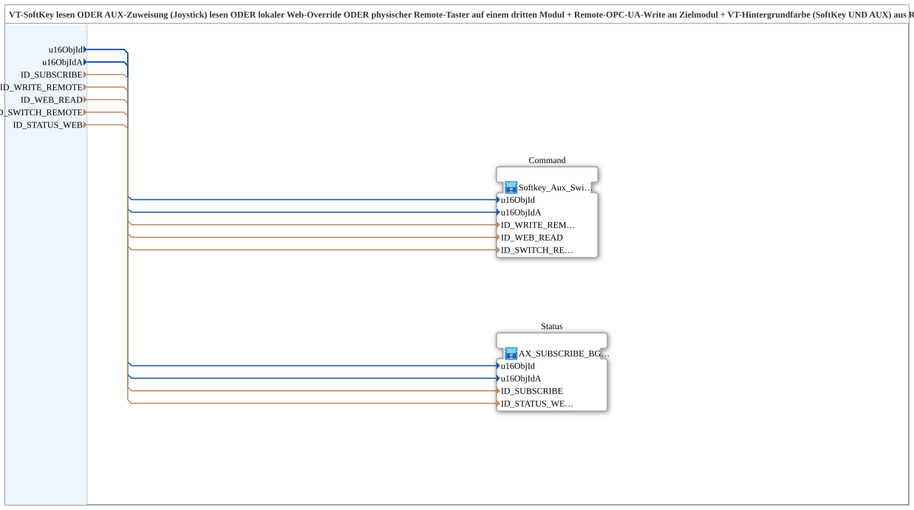

# Softkey_Aux_Switch_TO_Remote_WRITE_BG_OPC

* * * * * * * * * *

## Introduction

The **Softkey_Aux_Switch_TO_Remote_WRITE_BG_OPC** subapplication is a thin wrapper that combines two existing subapplications into a complete OPC UA remote control and status visualization solution. It reads up to four independent input sources — a VT softkey, an AUX joystick assignment, a local web override, and a physical remote button located on a third module — OR-combines them, and writes the resulting command to a target module via OPC UA. Simultaneously, it subscribes to the target module's status and updates the background color of both the softkey and AUX elements, while republishing the status locally for web clients.

This is the 4-source variant of `Softkey_Aux_IXA_TO_Remote_WRITE_BG_OPC`, intended for functions that include an additional permanently installed button on a third module, such as blade adjustment (Schnittverstellung).

## Interface Structure

The subapplication exposes seven data inputs and no event inputs, event outputs, data outputs, or adapters. Internally, it connects these inputs to two child subapplications: `Command` (type `MyLib::sys::Softkey_Aux_Switch_TO_Remote_WRITE`) and `Status` (type `MyLib::sys::AX_SUBSCRIBE_BG3_WEB_OPC`).

### **Event Inputs**

None.

### **Event Outputs**

None.

### **Data Inputs**

| Name | Type | Description |
|------|------|-------------|
| `u16ObjId` | UINT | Object ID of the SoftKey/background element on the VT. |
| `u16ObjIdA` | UINT | Object ID of the AuxFunction2/background element on the VT. |
| `ID_SUBSCRIBE` | WSTRING | Remote subscribe address for status/color data (ACTION=SUBSCRIBE). |
| `ID_WRITE_REMOTE` | WSTRING | Remote write address on the target module for command data (ACTION=WRITE, CLIENT). |
| `ID_WEB_READ` | WSTRING | Local subscribe address for a web client (e.g., vt-ui-mirror) on the same module; OR-combined with SoftKey and AUX. |
| `ID_SWITCH_REMOTE` | WSTRING | Remote subscribe address for an additional physical button on another module; OR-combined with SoftKey/AUX/Web. |
| `ID_STATUS_WEB` | WSTRING | Local publish address (on this module) for the state reported back from the target module, enabling a web client to display the same background color as the real VT. |

### **Data Outputs**

None.

### **Adapters**

None.

## Functionality

The subapplication operates in two parallel paths:

1. **Command path (Write):** The internal `Command` subapplication reads the four input sources:
   - `u16ObjId` — SoftKey state at the VT.
   - `u16ObjIdA` — AUX joystick assignment state at the VT.
   - `ID_WEB_READ` — local web override.
   - `ID_SWITCH_REMOTE` — physical button on a third module.

   These sources are OR-combined (any active source triggers the command), and the result is written to the target module via OPC UA using the address from `ID_WRITE_REMOTE`.

2. **Status path (Read):** The internal `Status` subapplication subscribes to the target module's status using `ID_SUBSCRIBE`. It updates the background color for both `u16ObjId` (SoftKey) and `u16ObjIdA` (AUX), and republishes the status locally via `ID_STATUS_WEB` so web clients can mirror the same background color.

## Technical Features

- **OPC UA Integration:** Uses ACTION=WRITE (CLIENT) for commands and ACTION=SUBSCRIBE for status updates.
- **OR Logic:** Four independent input sources are logically OR-combined, providing high flexibility in control and redundancy.
- **Status Feedback Loop:** The target module's reported state is subscribed to and used for visual feedback (background color) on both the VT and connected web clients.
- **Reusable Internal Blocks:** Composed of two well-established subapplications (`Softkey_Aux_Switch_TO_Remote_WRITE` and `AX_SUBSCRIBE_BG3_WEB_OPC`), ensuring reliability and maintainability.
- **Standard Compliance:** Implements IEC 61499-2 and is licensed under the Eclipse Public License 2.0.

## State Overview

The subapplication does not define an explicit state machine at its own level. The internal `Command` subapplication handles the OR-combination of the input sources and the remote write operation, while the internal `Status` subapplication handles subscription and background-color update logic. Both operate continuously, driven by the OPC UA communication events.

## Application Scenarios

Typical use cases include:

- **Machine tool control panels (e.g., blade adjustment):** A physical button on a third module, combined with VT softkeys, AUX joystick assignments, and web overrides, can trigger the same function on a target module.
- **Remote visualization:** Web clients (e.g., vt-ui-mirror) can display the same background color as the physical VT, providing consistent user feedback.
- **Multi-source control:** When a function must be controllable from multiple independent locations — HMI panel, joystick, web interface, and a remote hardware button.

## Comparison with Similar Blocks

| Feature | Softkey_Aux_Switch_TO_Remote_WRITE_BG_OPC (this block) | Softkey_Aux_IXA_TO_Remote_WRITE_BG_OPC (3-source variant) |
|---------|--------------------------------------------------------|-----------------------------------------------------------|
| Sources | 4 (SoftKey, AUX, Web, Remote Switch) | 3 (SoftKey, AUX, Web) |
| Remote hardware button on third module | Yes | No |
| Target module write | Yes | Yes |
| Status subscription / background color | Yes | Yes |
| Web republish | Yes | Yes |

The primary difference is the additional `ID_SWITCH_REMOTE` input, which enables the integration of a physical button located on a separate module.

## Conclusion

**Softkey_Aux_Switch_TO_Remote_WRITE_BG_OPC** is a flexible, reusable subapplication for OPC UA-based remote control with visual status feedback. By combining four independent input sources and providing both command write and status subscribe capabilities, it addresses complex control scenarios requiring input from multiple physical and virtual locations. For standard 3-source applications without an additional remote button, the 3-source variant remains the recommended choice.
