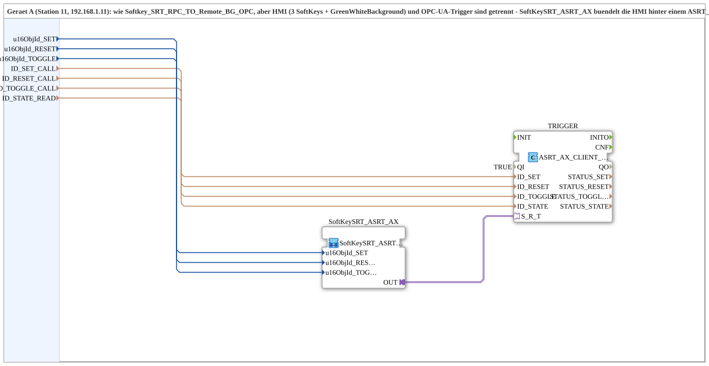

# Softkey_SRT_RPC_TO_Remote_BG_OPC_Adapter

* * * * * * * * * *
## Introduction

The **Softkey_SRT_RPC_TO_Remote_BG_OPC_Adapter** is a composite subapplication designed for distributed automation scenarios, specifically for Device A (Station 11, IP 192.168.1.11). It realizes a remote control architecture where three SoftKeys (Set, Reset, Toggle) and a GreenWhiteBackground indicator are operated via an HMI on Device A, while the actual flip‑flop logic is executed on a remote Device B.

This subapplication separates the HMI interaction from the OPC‑UA trigger mechanism: the `SoftKeySRT_ASRT_AX` subapplication bundles the HMI logic behind an ASRT_AX plug, while the `ASRT_AX_CLIENT_0_SUBSCRIBE_1` FB bundles three CLIENT_0 instances plus an AX_SUBSCRIBE_1 behind an ASRT_AX socket. The communication protocol is implemented inside the `MyLib::sys` composite, not in the device resource, following the “SUB style” architectural pattern.

## Interface Structure

### **Event Inputs**

None.

### **Event Outputs**

None.

### **Data Inputs**

| Name | Type | Initial Value | Comment |
|------|------|---------------|---------|
| `u16ObjId_SET` | UINT | `ID_NULL` | Object ID for the SoftKey Set function. |
| `u16ObjId_RESET` | UINT | `ID_NULL` | Object ID for the SoftKey Reset function. |
| `u16ObjId_TOGGLE` | UINT | `ID_NULL` | Object ID for the SoftKey Toggle function (also carries the GreenWhiteBackground state). |
| `ID_SET_CALL` | WSTRING | – | Remote method address (`ACTION=CALL_METHOD`) for the Set method call on Device B. |
| `ID_RESET_CALL` | WSTRING | – | Remote method address (`ACTION=CALL_METHOD`) for the Reset method call on Device B. |
| `ID_TOGGLE_CALL` | WSTRING | – | Remote method address (`ACTION=CALL_METHOD`) for the Toggle method call on Device B. |
| `ID_STATE_READ` | WSTRING | – | Locally monitored address (`BOOL`, `ACTION=READ`) for the flip‑flop state, written remotely by Device B. |

### **Data Outputs**

None.

### **Adapters**

The subapplication contains two internal components connected via an adapter link:

* **SoftKeySRT_ASRT_AX** (type `MyLib::sys::SoftKeySRT_ASRT_AX`) – provides the HMI/SoftKey logic and exposes a plug.
* **TRIGGER** (type `adapter::net::ASRT_AX_CLIENT_0_SUBSCRIBE_1`) – provides the OPC‑UA client/subscription functionality and exposes a socket.

The adapter connection is established between `SoftKeySRT_ASRT_AX.OUT` (plug) and `TRIGGER.S_R_T` (socket).

## Functionality

The subapplication implements a remote SoftKey control loop with the following data flows:

1. **HMI Signal Acquisition** – The three SoftKey object IDs (`u16ObjId_SET`, `u16ObjId_RESET`, `u16ObjId_TOGGLE`) are forwarded to the `SoftKeySRT_ASRT_AX` subapplication, which interprets HMI input and maintains the GreenWhiteBackground state.
2. **Remote Method Invocation** – The remote method addresses (`ID_SET_CALL`, `ID_RESET_CALL`, `ID_TOGGLE_CALL`) are passed to the `TRIGGER` FB. This FB uses OPC‑UA `CALL_METHOD` actions to invoke the corresponding methods on Device B.
3. **State Monitoring** – The `ID_STATE_READ` address is monitored via an OPC‑UA `READ` action to obtain the flip‑flop state, which is written remotely by Device B.
4. **Adapter Coupling** – The `SoftKeySRT_ASRT_AX` output is connected to the `TRIGGER` socket through an ASRT_AX adapter, decoupling the HMI logic from the OPC‑UA transport details.

## Technical Features

* **Modular architecture** – Separation of HMI handling (SoftKeySRT_ASRT_AX) and OPC‑UA communication (TRIGGER) improves reusability and testability.
* **Protocol encapsulation** – The communication protocol resides within the `MyLib::sys` composite library, not in the device resource, enabling easier maintenance and versioning.
* **Parameterized addresses** – All remote end‑points are configured via WSTRING inputs, allowing flexible deployment without modifying the internal network.
* **Initialization support** – Object IDs are initialized to `ID_NULL` (imported from `isobus::UT::Q::const::IDs`), ensuring a well‑defined startup state.
* **Explicit trigger configuration** – The `TRIGGER` FB has `QI` parameter set to `TRUE`, enabling the OPC‑UA subscription client immediately upon activation.

## State Overview

The subapplication itself does not maintain an explicit state machine; the state logic is contained in the embedded `SoftKeySRT_ASRT_AX` subapplication. The overall system reflects three operational states:

* **Idle** – No SoftKey pressed, flip‑flop state unknown/initial.
* **Set / Reset** – Corresponding remote method called on Device B, state updated via `ID_STATE_READ`.
* **Toggle** – Remote toggle method executed; the GreenWhiteBackground indicator reflects the new flip‑flop state.

The flip‑flop state is continuously readable via the locally monitored `ID_STATE_READ` address.

## Application Scenarios

This subapplication is suited for:

* **Distributed HMI panels** – Controlling remote actuators or logic from a central operator station.
* **OPC‑UA based machine control** – When the actual SoftKey logic resides on a different device than the HMI.
* **Reusable SoftKey libraries** – Where the same HMI pattern is applied to multiple remote targets by changing the object IDs and method addresses.
* **Complex automation cells** – Such as station‑based production lines where station 11 (Device A) supervises station functions on Device B.

## Comparison with Similar Blocks

Compared to the simpler `Softkey_SRT_RPC_TO_Remote_BG_OPC` (where HMI and OPC‑UA trigger are combined), this adapter variant:

* **Separates concerns** – HMI processing and OPC‑UA subscription are individually replaceable.
* **Reduces resource footprint** – Bundles three CLIENT_0 instances and one AX_SUBSCRIBE_1 into a single ASRT_AX socket, simplifying wiring.
* **Improves maintainability** – The protocol logic lives in the `MyLib::sys` composite, making it easier to update without touching device resources.
* **Enables plug‑and‑play** – The ASRT_AX adapter pattern allows rapid exchange of either the HMI or the communication layer.

## Conclusion

The `Softkey_SRT_RPC_TO_Remote_BG_OPC_Adapter` is a well‑structured subapplication that cleanly separates HMI SoftKey handling from OPC‑UA based remote method invocation and state monitoring. By leveraging adapter‑based design and encapsulating the protocol in a library composite, it provides a flexible, scalable, and maintainable solution for distributed automation scenarios. Its parameterized interface makes it adaptable to various object IDs and remote addresses without code changes, significantly reducing engineering effort in multi‑station systems.