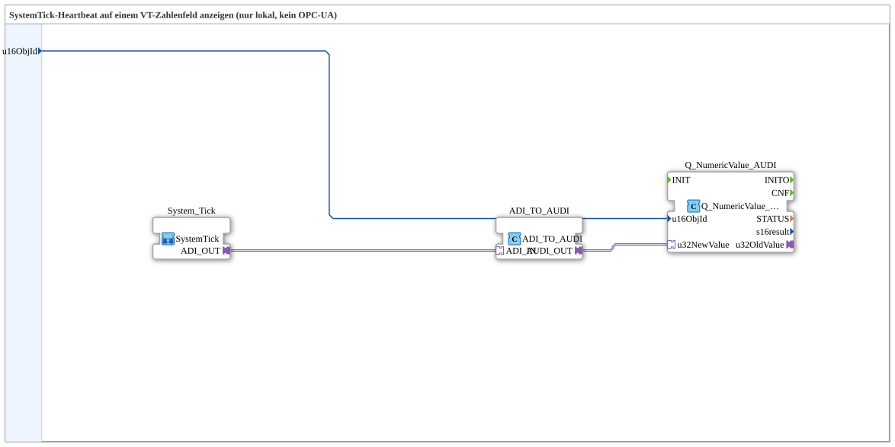

# SystemTickSender_ISO

* * * * * * * * * *

## Introduction

`SystemTickSender_ISO` displays the heartbeat locally on a VT numeric output field, without OPC UA. The running tick counter is written directly to a VT numeric field, so it's immediately clear on the screen whether the controller is still active (the value must change every 200 ms).

## Function Blocks (FBs) Used

### Sub-Blocks: SystemTickSender_ISO

- **Type**: SubAppType
- **Internal FBs Used**:

- **System_Tick** (SubApp, `MyLib::sys`): returns the counter reading as a `ADI` adapter (DINT).

- **ADI_TO_AUDI**: `adapter::conversion::unidirectional::ADI_TO_AUDI` — converts the DINT value to `AUDI` (UDINT) because `Q_NumericValue_AUDI` expects an unsigned value.

- **Q_NumericValue_AUDI**: `isobus::UT::Q::Q_NumericValue_AUDI` — VT command "Change numeric value" (Part 6 – F.22), writes the value to the numeric output field `u16ObjId`.

- **Functionality**: `System_Tick` returns the counter value, `ADI_TO_AUDI` converts it to the data type expected by `Q_NumericValue_AUDI`.

## Program Flow and Connections

1. `u16ObjId` → `Q_NumericValue_AUDI.u16ObjId` (data connection, hidden).

2. `System_Tick.ADI_OUT` → `ADI_TO_AUDI.ADI_IN` → `ADI_TO_AUDI.AUDI_OUT` → `Q_NumericValue_AUDI.u32NewValue`.

## Technical Features

- **Purely local, no OPC UA**: Unlike `SystemTickSender_ISO_OPC`, this module does not have a `ADI_PUBLISH_1` adapter.

## Application Scenarios

- Modules with their own VT connection that only need to make the heartbeat visible locally, without remote monitoring.

## Comparison with Similar Modules

For additional remote distribution, use `SystemTickSender_ISO_OPC` or ](./SystemTickSender_ISO_OPC.md). For a module without its own VT connection (OPC UA only) [`SystemTickSender_OPC`](./SystemTickSender_OPC.md)]. Compared to [`SystemTickSender`](./SystemTickSender.md) (VT + OPC UA, older example with `ADI_SPLIT_2`), this module is the pure VT-only variant without split/publish functionality.

## Summary

`SystemTickSender_ISO` displays the system tick heartbeat exclusively on a local VT numeric field—the most streamlined option for modules with their own VT connection without remote monitoring.

---

### 🌐 Related topic subpages on ms-muc-docs.de

- [🌐 Eclipse 4diac IDE & Color Reference on ms-muc-docs.de](https://www.ms-muc-docs.de/iec-61499/eclipse-4diac/)
