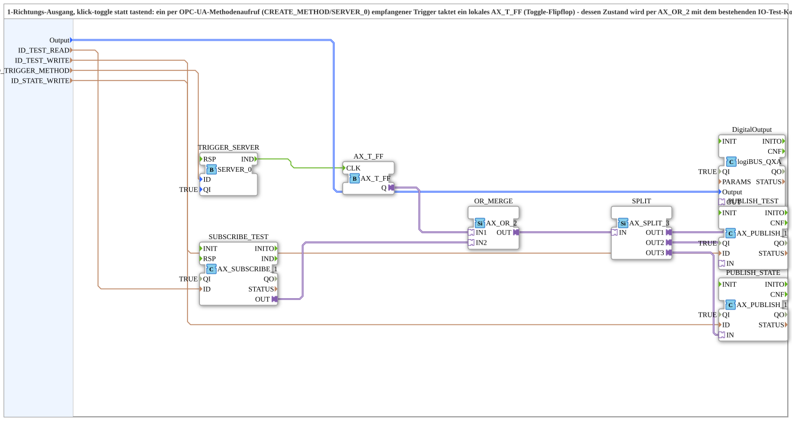

# TOGGLE_RPC_MERGE_QXA_OPC

* * * * * * * * * *

## Introduction

TOGGLE_RPC_MERGE_QXA_OPC is a composite subapplication designed for single‑action (click‑toggle) output control. It combines an RPC‑based trigger with an existing IO‑test command to drive a physical binary output. The RPC trigger is received via OPC‑UA method calls (CREATE_METHOD/SERVER_0) and toggles a local flip‑flop. The resulting state is merged with the standard IO‑test signal and then split to provide both a physical output and two separate feedback channels – one for IO diagnostics and one for the actual functional state (e.g., for background colour indication on a softkey). The design ensures full consistency with the project’s other similar blocks, avoiding self‑latch by using distinct publish nodes for commands and feedback.

## Interface Structure

The subapplication exposes only data inputs – no event interface or adapters are present at the subapp level. All event and adapter connections are internal.

### **Event Inputs**

None.

### **Event Outputs**

None.

### **Data Inputs**

| Name | Type | Description |
|------|------|-------------|
| `Output` | `logiBUS::io::DQ::logiBUS_DO_S` | Physical output value to be applied (initialized to `logiBUS_DO::Invalid`). Internal connection to the physical output FB. |
| `ID_TEST_READ` | `WSTRING` | Subscription address for the existing IO‑test command (e.g., `STG5_Q0x_READ`). |
| `ID_TEST_WRITE` | `WSTRING` | Publish address for the IO‑test feedback. Must be a separate node from `ID_TEST_READ` to avoid self‑feedback/latch. |
| `ID_TRIGGER_METHOD` | `WSTRING` | Local method address (ACTION=CREATE_METHOD) for the argumentless toggle trigger, invoked by the operation panel via CALL_METHOD. |
| `ID_STATE_WRITE` | `WSTRING` | Local publish address (ACTION=WRITE) for the actual toggle state – subscribed remotely by the operation panel (e.g., for GreenWhiteBackground). |

### **Data Outputs**

None – the subapplication does not expose output data variables; all results are delivered through the internal OPC‑UA publish mechanisms.

### **Adapters**

None at the subapp interface. Internally, the following adapters/FBs are used:

- `TRIGGER_SERVER` (iec61499::net::SERVER_0) – receives the RPC method call.
- `AX_T_FF` (adapter::events::unidirectional::AX_T_FF) – toggle flip‑flop.
- `SUBSCRIBE_TEST` (adapter::net::AX_SUBSCRIBE_1) – subscribes to the IO‑test command.
- `OR_MERGE` (adapter::booleanOperators::AX_OR_2) – merges flip‑flop state and IO‑test signal.
- `SPLIT` (adapter::events::unidirectional::AX_SPLIT_3) – distributes the merged result.
- `DigitalOutput` (logiBUS::io::DQ::logiBUS_QXA) – physical output.
- `PUBLISH_TEST` (adapter::net::AX_PUBLISH_1) – publishes feedback to IO‑test node.
- `PUBLISH_STATE` (adapter::net::AX_PUBLISH_1) – publishes the functional state to the dedicated feedback node.

## Functionality

The subapplication implements a **click‑toggle** behaviour:  

- A single press of a softkey (or any RPC client) issues an **argument‑free method call** on the `ID_TRIGGER_METHOD` node.  
- `TRIGGER_SERVER` receives this call and its `IND` event toggles the `AX_T_FF` flip‑flop (`CLK` input).  
- The flip‑flop output (`Q`) is combined via `OR_MERGE` with the signal coming from the IO‑test subscription (`SUBSCRIBE_TEST`). This way the IO‑test command can still force the output regardless of the toggle state.  
- The combined result is passed to `SPLIT`, which feeds three destinations:
  1. `DigitalOutput` – drives the physical logiBUS channel.
  2. `PUBLISH_TEST` – writes to the IO‑test feedback node (address from `ID_TEST_WRITE`).
  3. `PUBLISH_STATE` – writes to the functional feedback node (address from `ID_STATE_WRITE`).

The use of **separate write nodes** for feedback avoids the self‑latch problem that would occur if the same OPC‑UA node were used for both command and feedback. The toggle state is **not actively written back** to the panel via a client; instead, it is locally published and remotely subscribed – a pattern consistent with all other functions in the project.

## Technical Features

- **RPC Trigger without Polling**: The trigger is delivered as a method call (`CREATE_METHOD`/`SERVER_0`), eliminating any value‑change tricks or polling overhead.
- **Toggle Flip‑Flop**: The `AX_T_FF` changes its output on each rising edge of the input event, providing a bistable state.
- **Merging with IO‑Test**: The `AX_OR_2` ensures that the IO‑test command can override the toggle state, keeping the diagnostic capability intact.
- **Deterministic Feedback**: Two separate publish adapters (`PUBLISH_TEST` and `PUBLISH_STATE`) guarantee that IO diagnostics and functional state are reported independently.
- **No Active Client‑Write**: The feedback is published locally and subscribed remotely, consistent with the project’s distributed architecture (e.g., softkey background updates).
- **Unique Publish Nodes**: `ID_TEST_WRITE` and `ID_STATE_WRITE` must be distinct from each other and from the corresponding command nodes to prevent feedback loops.

## State Overview

The internal `AX_T_FF` flip‑flop maintains a single Boolean state (`Q`). This state toggles on every `CLK` pulse, which is generated by the RPC method call. The flip‑flop is **not** reset by any external signal; it only changes when a new trigger arrives. The output of the OR gate follows either the flip‑flop state or the IO‑test signal, whichever is currently TRUE. Since the IO‑test signal is typically FALSE during normal operation, the output normally mirrors the flip‑flop state.

## Application Scenarios

- **Flash Light Control**: A single press turns the light ON, another press turns it OFF – no need to hold the button.
- **Any Toggle‑Type Output**: Suitable for functions where a momentary switch action must produce a sustained state (e.g., latching relays, mode toggles).
- **Integration with IO‑Testing**: The block preserves the ability to force the output via the IO‑test system without interfering with the toggle logic.
- **Softkey Interaction**: The functional state is made available to the operation panel via a dedicated publish node, enabling dynamic visual feedback (e.g., green/white background) as seen in other project functions.

## Comparison with Similar Blocks

- **MERGE_SWITCH_1_QXA_OPC**: Uses a level‑based subscription (value change) as the command source instead of an RPC trigger. TOGGLE_RPC_MERGE_QXA_OPC additionally toggles the state via a flip‑flop, making it a true click‑toggle rather than a momentary switch.
- **ILOCK_SWITCH_2_QXA_OPC**: Also follows the pattern of separate feedback nodes, but its command source is different. TOGGLE_RPC_MERGE_QXA_OPC adds the toggle functionality while maintaining the same robust feedback architecture.
- **Toggle_RPC_FROM_Remote_QXA_OPC (original exercise)**: The original actively wrote back to the panel via a client. This block instead publishes locally and subscribes remotely, which is more consistent with the project’s distributed design and avoids unnecessary OPC‑UA client writes.

## Conclusion

TOGGLE_RPC_MERGE_QXA_OPC provides a clean, reusable solution for click‑toggle outputs in a distributed automation environment. By combining an RPC‑based trigger with a local flip‑flop, merging it with the IO‑test command, and publishing separate feedback channels, it achieves reliable operation without feedback loops. Its design is fully aligned with the project’s established patterns, making it ideal for functions that require a single press to toggle a binary state.
