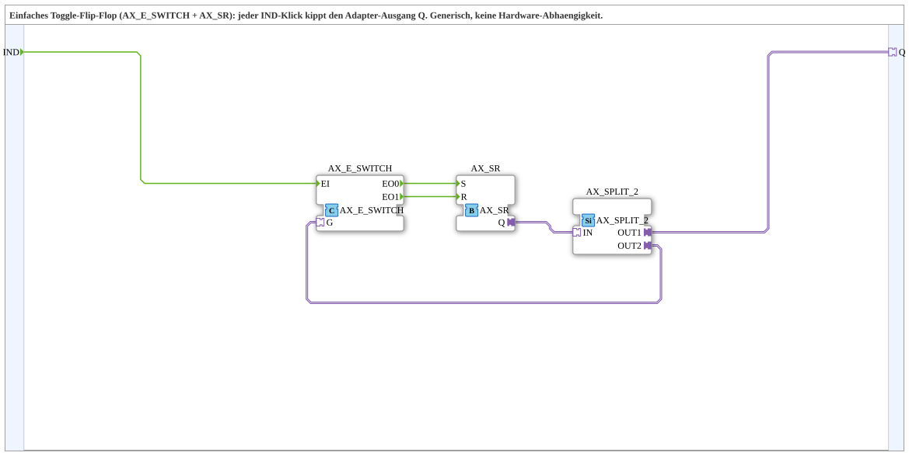

# T_FF_EVENT_AX

* * * * * * * * * *

## Introduction

T_FF_EVENT_AX is a generic toggle flip-flop (T-FF) subapplication that implements a toggling latch behavior based on an event-driven input and an adapter-based output. Every incoming `IND` event toggles the logical state of the output adapter `Q`. The subapplication is built entirely from standard event adapter blocks (`AX_E_SWITCH`, `AX_SR`, `AX_SPLIT_2`) and is completely hardware-independent.

## Interface Structure

### **Event Inputs**

| Name | Type  | Comment                          |
|------|-------|----------------------------------|
| IND  | Event | Event input (Clock / Click) – triggers the toggling |

### **Event Outputs**

None.

### **Data Inputs**

None.

### **Data Outputs**

None.

### **Adapters**

| Name | Type                               | Direction       | Comment                        |
|------|------------------------------------|-----------------|--------------------------------|
| Q    | `adapter::types::unidirectional::AX` | Output (Plug)   | Adapter output holding the current toggled state |

## Functionality

The subapplication implements a classic toggle (T) flip-flop behavior entirely through event and adapter connections:

1. An `IND` event triggers the internal `AX_E_SWITCH` block.
2. `AX_E_SWITCH` evaluates its gating input `G` and activates exactly one of its two event outputs:
   - `EO0` if the gate is inactive (state `FALSE`),
   - `EO1` if the gate is active (state `TRUE`).
3. If `EO0` fires, the internal `AX_SR` is **Set** (`Q` becomes `TRUE`).  
   If `EO1` fires, the internal `AX_SR` is **Reset** (`Q` becomes `FALSE`).
4. The current state from `AX_SR.Q` is passed to `AX_SPLIT_2`.
5. `AX_SPLIT_2.OUT1` drives the external adapter output `Q`; `AX_SPLIT_2.OUT2` is fed back to the gating input `G` of `AX_E_SWITCH`.
6. This feedback loop ensures that on the next `IND` event the gate has switched state, so the opposite branch is triggered – producing the alternating toggle effect.

## Technical Features

- **Pure event-driven design**: no cyclic data scanning, no level-triggered polling.
- **Generic adapter interface**: no hardware-specific dependencies, fully reusable in distributed IEC 61499 systems.
- Built from three reusable adapter-pattern blocks:
  - `AX_E_SWITCH` – gated event router with two complementary outputs.
  - `AX_SR` – Set/Reset flip-flop that stores the state.
  - `AX_SPLIT_2` – fan-out adapter splitting the state signal to the external plug and the internal feedback path.
- **Internal feedback loop** provides the memory/toggling effect without additional logic.
- Implemented as a subapplication, encapsulating the logic for easy reuse and readability.

## State Overview

| State   | Description                                                                                 |
|---------|---------------------------------------------------------------------------------------------|
| Q = FALSE | Internal `AX_SR` is Reset. On the next `IND` event, `EO0` fires and `Q` becomes `TRUE`.      |
| Q = TRUE  | Internal `AX_SR` is Set. On the next `IND` event, `EO1` fires and `Q` becomes `FALSE`.       |

The system alternates between these two states on every `IND` event, regardless of the duration or timing of the input pulse.

## Application Scenarios

- **Push-button toggles**: e.g., start/stop of a motor, light ON/OFF control in HMI panels.
- **Mode switching**: toggling between two operating modes in a control application.
- **Edge-triggered state toggling**: event-driven state changes in distributed automation systems.
- **Generic event-based logic**: wherever a single event should invert a Boolean/state output, without requiring a level-based data input.

## Comparison with Similar Blocks

| Block           | Behavior                                                                                |
|-----------------|-----------------------------------------------------------------------------------------|
| `AX_SR`         | Level-triggered Set/Reset – the output depends on which input (S or R) was activated last, not on toggling. |
| D flip-flop     | Copies the data input on a clock edge, does not toggle.                                 |
| Hardware T-FF   | Toggles on a clock edge – similar behavior, but uses binary level inputs/outputs.       |
| `T_FF_EVENT_AX` | Event-driven toggle flip-flop with an AX adapter output – toggles on every `IND` event, hardware-independent. |

The main distinction of `T_FF_EVENT_AX` is its **event-driven nature** and **adapter-type interface**, making it ideal for IEC 61499 event-based processing rather than cyclic scanning.

## Conclusion

`T_FF_EVENT_AX` is a compact, reusable, and generic subapplication implementing a toggle flip-flop with a purely event-driven design. Its adapter-based output and internal feedback loop make it a flexible building block for IEC 61499 applications where state toggling on a single event is required. Since it relies only on standard event adapters and no hardware-specific resources, it can be deployed across different platforms and runtime environments without modification.
