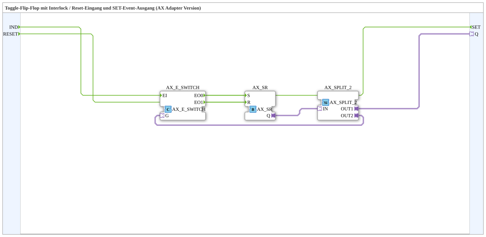

# T_FF_ILOCK_EVENT_AX

* * * * * * * * * *
## Introduction

**T_FF_ILOCK_EVENT_AX** is a subapplication-based function block that implements a **Toggle Flip-Flop with Interlock** functionality. It provides a clock/toggle input (`IND`), an unconditional reset input (`RESET`), a state output via an AX adapter (`Q`), and a dedicated `SET` event output that is used to coordinate interlocking with a partner block.

This component is realized entirely with event-driven adapter connections (unidirectional AX type), making it suitable for modular and distributed control applications where event-based data exchange between function blocks is preferred over cyclic data transmission. The block is primarily designed for scenarios where **mutual exclusion** between two devices must be guaranteed — for example, two actuators that may never be active at the same time.

## Interface Structure

### **Event Inputs**

| Name   | Description                                        |
|--------|----------------------------------------------------|
| `IND`  | Event input acting as clock / toggle trigger. Each event toggles the state. |
| `RESET`| External reset input. Forces the output `Q` to inactive (OFF) unconditionally. |

### **Event Outputs**

| Name | Description                                                  |
|------|--------------------------------------------------------------|
| `SET`| Fired when the block switches from OFF to ON. Used to reset the interlock partner. |

### **Data Inputs**

No data inputs are used. The block is purely event-driven.

### **Data Outputs**

No data outputs are used. The current state is provided through the `Q` adapter plug.

### **Adapters**

| Name | Type                                        | Description                         |
|------|---------------------------------------------|-------------------------------------|
| `Q`  | `adapter::types::unidirectional::AX`        | Output adapter carrying the current state (ON / OFF) of the flip-flop. |

## Functionality

The subapplication contains three internal function blocks that are connected to realize the toggle-with-interlock behavior:

- **`AX_E_SWITCH`** — routes the incoming `IND` event depending on the gate signal `G`.
- **`AX_SR`** — a Set/Reset flip-flop that stores the actual state.
- **`AX_SPLIT_2`** — duplicates the state signal for the external output and the feedback path.

**Internal event flow:**

1. When an event arrives at `IND`, it is forwarded to the `EI` input of `AX_E_SWITCH`.
2. The `AX_E_SWITCH` block evaluates the gate adapter `G`, which receives the current state `Q` via the feedback loop:
   - **If `Q` is inactive (OFF):** the event is routed to output `EO0`.
     - `EO0` triggers the **Set** input of `AX_SR`, driving the state to ON.
     - Simultaneously, the **`SET`** event output is fired, signalling the interlock partner that this block has been activated.
   - **If `Q` is active (ON):** the event is routed to output `EO1`.
     - `EO1` triggers the **Reset** input of `AX_SR`, driving the state back to OFF.
3. The `AX_SR` block maintains the current state; its adapter output `Q` is fed into `AX_SPLIT_2`.
4. `AX_SPLIT_2` duplicates the state:
   - **`OUT1`** is connected to the external `Q` adapter plug of the subapplication.
   - **`OUT2`** is fed back to the gate `G` of `AX_E_SWITCH`, closing the control loop.

The external `RESET` event is connected directly to the **Reset** input of the `AX_SR` flip-flop, forcing the state to OFF at any time — regardless of the current state.

## Technical Features

- **Pure event-driven design:** No data inputs or outputs; all state exchange uses AX adapter types.
- **Unidirectional AX adapters:** All internal and external adapter connections are of the unidirectional AX type, providing a lightweight and defined data flow direction.
- **State-dependent event routing:** The `AX_E_SWITCH` uses the feedback of the output state to decide whether an `IND` event turns the flip-flop ON or OFF.
- **Interlock support:** A dedicated `SET` event output is fired on every OFF→ON transition, allowing a partner block to be reset. This ensures that two mutually exclusive devices cannot be activated simultaneously.
- **Unconditional reset:** The `RESET` event bypasses any state evaluation and forces the output to OFF.
- **Low resource footprint:** The implementation uses only three internal function blocks and requires no internal variables or state machines from the user's perspective.

## State Overview

The following table summarizes the behavior of the flip-flop:

| Current State (`Q`) | Input Event   | Next State (`Q`) | `SET` Output fired? |
|---------------------|---------------|------------------|----------------------|
| OFF                 | `IND`         | ON               | **Yes**              |
| ON                  | `IND`         | OFF              | No                   |
| OFF or ON           | `RESET`       | OFF              | No                   |

This state diagram shows a classic toggle operation with the added interlock pulse on the rising edge (OFF→ON).

## Application Scenarios

- **Interlocked actuators:** Two motors, valves, or conveyors sharing a common output station where only one may run at a time. Pressing the start button on one unit activates it and automatically resets the other via the `SET` event.
- **Mutual exclusion for control panels:** Two push-buttons for alternative operating modes; the active mode is toggled and the partner mode is locked out.
- **Alternating control with safety interlock:** In production lines where two stations work alternately, this block ensures that a handover of the active state occurs cleanly and without overlap.
- **Event-driven distributed systems:** Because the block uses AX adapters, it can be embedded in systems where separate applications communicate via adapter sockets and plugs.

## Comparison with Similar Blocks

| Block / Approach                        | Difference                                                                                     |
|-----------------------------------------|------------------------------------------------------------------------------------------------|
| Standard T_FF (toggle)                  | Provides only a simple toggle output without interlock coordination or reset event capability. |
| SR flip-flop                            | Is level/event driven by Set and Reset inputs but does not toggle on a single clock and cannot signal an interlock partner. |
| E_SWITCH based latch                    | A latch can hold a state but lacks the automatic toggle behavior and the `SET` synchronisation output. |
| Counter / step chain                    | Counters provide numeric step sequences but are not intended for simple two-state interlocking. |

The key advantage of `T_FF_ILOCK_EVENT_AX` is the combination of toggle functionality, unconditional reset, and the interlock `SET` output in a single compact event-driven component.

## Conclusion

`T_FF_ILOCK_EVENT_AX` is a compact, event-driven subapplication that implements a toggle flip-flop with interlock capabilities. Its internal architecture uses adapter-based event switching and a set/reset flip-flop with feedback, resulting in a reliable mutual-exclusion mechanism for control applications. The dedicated `SET` event output and the reset input make it especially suitable for systems where two or more participants must never be active at the same time. Because it is implemented entirely with AX adapters and events, it integrates cleanly into modern distributed control platforms such as Eclipse 4diac.