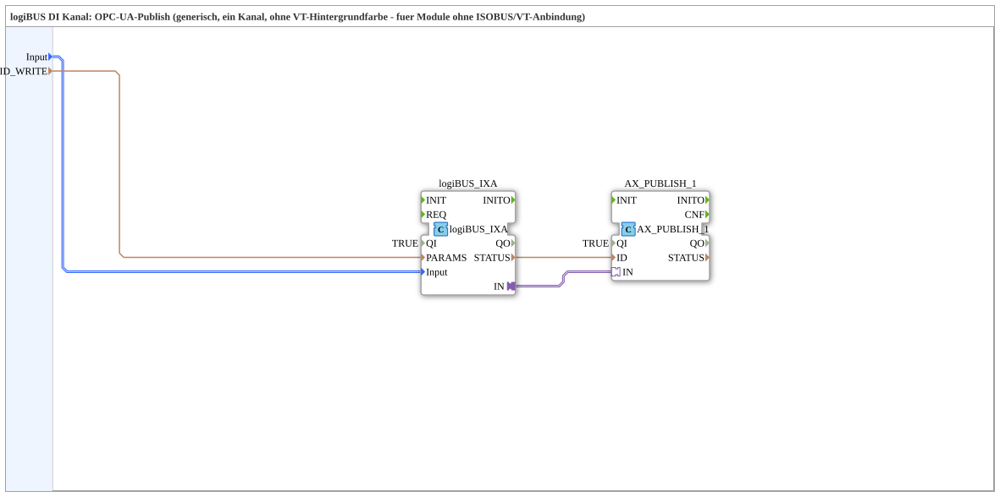

# logiBUS_IXA_OPC

* * * * * * * * * *
## Introduction
The logiBUS_IXA_OPC subapplication provides a generic single-channel logiBUS digital input (DI) monitoring solution with built-in OPC-UA publish capability. It is designed for modules that do not require ISOBUS/VT integration, as it omits VT background color handling. The subapp combines the logiBUS_IXA function block for digital input processing with the AX_PUBLISH_1 adapter for publishing input states to an OPC-UA server.

## Interface Structure
The subapplication exposes two data inputs and no event or output interfaces. All data processing and publishing logic is encapsulated internally within the subapp network.

### **Event Inputs**
None.

### **Event Outputs**
None.

### **Data Inputs**
| Name | Type | Initial Value | Comment |
|------|------|---------------|---------|
| Input | logiBUS::io::DI::logiBUS_DI_S | logiBUS_DI::Invalid | Identifies the logiBUS digital input channel (Input_I1..I8) |
| ID_WRITE | WSTRING | — | OPC-UA publish key (readable) |

### **Data Outputs**
None. The digital input state is published externally via the OPC-UA mechanism rather than through direct output variables.

### **Adapters**
No adapters are exposed on the subapplication interface. Internally, the adapter connection between logiBUS_IXA.IN and AX_PUBLISH_1.IN transfers the processed digital input data to the publisher adapter.

## Functionality
The subapplication accepts a selected logiBUS digital input channel (specified via the Input variable of type logiBUS_DI_S, allowing selection from Input_I1 through Input_I8) and routes it to the internal logiBUS_IXA function block. This block processes the raw digital input data. The processed result is then passed via an internal adapter connection to the AX_PUBLISH_1 adapter, which publishes the data to an OPC-UA server. The ID_WRITE parameter supplies a readable publish key used by the OPC-UA publisher to identify the published data item.

## Technical Features
- Single-channel logiBUS digital input handling with support for Input_I1 to Input_I8.
- OPC-UA publish functionality through the internal AX_PUBLISH_1 adapter.
- Generic design for modules without ISOBUS/VT connectivity (no VT background color handling).
- Configurable OPC-UA publish key via the WSTRING ID_WRITE parameter.
- Initial input state set to logiBUS_DI::Invalid, ensuring undefined states are explicitly handled.
- Internal enable signal (QI) set to TRUE on both the logiBUS_IXA and AX_PUBLISH_1 blocks, ensuring continuous operation.

## State Overview
The subapplication does not define explicit state machines of its own. Its behavior is determined by the internal logiBUS_IXA function block, which manages the digital input processing states. The initial state of the Input variable is logiBUS_DI::Invalid, representing an undefined or unselected input channel until a valid channel is configured.

## Application Scenarios
- Industrial automation environments where logiBUS digital input states need to be monitored and forwarded to OPC-UA-based SCADA or MES systems.
- Modular systems that lack ISOBUS/VT connectivity but require OPC-UA data publishing for remote supervision.
- Generic single-channel DI monitoring applications where a readable OPC-UA key is needed for data identification.
- Retrofit or extension scenarios where existing logiBUS DI inputs are integrated into OPC-UA-based supervisory layers.

## Comparison with Similar Blocks
Compared to other logiBUS DI subapplications, this block distinguishes itself through its OPC-UA publishing focus. While blocks like logiBUS_DI or logiBUS_DI_S provide raw digital input handling, logiBUS_IXA_OPC adds the AX_PUBLISH_1 adapter for direct OPC-UA publication. Unlike subapplications that include ISOBUS/VT integration, this block deliberately omits VT background color handling, making it lighter and more suitable for non-VT modules. It also differs from multi-channel variants by supporting a single channel, simplifying configuration for one-input scenarios.

## Conclusion
The logiBUS_IXA_OPC subapplication offers a compact, generic solution for publishing a single logiBUS digital input channel to an OPC-UA server. By combining the logiBUS_IXA processing block with the AX_PUBLISH_1 publisher adapter, it delivers a complete publish path in a single subapp. Its lack of ISOBUS/VT dependencies and its configurable publish key make it well suited for straightforward automation scenarios where OPC-UA connectivity of DI states is required.