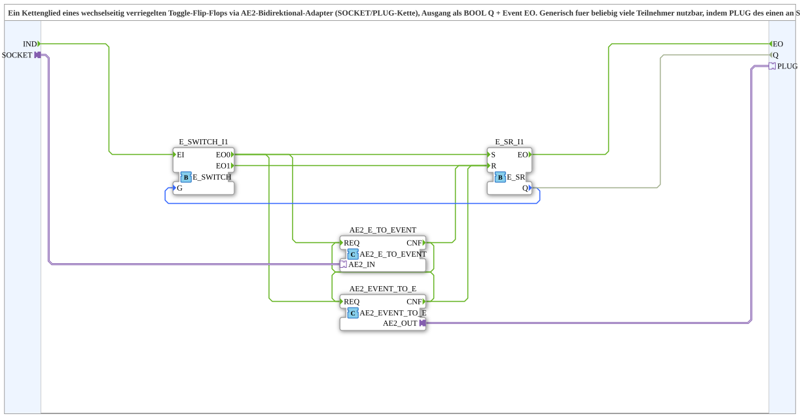

# AE2_ILOCK_T_FF_TO_BOOL_EVENT

* * * * * * * * * *
## Introduction

`AE2_ILOCK_T_FF_TO_BOOL_EVENT` is a reusable IEC 61499 subapplication that implements one link of a mutually interlocked toggle flip-flop chain. It uses an AE2 bidirectional adapter interface with a `SOCKET`/`PLUG` chain topology and provides the current state as a Boolean output `Q` together with a confirmation event `EO`.

The block is designed as a chain element: several instances can be connected by linking the `PLUG` of one element to the `SOCKET` of the next element. This makes the interlock logic scalable for an arbitrary number of participants.

* * * * * * * * * *
## Interface Structure

The subapplication has one event input, one event output, one Boolean data output, and two bidirectional adapter interfaces.

### **Event Inputs**

| Name  | Type    | Description                                              |
|-------|---------|----------------------------------------------------------|
| `IND` | `Event` | Trigger input used to toggle the local flip-flop state. |

### **Event Outputs**

| Name | Type    | Description                                                            |
|------|---------|------------------------------------------------------------------------|
| `EO` | `Event` | Emitted when the local `E_SR` flip-flop has been updated and `Q` has changed. |

### **Data Inputs**

None.

### **Data Outputs**

| Name | Type   | Description                                     |
|------|--------|-------------------------------------------------|
| `Q`  | `BOOL` | Current state of the local toggle flip-flop.    |

### **Adapters**

| Name     | Type                               | Description                                                                 |
|----------|------------------------------------|-----------------------------------------------------------------------------|
| `SOCKET` | `adapter::types::bidirectional::AE2` | Bidirectional adapter connection to the previous element in the chain.      |
| `PLUG`   | `adapter::types::bidirectional::AE2` | Bidirectional adapter connection to the next element in the chain.          |

* * * * * * * * * *
## Functionality

The subapplication behaves as one interlock-capable toggle flip-flop inside a chain of identical elements.

When an event arrives at `IND`, the event is routed by the internal `E_SWITCH` according to the current value of `Q`:

- If `Q = FALSE`, the event is routed to the set branch of the internal `E_SR`. The internal state is set, so `Q` becomes `TRUE`.
- If `Q = TRUE`, the event is routed to the reset branch of the internal `E_SR`. The internal state is reset, so `Q` becomes `FALSE`.

In both cases, the internal `E_SR` issues its output event, which is propagated to the subapplication output `EO`.

The AE2 adapter part is responsible for the mutual interlock. The internal conversion FBs `AE2_EVENT_TO_E` and `AE2_E_TO_EVENT` exchange interlock events through `SOCKET` and `PLUG`. When a participant becomes active, the interlock event is sent into the chain. The event can be forwarded through neighboring elements, preventing conflicting active states in other participants.

The overall result is a decentralized, chainable interlocked toggle flip-flop that can be extended simply by adding more subapplication instances and connecting `PLUG` to `SOCKET`.

* * * * * * * * * *
## Technical Features

- Standard-compliant IEC 61499 subapplication type.
- Uses standard event FBs `E_SR` and `E_SWITCH` for state storage and event routing.
- Bidirectional AE2 adapter interface supports chain-based communication.
- No explicit data inputs are required; the only external data output is the Boolean state `Q`.
- The application logic is isolated from the adapter protocol by the conversion FBs `AE2_EVENT_TO_E` and `AE2_E_TO_EVENT`.
- The `SOCKET`/`PLUG` topology allows an arbitrary number of chain participants.
- A sister block `AE2_ILOCK_T_FF_TO_AX` exists with an AX adapter output instead of `BOOL` + `Event`.

* * * * * * * * * *
## State Overview

The internal behavior can be described by the two states of the stored flip-flop:

| State    | Meaning                      | Behavior on `IND`                                                        |
|----------|------------------------------|--------------------------------------------------------------------------|
| `Q = FALSE` | Participant is inactive/reset. | The set branch is activated, `Q` becomes `TRUE`, and the interlock event is sent through the adapter chain. |
| `Q = TRUE`  | Participant is active/set.   | The reset branch is activated, `Q` becomes `FALSE`, and the confirmation event `EO` is emitted. |

Additionally, interlock signals arriving from neighboring chain elements through the adapter interfaces can reset the local flip-flop, implementing the mutual exclusion between participants.

* * * * * * * * * *
## Application Scenarios

- Decentralized toggle systems in modular machines where only one station may be active at a time.
- Interlocked control chains built from identical reusable subapplication instances.
- Event-driven applications that need a Boolean state output combined with an event confirmation.
- Educational or experimental IEC 61499 systems demonstrating adapter-based chain communication.
- Architectures where a centralized interlock unit would require too much wiring or configuration.

* * * * * * * * * *
## Comparison with Similar Blocks

- `AE2_ILOCK_T_FF_TO_BOOL_EVENT` provides a Boolean output `Q` and a confirmation event `EO`, making it convenient for connection to classic IEC 61499 Boolean and event logic.
- The sister block `AE2_ILOCK_T_FF_TO_AX` provides the same interlocked toggle behavior but outputs an AX adapter instead of a Boolean/event interface. It is intended for systems where the next participant also expects an adapter-based interface.
- Compared with a simple `E_SR` or toggle flip-flop, this block adds a distributed interlock mechanism through the AE2 adapter chain. A standalone flip-flop cannot coordinate with other participants.
- Compared with a central interlock function block, this subapplication uses a neighbor-to-neighbor chain topology. This reduces central wiring and allows the interlock logic to scale more flexibly.

* * * * * * * * * *
## Conclusion

`AE2_ILOCK_T_FF_TO_BOOL_EVENT` is a compact and reusable IEC 61499 subapplication for building mutually interlocked toggle chains. It combines the simplicity of a Boolean output and event confirmation with the flexibility of a bidirectional AE2 adapter interface. Its `SOCKET`/`PLUG` design makes it particularly suitable for decentralized, scalable interlock applications.