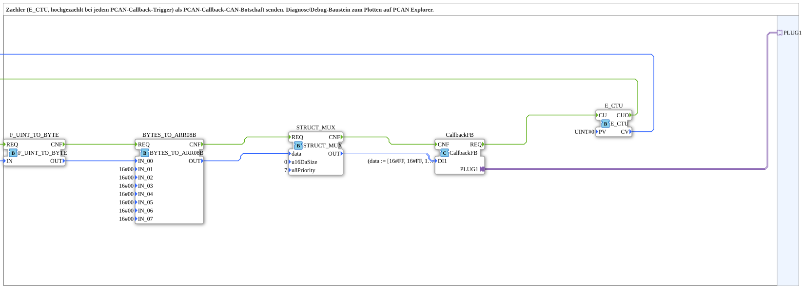

# CTU_TO_PCAN_Callback





* * * * * * * * * *

## Introduction

CTU_TO_PCAN_Callback is a diagnostic/debug subapplication designed to monitor PCAN callback triggers by incrementing a counter and transmitting the current counter value as a CAN message over the PCAN bus. Each time the connected callback adapter fires, the internal counter is incremented, its value is converted and packed into a CAN message structure, and the message is sent back through the callback interface. This block is intended for visualization and debugging purposes on tools like the PCAN Explorer.

## Interface Structure

The subapplication exposes a single adapter plug as its primary interface. All data and event processing happen internally, triggered by the adapter's callback request.

### **Adapters**

| Adapter | Type | Description |
|---------|------|-------------|
| PLUG1   | `isobus::pgn::tx::Callback` | ISOBUS PGN transmission callback. Fires on incoming CAN callback requests and receives the generated CAN message for transmission. |

## Functionality

The subapplication implements an event-counting and CAN message generation pipeline. It operates entirely on event-driven logic triggered by the callback adapter.

### Event & Data Flow

1. **Trigger**: The external callback adapter (connected to `PLUG1`) issues a request event via `CallbackFB.REQ`.
2. **Count**: The `E_CTU` event counter (with initial value 0) increments on the rising edge of the request and outputs the updated count value (`CV`).
3. **Convert**: The counter value is converted from `UINT` to a single `BYTE` by `F_UINT_TO_BYTE`.
4. **Assemble**: `BYTES_TO_ARR08B` places the converted byte into the first position (`IN_00`) of an 8‑byte array. The remaining bytes (`IN_01` … `IN_07`) are initialized to `16#00`.
5. **Mux**: `STRUCT_MUX` packs the byte array into a structured `CAN_MSG` (data field, priority = 7, data size = 0) for ISOBUS framing.
6. **Transmit**: `CallbackFB` receives the structured message via its `DI1` input and forwards it as a PCAN message through the adapter (`PLUG1`).

### Internal Block Diagram

```
CallbackFB.REQ → E_CTU.CU → E_CTU.CV → F_UINT_TO_BYTE.IN → BYTES_TO_ARR08B.IN_00
                                                                        │
                     STRUCT_MUX.OUT ← STRUCT_MUX.data ← BYTES_TO_ARR08B.OUT
                          │
                     CallbackFB.DI1 → transmitted via PLUG1
```

The event chain is: `CallbackFB.REQ` → `E_CTU.CU` → `E_CTU.CUO` → `F_UINT_TO_BYTE.REQ` → `F_UINT_TO_BYTE.CNF` → `BYTES_TO_ARR08B.REQ` → `BYTES_TO_ARR08B.CNF` → `STRUCT_MUX.REQ` → `STRUCT_MUX.CNF` → `CallbackFB.CNF`, providing a fully synchronous handshake from trigger to acknowledgement.

## Technical Features

| Feature | Details |
|---------|---------|
| **Event Counter** | `E_CTU` with preset value `0` (`PV = UINT#0`), counts rising edges of the callback request. |
| **Data Conversion** | `iec61131::conversion::F_UINT_TO_BYTE` – maps the 16‑bit counter value to an 8‑bit byte value. |
| **Byte Array Assembly** | `logiBUS::utils::conversion::arr::reversing::BYTES_TO_ARR08B` – constructs an 8‑byte array; the counter byte occupies `IN_00`, remaining bytes are `0x00`. |
| **CAN Message Packing** | `eclipse4diac::convert::STRUCT_MUX` with structured type `isobus::pgn::CAN_MSG`; sets `u8Priority = 7` and `u16DaSize = 0`. |
| **Callback Interface** | `isobus::pgn::tx::Callback` – enables sending the generated CAN frame back to the ISOBUS transmission layer. |
| **Flow Control** | Full event chain with `REQ`/`CNF` handshakes ensures deterministic processing without race conditions. |

## State Overview

This subapplication does not define an explicit state machine. Instead, it relies on the built-in event flow of the participating function blocks:

- **Idle State**: No callback request pending; counter holds its last value.
- **Processing State**: Triggered by `CallbackFB.REQ`, the pipeline executes through the counter, converter, array assembler, and mux in a single synchronous pass.
- **Completion State**: `CallbackFB.CNF` acknowledges the processed trigger, and the counter value has been incremented.

The `E_CTU` block internally maintains the count value as its persistent state across cycles.

## Application Scenarios

- **Debugging / Diagnostics**: Visualizing the number of ISOBUS callback events on the PCAN bus using PCAN Explorer or similar tools.
- **Protocol Monitoring**: Tracking the frequency of incoming PGN transmission callbacks at runtime.
- **System Health Checks**: Verifying that callback paths are active and working by observing monotonically increasing counter values.
- **Signal Generation for Testing**: Producing a repeating CAN frame whose data byte encodes the current trigger count, useful for instrumentation and test benches.

## Comparison with Similar Blocks

| Block | Data Source | Transmission Type | Use Case |
|-------|-------------|-------------------|----------|
| **CTU_TO_PCAN_Callback** | Internal event counter | ISOBUS PGN callback | Diagnostics of callback frequency on PCAN bus |
| **CTU_TO_PCAN_Send** (typical alternative) | External data input | Direct CAN send | Sending arbitrary data upon counter event |
| **E_CTU with IO mapping** | Counter output mapped directly to output | No CAN packaging | Simple CPU-local counting, no bus output |

Unlike a plain counter or a direct data sender, this subapplication combines counting, byte conversion, CAN message packing, and callback-based transmission in one integrated and reusable unit. Its reverse byte order handling (`reversing::BYTES_TO_ARR08B`) accommodates endianness requirements of the ISOBUS protocol.

## Conclusion

CTU_TO_PCAN_Callback is a compact, event-driven diagnostic tool that turns PCAN callback triggers into an easily observable CAN message containing an incrementing counter value. Its well-defined event flow, combined with standard IEC 61499 and ISOBUS building blocks, makes it a reusable and reliable component for debugging and monitoring ISOBUS communication on PCAN hardware. The consistent use of request/confirm handshakes guarantees deterministic behavior and simple integration into larger automation or vehicle electronics applications.
