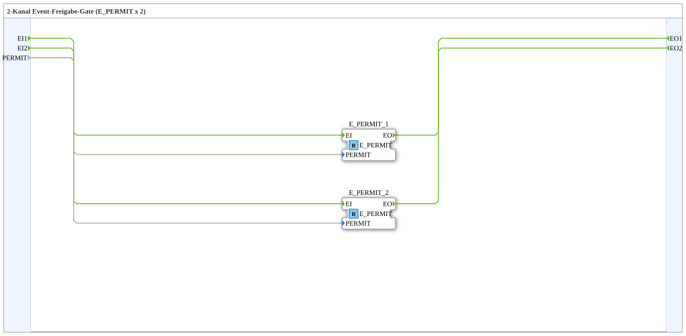

# E_PERMIT_2

* * * * * * * * * *

## Introduction

The **E_PERMIT_2** is a composite subapplication that provides a two-channel event permission gate. It encapsulates two independent instances of the standard IEC 61499 `E_PERMIT` function block, allowing two separate event streams to be selectively forwarded or blocked using a single common permission signal. This block is particularly useful in safety-oriented or access-controlled automation scenarios where multiple event paths must be gated simultaneously.

## Interface Structure

### **Event Inputs**

| Name  | Type  | Description                |
|-------|-------|----------------------------|
| EI1   | Event | Event input channel 1      |
| EI2   | Event | Event input channel 2      |

### **Event Outputs**

| Name  | Type  | Description                |
|-------|-------|----------------------------|
| EO1   | Event | Event output channel 1     |
| EO2   | Event | Event output channel 2     |

### **Data Inputs**

| Name   | Type | Description                      |
|--------|------|----------------------------------|
| PERMIT | BOOL | Common permission condition for both channels |

### **Data Outputs**

None.

### **Adapters**

None.

## Functionality

The `E_PERMIT_2` subapplication implements two parallel event gate channels. Internally, it instantiates two `iec61499::events::E_PERMIT` function blocks:

- `E_PERMIT_1` connects event input `EI1` to event output `EO1`.
- `E_PERMIT_2` connects event input `EI2` to event output `EO2`.

Both internal blocks receive the same boolean `PERMIT` signal as their gating condition. The behavior of each channel follows the standard `E_PERMIT` semantics:

- When `PERMIT = TRUE`, an incoming event at `EI1` (or `EI2`) is immediately forwarded to `EO1` (or `EO2`).
- When `PERMIT = FALSE`, incoming events are suppressed and not propagated to the outputs.

The two channels operate completely independently in terms of event flow, but share a common permission signal to ensure coordinated gating behavior across both paths.

## Technical Features

- **Dual redundant channel structure** – Two identical event gate paths in a single subapplication.
- **Common gating signal** – A single `PERMIT` data input controls both channels, simplifying external wiring.
- **Event-driven processing** – No cyclic polling; events are processed only when received on the event inputs.
- **Standard IEC 61499 compliance** – Built entirely from standard `E_PERMIT` function blocks.
- **Zero internal data output** – No data is produced by the subsystem; it purely routes or blocks event flows.

## State Overview

Since the internal `E_PERMIT` blocks are event-triggered and stateless in terms of event propagation, the subapplication does not maintain a persistent internal state machine. The effective state of the gate is solely determined by the value of the `PERMIT` input:

| State          | Condition   | Behavior                                  |
|----------------|-------------|-------------------------------------------|
| **Permitted**  | `PERMIT = TRUE`  | Events on `EI1`/`EI2` pass to `EO1`/`EO2` |
| **Blocked**    | `PERMIT = FALSE` | Events on `EI1`/`EI2` are discarded        |

No further internal states or history are retained by the subapplication.

## Application Scenarios

- **Machine safety interlocks** – Block multiple event-driven control commands (e.g., start, stop) when a safety condition is not met.
- **Production line supervision** – Gate two independent processing steps behind a single enable/disable master signal.
- **Conditional data acquisition** – Permit or suppress event notifications from two different sensors or sources based on a common readiness flag.
- **Redundant monitoring paths** – Use both channels to carry safety-relevant events while ensuring that both are disabled together during maintenance.

## Comparison with Similar Blocks

| Feature            | Single `E_PERMIT`              | `E_PERMIT_2` (this subapp)          |
|--------------------|--------------------------------|--------------------------------------|
| Number of channels | 1                              | 2                                    |
| Gating inputs      | 1 (own `PERMIT`)               | 1 shared `PERMIT` for both channels  |
| Event inputs       | 1 (`EI`)                       | 2 (`EI1`, `EI2`)                    |
| Event outputs      | 1 (`EO`)                       | 2 (`EO1`, `EO2`)                    |
| Wiring complexity  | Requires separate gating per channel | Reduced due to shared permission    |
| Independence       | Fully independent if used twice | Channels independent except for gate signal |

Compared to simply placing two `E_PERMIT` blocks manually, the `E_PERMIT_2` subapplication offers a cleaner, reusable component with unified control logic, reduced wiring overhead, and a clearer interface for system integrators.

## Conclusion

The **E_PERMIT_2** subapplication provides a compact and reusable solution for gating two independent event channels using a single permission input. By reusing the standardized `E_PERMIT` function block internally, it ensures predictable and IEC 61499-compliant behavior. Its dual-channel design makes it well suited for applications requiring coordinated event blocking across multiple paths, while keeping the external interface minimal and easy to integrate.
