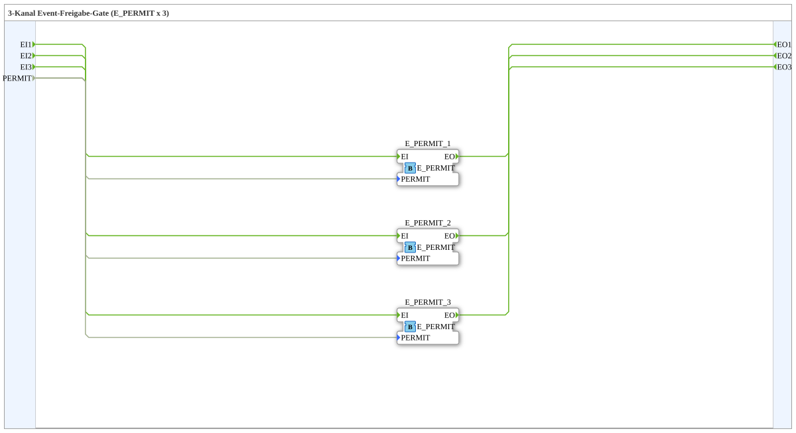

# E_PERMIT_3

* * * * * * * * * *

## Introduction

E_PERMIT_3 is a composite subapplication that implements a three-channel event gating mechanism. It combines three independent instances of the standard IEC 61499 E_PERMIT function block into a single reusable component. Each channel permits or blocks an incoming event stream based on a common Boolean permission signal. This subapp simplifies the design of systems requiring multiple synchronized event gates without duplicating logic.

## Interface Structure

### **Event Inputs**

- **EI1**: Event input for channel 1. When triggered, the event is forwarded to output **EO1** if the permission condition is TRUE.
- **EI2**: Event input for channel 2. When triggered, the event is forwarded to output **EO2** if the permission condition is TRUE.
- **EI3**: Event input for channel 3. When triggered, the event is forwarded to output **EO3** if the permission condition is TRUE.

### **Event Outputs**

- **EO1**: Event output for channel 1. Corresponds to the gated event from **EI1**.
- **EO2**: Event output for channel 2. Corresponds to the gated event from **EI2**.
- **EO3**: Event output for channel 3. Corresponds to the gated event from **EI3**.

### **Data Inputs**

- **PERMIT**: Boolean data input (type `BOOL`) that serves as the global gate condition for all three channels. If `PERMIT = TRUE`, incoming events are propagated to the respective outputs; if `FALSE`, events are discarded.

### **Data Outputs**

No data outputs are provided by this subapplication.

### **Adapters**

No adapters are used in this subapplication.

## Functionality

The subapplication internally instantiates three identical E_PERMIT function blocks, each wired to one channel. The data input `PERMIT` is broadcast to all three blocks simultaneously. When an event arrives on any of the event inputs (`EI1`, `EI2`, or `EI3`), the corresponding internal E_PERMIT block evaluates the current value of `PERMIT`. If `PERMIT` is `TRUE`, the event is immediately re-emitted on the matching event output; otherwise, the event is suppressed. All three channels operate independently, and the behavior is identical to that of a single E_PERMIT block multiplied by three.

## Technical Features

- **Three independent channels**: Each channel has its own event input and output, preventing cross-interference.
- **Shared permission signal**: A single `PERMIT` input controls all channels, simplifying coordination.
- **Standard-based implementation**: The subapplication is composed of standard IEC 61499 E_PERMIT function blocks, ensuring compatibility and predictable behavior.
- **Reusable and compact**: Encapsulates complex wiring into a single, clean interface.
- **No internal state**: The E_PERMIT block is combinational with respect to events; the subapplication does not introduce additional memory.

## State Overview

The subapplication does not maintain its own state. Each internal E_PERMIT block is stateless (purely event-driven). The only relevant condition is the value of `PERMIT` at the moment an event is received. No state transitions occur within the subapplication itself.

## Application Scenarios

- **Synchronized gating**: When multiple event sources must be enabled or disabled simultaneously, e.g., enabling several production machine signals based on a safety interlock.
- **System mode switching**: A central `PERMIT` can activate or deactivate three different event-driven actions (e.g., data logging, alarm processing, or control outputs) in one go.
- **Multi-channel permission checks**: In distributed control systems, three independent event paths can be selectively allowed based on a common authorization flag.
- **Prototyping and reuse**: The subapplication can be placed in a library and reused across projects where triple-channel event gating is needed.

## Comparison with Similar Blocks

- **Single E_PERMIT**: Offers only one channel. E_PERMIT_3 is a direct triplication of the E_PERMIT functionality, providing greater convenience and reducing diagram clutter.
- **Multiple independent E_PERMIT blocks**: While functionally equivalent, wiring three separate blocks manually increases the risk of connection errors and makes the design less maintainable. E_PERMIT_3 centralizes the shared `PERMIT` signal.
- **E_PERMIT with fan-out**: Some designs might use one E_PERMIT and split its output; however, this does not provide per-channel event inputs. E_PERMIT_3 preserves distinct event inputs and outputs for each channel.

## Conclusion

E_PERMIT_3 is a straightforward composite subapplication that encapsulates three instances of the standard E_PERMIT function block into a single, reusable unit. It offers a clean, three-channel event gating solution with a shared permission flag, making it ideal for scenarios where multiple event streams must be controlled together. Its simplicity, standard-based construction, and lack of internal state ensure reliable and predictable operation in a variety of automation and control applications.
