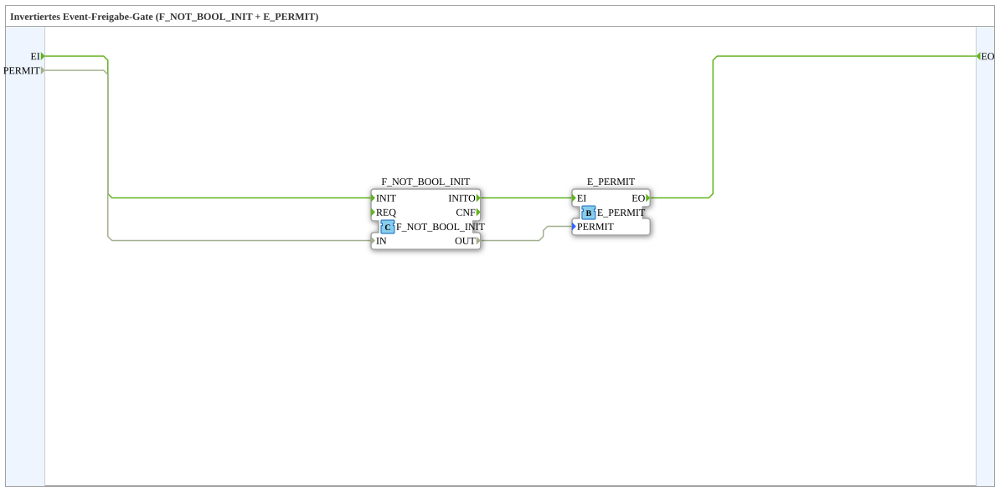

# E_PERMIT_INVERT

* * * * * * * * * *
## Introduction

E_PERMIT_INVERT is an event-gating subapplication that implements an inverted event permission gate. It combines an inversion function and an event-permit block so that an incoming event is only forwarded when the Boolean input `PERMIT` is `FALSE`. This is useful in control logic where a `TRUE` signal should suppress or inhibit an event, rather than enable it.

## Interface Structure

### **Event Inputs**

| Name | Type | Description |
|------|------|-------------|
| `EI` | Event | Event input. An event arriving here is forwarded to `EO` when `PERMIT` is `FALSE`. |

### **Event Outputs**

| Name | Type | Description |
|------|------|-------------|
| `EO` | Event | Event output. Fires when `EI` occurs and `PERMIT` is `FALSE`. |

### **Data Inputs**

| Name | Type | Description |
|------|------|-------------|
| `PERMIT` | BOOL | Inverted enable condition. If `TRUE`, the event is blocked. If `FALSE`, the event is allowed to pass. |

### **Data Outputs**

None.

### **Adapters**

None.

## Functionality

The internal structure of E_PERMIT_INVERT consists of two standard blocks:

- `F_NOT_BOOL_INIT`  
- `E_PERMIT`

The `PERMIT` input is connected to `F_NOT_BOOL_INIT.IN`. The inverted result is then connected to `E_PERMIT.PERMIT`. The incoming event `EI` is connected directly to `E_PERMIT.EI`, and the output event `E_PERMIT.EO` is forwarded as `EO`.

This means:

1. `EI` triggers the event path.
2. `F_NOT_BOOL_INIT` inverts the current value of `PERMIT`.
3. `E_PERMIT` receives the inverted permission value.
4. If the original `PERMIT` is `FALSE`, the inverted value is `TRUE`, so the event is forwarded to `EO`.
5. If the original `PERMIT` is `TRUE`, the inverted value is `FALSE`, so the event is blocked.

## Technical Features

- Implements an inverted event permission gate.
- Reuses standard IEC 61499 event and IEC 61131 logic blocks.
- Encapsulates the wiring of an inverter and an event gate in one reusable subapplication.
- Provides a single Boolean control input and a single event input/output pair.
- Does not expose any data outputs.
- Behaves as a pure event gate: no output event is generated without an input event.
- Suitable for event-driven control applications.

## State Overview

E_PERMIT_INVERT has no internal state machine and no persistent state variables. The output behavior depends only on the current value of `PERMIT` and the occurrence of an event at `EI`. The gate is combinational with respect to the Boolean condition: a change of `PERMIT` alone does not generate an output event, but it affects whether the next `EI` event is passed through.

## Application Scenarios

- Active-low enable signals: an event is allowed when the enable signal is `FALSE`.
- Inhibit logic: a `TRUE` inhibit signal suppresses event-driven actions.
- Interlocking: events are blocked while a safety condition is active.
- Replacing a manual inverter followed by an `E_PERMIT` with a single reusable component.
- Cleaner design in event-based control systems where inverted permission semantics are required.

## Comparison with Similar Blocks

| Block / Approach | Behavior |
|------------------|----------|
| `E_PERMIT` | Passes an event when the permit input is `TRUE`. |
| `E_PERMIT_INVERT` | Passes an event when the permit input is `FALSE`. |
| Manual inverter + `E_PERMIT` | Equivalent logic, but requires additional wiring and is less reusable. |
| `E_SWITCH` | Routes events to different output paths, rather than simply suppressing or passing one event. |

E_PERMIT_INVERT is therefore best understood as an “event gate with inverted permission logic”.

## Conclusion

E_PERMIT_INVERT is a compact and reusable subapplication that provides inverted event gating logic. By internally combining `F_NOT_BOOL_INIT` and `E_PERMIT`, it gives designers a clear, maintainable way to permit event flow when a Boolean condition is `FALSE`. It is especially useful in event-driven control applications where inhibit or active-low enable signals are required.