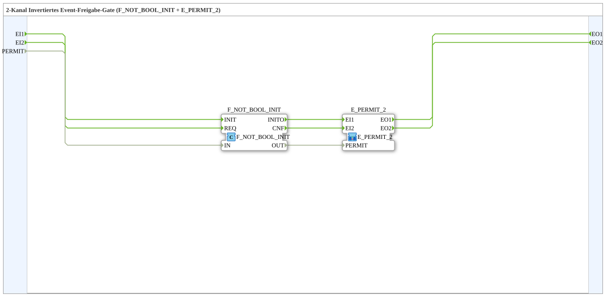

# E_PERMIT_INVERT_2

* * * * * * * * * *

## Introduction

E_PERMIT_INVERT_2 is a two-channel inverted event permit gate. It is implemented as a subapplication that combines an IEC 61131 boolean inverter with a standard IEC 61499 E_PERMIT_2 event gate.

The subapplication accepts two independent event input channels and forwards them to two output channels only when an external BOOL permission signal is FALSE. This makes the block suitable for applications where an active-low permission or release signal must control event forwarding.

## Interface Structure

### **Event Inputs**

| Name | Type | Description |
|------|------|-------------|
| EI1 | Event | Event input channel 1. Forwarded to EO1 when the gate is open. |
| EI2 | Event | Event input channel 2. Forwarded to EO2 when the gate is open. |

### **Event Outputs**

| Name | Type | Description |
|------|------|-------------|
| EO1 | Event | Event output channel 1. Emitted when EI1 is received and the gate is open. |
| EO2 | Event | Event output channel 2. Emitted when EI2 is received and the gate is open. |

### **Data Inputs**

| Name | Type | Description |
|------|------|-------------|
| PERMIT | BOOL | Inverted permission condition. FALSE enables event forwarding; TRUE blocks event forwarding. |

### **Data Outputs**

None.

### **Adapters**

None.

## Functionality

The subapplication uses an internal F_NOT_BOOL_INIT block to invert the external PERMIT signal. The resulting value is connected to the PERMIT input of an internal E_PERMIT_2 block.

The behavior is as follows:

- When the external PERMIT input is FALSE, the internal E_PERMIT_2 receives a TRUE permit signal. An event on EI1 is forwarded to EO1, and an event on EI2 is forwarded to EO2.
- When the external PERMIT input is TRUE, the internal E_PERMIT_2 receives a FALSE permit signal. Incoming events on EI1 and EI2 are blocked and no output events are generated.

Each event channel is independent. EI1 only controls EO1, and EI2 only controls EO2. Both channels share the same inverted permission condition.

## Technical Features

- Reusable subapplication defined as an IEC 61499 SubAppType.
- Two event input channels and two event output channels.
- One common BOOL permission input.
- No data outputs and no adapters.
- Internally uses the standard function blocks F_NOT_BOOL_INIT and E_PERMIT_2.
- Provides active-low event gating behavior.
- Encapsulates the inverter plus event gate logic into a single application component.
- The gate does not queue or store events. Events arriving while the gate is closed are discarded.

## State Overview

The subapplication does not define an internal state machine or sequential function chart. Its behavior is determined by the current value of the external PERMIT input.

| External PERMIT | Internal E_PERMIT_2 Input | Result |
|-----------------|---------------------------|--------|
| FALSE | TRUE | Gate is open. EI1 triggers EO1, EI2 triggers EO2. |
| TRUE | FALSE | Gate is closed. EI1 and EI2 are blocked. |

The behavior is combinational with respect to the permission signal. Changing PERMIT immediately changes whether new events are allowed through. No internal state is retained.

## Application Scenarios

E_PERMIT_INVERT_2 is useful in control applications where the available permission signal has inverted logic. Typical scenarios include:

- Using a "fault active" or "blocked" signal as the event gate. Events are only passed when the fault signal is FALSE.
- Gating two independent event streams with a single active-low release condition.
- Integrating inverted enable logic into a reusable subapplication to avoid adding a separate inverter block in the calling application.
- Implementing safety-oriented event suppression where a TRUE signal must prevent event propagation.

## Comparison with Similar Blocks

| Block / Pattern | Behavior |
|-----------------|----------|
| E_PERMIT_2 | Passes events when the PERMIT input is TRUE. Requires an external inverter for active-low permission signals. |
| E_PERMIT_INVERT_2 | Passes events when the external PERMIT input is FALSE. The inversion is integrated internally. |
| F_NOT_BOOL_INIT | Inverts a BOOL data signal only. It does not gate events. |
| E_PERMIT | A single-channel permit gate with similar high-active semantics. |

E_PERMIT_INVERT_2 is therefore a convenient alternative to manually wiring an inverter in front of an E_PERMIT_2 block.

## Conclusion

E_PERMIT_INVERT_2 is a compact and reusable two-channel event gate for inverted permission logic. By combining a boolean inverter with an E_PERMIT_2 event gate, it provides clear active-low event forwarding behavior. It is especially useful when an application uses inhibit or fault signals to control whether events may pass. The subapplication reduces wiring complexity and improves readability in larger IEC 61499 systems.
