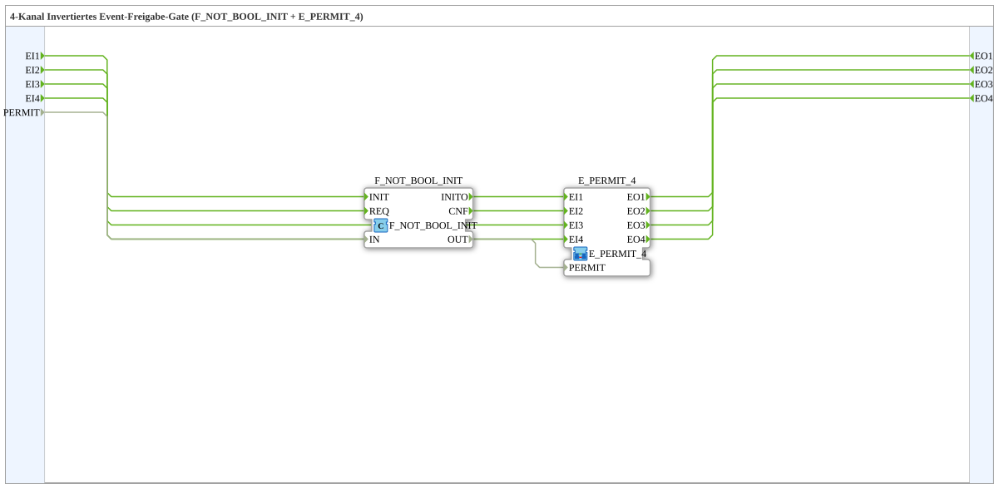

# E_PERMIT_INVERT_4

* * * * * * * * * *

## Introduction

`E_PERMIT_INVERT_4` is a typed subapplication that implements a four-channel inverted event-permission gate. It combines an `F_NOT_BOOL_INIT` block with an `E_PERMIT_4` block. The external `PERMIT` input is logically inverted before it is applied to the internal event gate. Therefore, an event is forwarded only when `PERMIT` is `FALSE`. When `PERMIT` is `TRUE`, arriving events are suppressed.

The four event channels operate independently from each other, but they all share the same permission condition.

## Interface Structure

The subapplication has four event inputs, four event outputs, and one Boolean data input. There are no data outputs and no adapters.

### **Event Inputs**

| Name | Type | Description |
|------|------|-------------|
| `EI1` | `Event` | Event input channel 1. |
| `EI2` | `Event` | Event input channel 2. |
| `EI3` | `Event` | Event input channel 3. |
| `EI4` | `Event` | Event input channel 4. |

### **Event Outputs**

| Name | Type | Description |
|------|------|-------------|
| `EO1` | `Event` | Event output channel 1. |
| `EO2` | `Event` | Event output channel 2. |
| `EO3` | `Event` | Event output channel 3. |
| `EO4` | `Event` | Event output channel 4. |

### **Data Inputs**

| Name | Type | Description |
|------|------|-------------|
| `PERMIT` | `BOOL` | Inverted enable condition. `FALSE` opens the event gate; `TRUE` closes it. |

### **Data Outputs**

None.

### **Adapters**

None.

## Functionality

`E_PERMIT_INVERT_4` performs the following internal operations:

1. The Boolean input `PERMIT` is negated by `F_NOT_BOOL_INIT`.
2. The negated value is connected to the `PERMIT` input of `E_PERMIT_4`.
3. Each event input `EIx` is connected to the corresponding event input of `E_PERMIT_4`.
4. The corresponding event output `EOx` is emitted only when the internal `E_PERMIT_4.PERMIT` value is `TRUE`.

The effective enable condition is:

**enable = NOT PERMIT**

For each channel `x`:

- When `PERMIT = FALSE`, `enable = TRUE`, and an event on `EIx` produces an event on `EOx`.
- When `PERMIT = TRUE`, `enable = FALSE`, and an event on `EIx` is suppressed.

The gate does not buffer events. If the gate is closed, the incoming event is discarded.

## Technical Features

- Four-channel event gating in a single reusable subapplication.
- Active-low permission behavior due to the inverted `PERMIT` input.
- Shared gate condition for all four channels.
- Direct one-to-one event routing from each `EIx` to the corresponding `EOx`.
- No data outputs or additional data transformation.
- Built from standard blocks: `E_PERMIT_4` and `F_NOT_BOOL_INIT`.
- No adapters required for integration.

## State Overview

`E_PERMIT_INVERT_4` has no complex internal state machine. The relevant state is determined by the value of `PERMIT`:

| State | `PERMIT` | Internal `E_PERMIT_4.PERMIT` | Event behavior |
|-------|----------|-------------------------------|----------------|
| Gate open | `FALSE` | `TRUE` | `EIx` → `EOx` |
| Gate closed | `TRUE` | `FALSE` | `EIx` is suppressed |

A change of `PERMIT` takes effect for the next arriving event. The four event channels remain independent and do not synchronize with one another.

## Application Scenarios

This subapplication is suitable whenever an event stream should be allowed while a signal is inactive. Typical examples include:

- Passing alarm or notification events only when the process is not in an error state.
- Blocking event outputs during maintenance or startup phases, where the control signal is `TRUE`.
- Implementing fail-safe enable logic in which `FALSE` means “normal operation” and `TRUE` means “inhibit”.
- Combining multiple permission-dependent event channels into one compact component.

## Comparison with Similar Blocks

`E_PERMIT_4` is a non-inverted event gate: events are forwarded when its `PERMIT` input is `TRUE`. `E_PERMIT_INVERT_4` reverses this behavior, so events are forwarded when the external `PERMIT` is `FALSE`.

Compared to manually wiring an `F_NOT_BOOL_INIT` in front of an `E_PERMIT_4`, this subapplication reduces connection effort and avoids wiring mistakes. It is not a routing switch like `E_SWITCH` or `E_SELECT`; it simply forwards or suppresses an event on the same channel.

## Conclusion

`E_PERMIT_INVERT_4` is a compact and clear solution for four-channel event gating with an active-low enable condition. By combining a Boolean inverter with the standard `E_PERMIT_4` block, it provides predictable event suppression and easy integration into IEC 61499 applications.