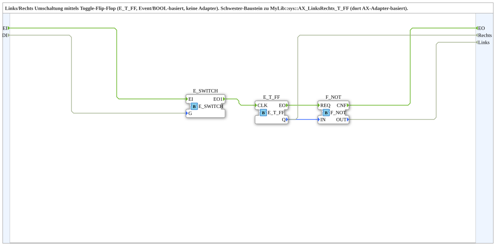

# LinksRechts_T_FF_Event

* * * * * * * * * *
## Introduction

`LinksRechts_T_FF_Event` is a reusable IEC 61499 subapplication that implements a left/right toggle switch using an event-triggered T flip-flop. It provides two complementary boolean outputs, `Rechts` and `Links`, and can be used wherever a single event should alternately switch between two states.

The subapplication is built from standard function blocks: `E_SWITCH`, `E_T_FF`, and `F_NOT`. It uses only event and BOOL data connections and does not require any adapter interfaces. This makes it easy to integrate into plain event/BOOL-based automation networks.

## Interface Structure

The subapplication has one event input, one event output, one BOOL data input, and two BOOL data outputs.

### **Event Inputs**

| Name | Type    | Description                                                                                     |
|------|---------|-------------------------------------------------------------------------------------------------|
| `EI` | `Event` | Master trigger event. If `DI` is `TRUE`, this event toggles the internal flip-flop. If `DI` is `FALSE`, the event is ignored. |

### **Event Outputs**

| Name | Type    | Description                                                                                             |
|------|---------|---------------------------------------------------------------------------------------------------------|
| `EO` | `Event` | Completion event. It is issued after the toggle operation has finished and both `Rechts` and `Links` have been updated. |

### **Data Inputs**

| Name | Type   | Description                                                                                    |
|------|--------|------------------------------------------------------------------------------------------------|
| `DI` | `BOOL` | Enable signal for the toggle. `TRUE` allows the next `EI` event to toggle the state. `FALSE` suppresses the toggle. |

### **Data Outputs**

| Name      | Type   | Description                                                                                  |
|-----------|--------|----------------------------------------------------------------------------------------------|
| `Rechts`  | `BOOL` | Direct output of the internal T flip-flop. It is `TRUE` when the toggle state is `1`.          |
| `Links`   | `BOOL` | Inverted output of the internal T flip-flop. It is always the complement of `Rechts`.          |

### **Adapters**

| Name   | Type | Description |
|--------|------|-------------|
| None   | -    | This subapplication has no adapter sockets or plugs. |

## Functionality

The subapplication works as a gated toggle switch:

1. An event arrives at `EI`.
2. The internal `E_SWITCH` checks the `DI` signal:
   - If `DI = TRUE`, the event is passed to `E_T_FF.CLK`.
   - If `DI = FALSE`, the event is passed to the unconnected `EO0` output of `E_SWITCH` and has no effect.
3. When `E_T_FF` receives the clock event, it toggles its internal state `Q`.
4. The new `Q` value is written directly to `Rechts`.
5. `E_T_FF.EO` triggers `F_NOT.REQ`, and `F_NOT` computes the inverted value of `Q`.
6. The inverted value is written to `Links`.
7. `F_NOT.CNF` issues the external event `EO`.

This event chain ensures that `Rechts` and `Links` are always complementary and are updated together during the same event handling cycle.

## Technical Features

- Built entirely from standard 4diac/IEC 61499 function blocks: `E_SWITCH`, `E_T_FF`, and `F_NOT`.
- Pure event and BOOL-based data flow.
- No adapter interfaces required.
- Single event input for triggering and a single completion event output.
- Gating input `DI` enables or disables switching.
- Complementary outputs are generated automatically by the `F_NOT` block.
- Deterministic behavior: only one active event can cause a state change at a time.
- Suitable as a reusable subapplication in higher-level function block networks.

## State Overview

The subapplication has no explicit ECC state machine, but it contains an internal memory state represented by the T flip-flop output `Q`.

| Internal State `Q` | `Rechts` | `Links` |
|--------------------|----------|---------|
| `FALSE`            | `FALSE`  | `TRUE`  |
| `TRUE`             | `TRUE`   | `FALSE` |

An active event, i.e. `EI` with `DI = TRUE`, toggles `Q` to the opposite state. The subapplication therefore alternates between the `Rechts` active state and the `Links` active state on each accepted trigger event.

If `DI = FALSE`, the state remains unchanged and no external completion event is generated.

## Application Scenarios

- Direction control for motors, conveyors, or actuators where `Rechts` and `Links` represent clockwise/counterclockwise rotation.
- Single-button toggle with an additional enable signal, e.g. manual mode switching.
- Alternating between two operating modes using a single event source.
- Reusable subapplication for machine controls that require two mutually exclusive output signals.

## Comparison with Similar Blocks

| Block                          | Interface Type     | Behavior                                                              |
|--------------------------------|--------------------|-----------------------------------------------------------------------|
| `LinksRechts_T_FF_Event`       | Event/BOOL         | Gated toggle with complementary `Rechts` and `Links` outputs.          |
| `AX_LinksRechts_T_FF`          | Adapter-based       | Same left/right toggle concept, but uses an adapter interface.         |
| Plain `E_T_FF`                 | Event/BOOL         | Simple toggle flip-flop only; no input gating and no complement output. |

Compared to a direct `E_T_FF`, this subapplication adds an enable path and complementary output generation. Compared to the adapter-based sister block, it uses a simpler interface and is therefore easier to embed in applications that do not need adapter abstraction.

## Conclusion

`LinksRechts_T_FF_Event` is a compact and reliable subapplication for event-controlled left/right switching. It combines an event gate, a T flip-flop, and an inverter to produce two stable complementary outputs. Because it requires no adapters and uses only standard function blocks, it can be easily reused in a wide range of 4diac-based control applications.