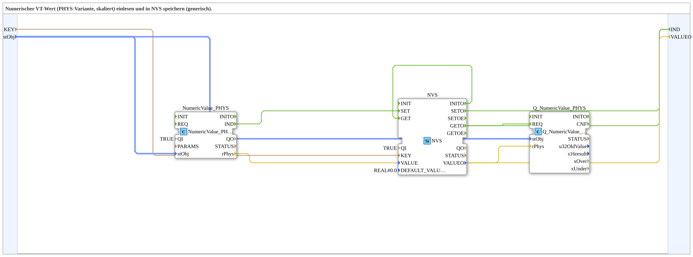

# NumericValue_PHYS_TO_NVS

* * * * * * * * * *

## Introduction

The **NumericValue_PHYS_TO_NVS** subapplication is a generic, reusable component that integrates a physical numeric value sensor (scaled variant) with non‑volatile storage (NVS). It reads a physical value using the `NumericValue_PHYS` function block, stores the result into an NVS key, and provides the stored value as an output. The subapp is designed for embedded systems where calibration data or process values need to be persisted across power cycles.

This subapp decouples the scaling logic (performed by `NumericValue_PHYS`) from the storage management (handled by `NVS`), offering a clean interface that exposes only the key name, scaling parameters, and the current stored value.

## Interface Structure

### **Event Outputs**

| Event   | Description                                                                 |
|---------|-----------------------------------------------------------------------------|
| `IND`   | Indicates that a storage or retrieval operation has been completed. This event is emitted after a successful `SET` or `GET` operation from the internal NVS block. |

### **Event Inputs**

*None.*

### **Data Inputs**

| Name     | Type                                                   | Description                                                                 |
|----------|--------------------------------------------------------|-----------------------------------------------------------------------------|
| `KEY`    | `STRING`                                               | The unique identifier (key name) under which the value is stored in NVS.    |
| `stObj`  | `logiBUS::utils::conversion::phys::NumericObjectPool_S` | Scaling and formatting parameters (object ID, scaling factor, offset, decimals). Default: `(u16ObjId := ID_NULL, r32Scale := 1.0, i32Offset := 0, u8Decimals := 0)`. |

### **Data Outputs**

| Name     | Type   | Description                                                    |
|----------|--------|----------------------------------------------------------------|
| `VALUEO` | `REAL` | The current value stored in NVS (read back after initialization or after a write operation). |

### **Adapters**

*None.*

## Functionality

The subapp operates internally with three main components:

1. **`NumericValue_PHYS`** – Converts a raw physical input into a scaled `REAL` value (`rPhys`) using the scaling parameters from `stObj`. It is configured with `QI = TRUE`, so it is always ready to process.

2. **`NVS`** – A non‑volatile storage block that handles `SET`, `GET`, and `INIT` operations. It is initialized with `QI = TRUE` and a default value of `0.0`.

3. **`Q_NumericValue_PHYS`** – A query block that reconstructs the physical value from the stored data, making it available for further processing.

**Data flow:**

- The scaled physical value (`rPhys`) from `NumericValue_PHYS` is fed to the `VALUE` input of `NVS`.
- The event `IND` from `NumericValue_PHYS` triggers the `SET` operation of `NVS`, storing the current value under `KEY`.
- Upon successful `SETO` (or `GETO`), the subapp emits an `IND` event to inform the outside world.
- During initialization (`INITO`), the NVS block performs a `GET` operation, retrieving the previously stored value. This value is then output via `VALUEO` and also passed to `Q_NumericValue_PHYS` for scaling/interpretation.

The subapp therefore keeps the stored value up‑to‑date whenever a new physical reading is available and also allows the stored value to be read back after a restart.

## Technical Features

- **Generic scalability** – The `stObj` parameter encapsulates all scaling and formatting information, making the subapp reusable for different sensor types or units.
- **Persistent storage** – Leverages the NVS mechanism of the ESP32 platform to retain data across power cycles.
- **Automatic initialization** – On startup, the subapp reads the stored value from NVS and exposes it via `VALUEO`.
- **Minimal external interface** – Only one key name and the scaling object are required as inputs, keeping integration simple.
- **Modular design** – Uses well‑defined function blocks from the `isobus` and `logiBUS` libraries, promoting code reuse and maintainability.

## State Overview

The subapp does not explicitly define a state machine. Instead, it relies on the built‑in behavior of the internal NVS block, which has the following typical states:

- **Uninitialized** – Before `INITO` is processed.
- **Idle** – Waiting for a `SET` or `GET` request.
- **Busy** – During a read/write operation.
- **Error** – If a storage operation fails (handled internally by the NVS block).

The subapp’s output `IND` is emitted after each completed operation, providing a simple handshake mechanism for external logic.

## Application Scenarios

- **Calibration data storage** – Store calibration constants or correction factors for analog inputs.
- **Setpoint persistence** – Save user‑configured setpoints in an industrial control system.
- **Data logging** – Periodically capture a physical measurement and keep the last value in non‑volatile memory.
- **Fail‑safe recovery** – Restore the last known good value after a system reboot.

The subapp is particularly useful in IoT devices, smart sensors, and embedded controllers where configuration or measurement data must survive power loss.

## Comparison with Similar Blocks

There are other subapplications that handle NVS storage (e.g., a raw value store without scaling or a store with a fixed scaling). The distinguishing feature of **NumericValue_PHYS_TO_NVS** is its tight integration with the physical scaling layer. Unlike a simple `NVS` wrapper, this block:

- Automatically applies scaling factors and offsets via `NumericValue_PHYS`.
- Provides a query path (`Q_NumericValue_PHYS`) to convert the stored raw data back to a physical value.
- Combines storage and conversion in a single, configurable component.

Other blocks might require the user to manage scaling separately, increasing complexity and the risk of inconsistencies.

## Conclusion

The **NumericValue_PHYS_TO_NVS** subapplication offers a compact and efficient solution for persisting scaled numeric values in non‑volatile storage. Its generic interface and internal modularity make it suitable for a wide range of embedded applications. By encapsulating scaling, storage, and retrieval, it simplifies the development of robust systems that require reliable data retention.
