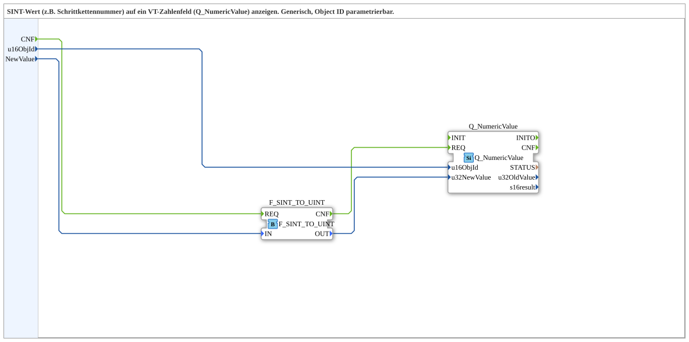

# SINT_TO_Q_NumericValue

* * * * * * * * * *
## Introduction

The **SINT_TO_Q_NumericValue** subapplication provides a generic and reusable solution for displaying a signed 8‑bit integer value (e.g., a step number in a sequence) on a numeric visualization field (Q_NumericValue) within a VT (Visualization Terminal). The object ID of the target display element is parameterizable, making the block adaptable to different HMI layouts without internal modification. It decouples the source data type (SINT) from the display element’s expected input type (UINT) by performing a conversion internally.

## Interface Structure

### **Event Inputs**

| Event    | Description                                                                 |
|----------|-----------------------------------------------------------------------------|
| `CNF`    | Triggers the conversion and subsequent update of the numeric display field. |

### **Event Outputs**

None.

### **Data Inputs**

| Data Name  | Type  | Initial Value | Description                                                                 |
|------------|-------|---------------|-----------------------------------------------------------------------------|
| `u16ObjId` | UINT  | `ID_NULL`     | Object ID of the target Q_NumericValue element on the visualization screen.|
| `NewValue` | SINT  | –             | Signed 8‑bit value to be converted and displayed.                           |

### **Data Outputs**

None.

### **Adapters**

None.

## Functionality

Upon receiving an event at the `CNF` input, the subapplication performs the following operations internally:

1. The value on `NewValue` (SINT) is passed to the conversion function block **F_SINT_TO_UINT** (IEC 61131‑3 compliant) via the `IN` input.
2. The conversion block produces the corresponding unsigned 32‑bit representation on its `OUT` output.
3. This converted value is routed to the `u32NewValue` input of the **Q_NumericValue** function block, which represents the target visualization element.
4. Simultaneously, the `u16ObjId` input is forwarded to the `u16ObjId` input of **Q_NumericValue**, telling the visualization which display field to update.
5. The function block Q_NumericValue is then triggered by the `REQ` event (sourced from the completion of the conversion, `CNF` of F_SINT_TO_UINT), causing it to update the display with the new numeric value.

The entire process is combinational – there is no internal state storage; each `CNF` event produces one display update.

## Technical Features

- **Data Type Conversion** – Uses a standard IEC 61131‑3 conversion block (`F_SINT_TO_UINT`) to safely map the signed 8‑bit input to an unsigned 32‑bit value.
- **Parameterizable Object ID** – The `u16ObjId` input allows the user to specify which numeric field on the HMI should be updated, enabling reuse of the subapplication across multiple screens and elements.
- **Generic Design** – The block is completely independent of the specific step sequence or machine logic; it only provides the interface and conversion logic.
- **No Internal State** – Because no data is stored, the block is stateless and can be used in cyclic or event‑driven environments without concerns about stale data.
- **Compact and Reusable** – Encapsulates common conversion and display logic, reducing duplication in larger projects.

## State Overview

This subapplication does not contain any state memory or sequential logic. Every activation of the `CNF` event immediately leads to a fresh conversion and update of the display field. Therefore, no state diagram is applicable; the behavior is purely event‑driven and deterministic.

## Application Scenarios

- **Step Number Display** – In a sequential control system (e.g., a packaging machine), a SINT step counter can be shown on an HMI numeric field.
- **Parameter Value Visualization** – Any signed 8‑bit parameter (temperature offset, speed correction, etc.) that needs to be presented on a VT.
- **Generic HMI Binding** – When multiple numeric fields are used, each can be connected to a separate instance of this subapplication with a different `u16ObjId`.
- **Modular Automation Projects** – Used as a building block in larger subapplications or FBs, where conversion and display logic is required repeatably.

## Comparison with Similar Blocks

- **Direct Q_NumericValue usage** – Without this subapplication, one would have to connect a UINT source directly to Q_NumericValue and handle the conversion externally. This block encapsulates the conversion, reducing wiring and potential errors.
- **Other conversion blocks** – Standard conversion FBs (e.g., F_SINT_TO_DINT) could be used, but this subapplication combines conversion with HMI communication, offering a higher‑level interface tailored to visualization tasks.
- **Custom display logic** – Writing custom code for each display element would be error‑prone and not reusable; this subapplication provides a uniform, parameterized solution.

## Conclusion

The **SINT_TO_Q_NumericValue** subapplication is a focused, non‑intrusive utility that bridges the gap between a signed 8‑bit data source and a numeric HMI display. By integrating type conversion and display addressing into a single, stateless block, it simplifies project engineering, improves maintainability, and promotes reuse across different automation systems. Its generic object ID parameter ensures flexibility, while its straightforward event interface makes it easy to integrate into any IEC 61499‑based control application.