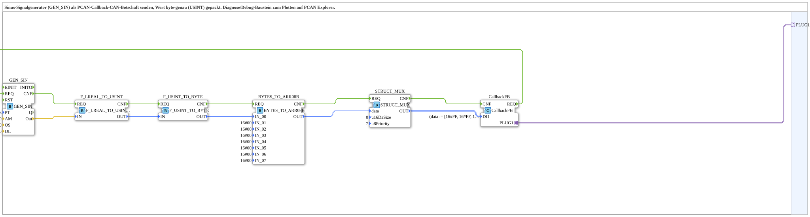

# SIN_TO_PCAN_Callback_Byte

* * * * * * * * * *

## Introduction

The **SIN_TO_PCAN_Callback_Byte** subapplication is a diagnostic and debugging tool designed to generate a sinusoidal signal and transmit it as a CAN message via PCAN, using a callback-based adapter interface. The signal value is converted into a single unsigned byte (USINT) and packed into a CAN frame, making it suitable for real-time plotting and analysis in tools such as PCAN Explorer. This subapplication encapsulates the entire signal generation, conversion, and transmission chain into a reusable component.

## Interface Structure

The subapplication exposes only one external interface: a plug adapter for the CAN callback. It has no direct event or data inputs/outputs; all control and data flow is handled internally.

### **Event Inputs**

None.

### **Event Outputs**

None.

### **Data Inputs**

None.

### **Data Outputs**

None.

### **Adapters**

| Name | Type | Description |
|------|------|-------------|
| `PLUG1` | `isobus::pgn::tx::Callback` | Callback interface to send CAN messages (e.g., to PCAN) upon request. This adapter is used to pass the structured CAN message prepared by the internal `CallbackFB` function block. |

## Functionality

The subapplication performs the following steps in a continuous loop:

1. **Signal Generation**: The `GEN_SIN` function block (from the OSCAT library) creates a sinusoidal waveform with the given parameters (period `PT`, amplitude `AM`, offset `OS`, and dead level `DL`). In this configuration, the period is 10 seconds, amplitude 10.0, and offset 5.0, producing a sine wave oscillating between -5.0 and 15.0.
2. **Conversion to USINT**: The `F_LREAL_TO_USINT` conversion block transforms the LREAL output from `GEN_SIN` into an `USINT` (unsigned 8-bit integer) value.
3. **Byte Conversion**: The `F_USINT_TO_BYTE` block converts the USINT value into a byte representation.
4. **Array Assembly**: The `BYTES_TO_ARR08B` block places the converted byte into the first byte of an 8‑byte array. This block also supports byte reversal (reversing order) and is configured with initial placeholder values for the remaining seven bytes (all set to `16#00`).
5. **Message Structuring**: The `STRUCT_MUX` block packs the byte array into a structured CAN message of type `isobus::pgn::CAN_MSG`. It also sets the payload size (`u16DaSize`) to 0 and the default priority (`u8Priority`) to 7.
6. **Transmission**: The `CallbackFB` function block receives the structured CAN message and, when triggered, sends it via the `PLUG1` adapter (connected to a callback interface, typically a PCAN driver).

The event chain is: `CallbackFB.REQ` → `GEN_SIN.REQ` → `GEN_SIN.CNF` → `F_LREAL_TO_USINT.REQ` → `F_LREAL_TO_USINT.CNF` → `F_USINT_TO_BYTE.REQ` → `F_USINT_TO_BYTE.CNF` → `BYTES_TO_ARR08B.REQ` → `BYTES_TO_ARR08B.CNF` → `STRUCT_MUX.REQ` → `STRUCT_MUX.CNF` → `CallbackFB.CNF`. Each step passes the required data along the corresponding data connections.

## Technical Features

- **Sinusoidal Generation**: Configurable via parameters `PT`, `AM`, `OS`, and `DL` to adapt the signal characteristics.
- **Precision Conversion**: The signal value is rounded to an unsigned 8‑bit integer, ensuring byte‑level accuracy.
- **CAN Message Formatting**: Uses a structured type `isobus::pgn::CAN_MSG` for compatibility with ISO 11783 (ISOBUS) PGN transmission.
- **Callback‑based Transmission**: The output adapter `PLUG1` uses a callback interface, allowing integration with event‑driven PCAN drivers.
- **Reusable Design**: The subapplication can be instantiated multiple times with different parameters or data sources.
- **Debug Friendly**: The byte‑only representation simplifies plotting and analysis in external tools.

## State Overview

This subapplication does not maintain any internal state machine. It operates purely as a data‑flow pipeline, where each function block processes its input and produces an output in a single scan cycle. The only dynamic behavior is the continuous generation of sinusoidal values by `GEN_SIN`, which is driven by the event request from `CallbackFB`. All conversions and message assembly are combinatorial in nature.

## Application Scenarios

- **Real‑time Signal Visualization**: Use the sinusoidal output to test or calibrate CAN‑based measurement systems.
- **Function Testing of PCAN Interfaces**: Verify correct data packing and transmission in a PCAN environment.
- **Educational Tool**: Demonstrate how to generate, convert, and send analog signals over CAN in an industrial automation context.
- **Prototyping**: Quickly create a CAN node that broadcasts a sinusoidal test signal for development purposes.

## Comparison with Similar Blocks

Unlike a standard analog‑to‑CAN converter that may send floating‑point values, this subapplication specifically packs the signal into a single byte, sacrificing resolution for simplicity and compactness. It also uses a callback‑based adapter rather than a direct CAN output, making it more flexible for different bus interfaces. Compared to a generic `GEN_SIN` block used standalone, this subapplication integrates the conversion and CAN transmission chain into a single ready‑to‑use component. It is similar in purpose to dedicated signal generator modules but is optimized for debugging and analysis via PCAN tools.

## Conclusion

The **SIN_TO_PCAN_Callback_Byte** subapplication is a compact and reusable component for generating sinusoidal signals and transmitting them as CAN messages with byte‑level precision. Its modular design, based on standard 4diac‑IDE function blocks, ensures easy integration into larger projects. The clear separation of signal generation, conversion, and transmission makes it an ideal choice for diagnostic tasks, prototype development, and educational use in industrial automation environments.
