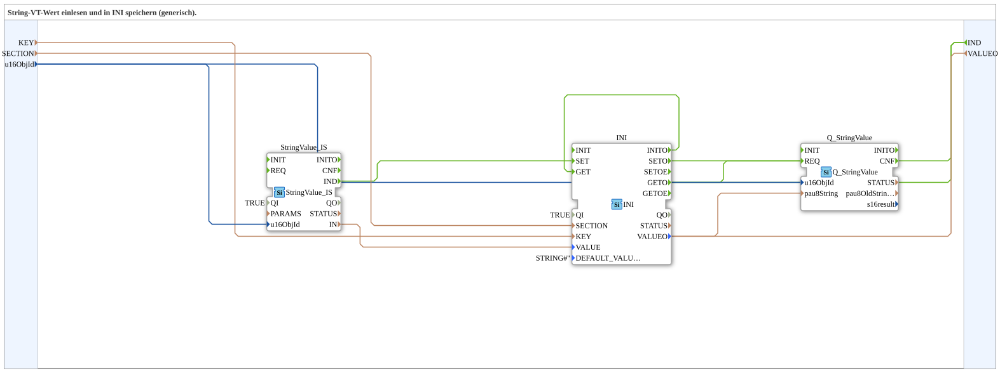

# StringValue_TO_INI

* * * * * * * * * *

## Introduction

The StringValue_TO_INI subapplication is a generic IEC 61499 component that reads a string value from an ISOBUS Virtual Terminal (VT) object and persistently stores it in an INI-based storage system. It provides both storage and retrieval functionality, making it suitable for scenarios where VT input values need to be persisted across sessions or used by other parts of a control application.

## Interface Structure

### **Event Inputs**

| Event | Description |
|-------|-------------|
| (None) | The subapplication has no event inputs. It is driven by its internal initialization and the incoming VT data. |

### **Event Outputs**

| Event | Description |
|-------|-------------|
| IND | Indicates that a SET or GET operation on the INI storage has completed successfully. |

### **Data Inputs**

| Data | Type | Description |
|------|------|-------------|
| KEY | STRING | The key name under which the value is stored in the INI file. |
| SECTION | STRING | The section name in the INI file where the key resides. |
| u16ObjId | UINT | The object identifier of the string object within the ISOBUS Virtual Terminal. Initialized to ID_NULL. |

### **Data Outputs**

| Data | Type | Description |
|------|------|-------------|
| VALUEO | STRING | The string value read from the INI storage after a GET operation. |

### **Adapters**

None.

## Functionality

The StringValue_TO_INI subapplication combines three functional building blocks to perform the following operations:

1. **Read from VT**: The internal StringValue_IS FB reads a string value from the ISOBUS VT object specified by u16ObjId. When this value is available, it triggers the INI SET operation.

2. **Store in INI**: The internal INI FB stores the received string value under the KEY within the SECTION of the INI storage. This allows the value to be persisted and retrieved later.

3. **Retrieve and Queue**: On initialization, the subapplication automatically performs a GET operation to read the stored value. This value is then output via VALUEO and also forwarded to the internal Q_StringValue queue for further processing.

The event flow is as follows:
- When the INI storage initializes, a GET operation is automatically triggered.
- Upon completion of a GET operation, the retrieved value appears at VALUEO and is queued via Q_StringValue, and the IND event is emitted.
- When a VT string value is read (StringValue_IS.IND), it is written to the INI storage via a SET operation, and the IND event is emitted upon completion.

## Technical Features

- **Generic INI Storage**: Uses the eclipse4diac INI storage FB, making the storage format compatible with standard INI file conventions.
- **ISOBUS VT Integration**: Reads string values from ISOBUS Virtual Terminal objects using the isobus::UT::io::StringValue FB, enabling interaction with operator terminals.
- **Automatic Initialization**: The subapplication performs an initial GET operation during startup to load the persisted value.
- **Queue Support**: The internal Q_StringValue block queues string values, allowing for ordered processing in downstream logic.
- **Configurable Keys**: Both KEY and SECTION are configurable data inputs, making the subapplication reusable for different INI entries.
- **Default Value Handling**: The INI FB uses a default empty string when no value exists in storage.

## State Overview

The subapplication exhibits the following operational states:

| State | Description |
|-------|-------------|
| Initialization | During startup, the INI storage initializes. The INITO output triggers a GET operation to retrieve the stored value. |
| GET Operation | Retrieves the string value associated with KEY/SECTION from the INI storage. Upon completion (GETO), the value is output and queued, and the IND event is issued. |
| SET Operation | Stores a new string value received from the VT object into INI storage. Triggered by StringValue_IS.IND. Upon completion (SETO), the IND event is issued. |
| Idle | Waiting for either a VT value to arrive (triggering SET) or for external requests that cause further GET operations. |

## Application Scenarios

- **Machine Operator Preferences**: Store operator-entered string values (e.g., machine names, batch identifiers) from a VT terminal into persistent INI storage.
- **Configuration Persistence**: Save configuration strings entered via a VT terminal so they are retained across power cycles.
- **Data Exchange Between Applications**: Write VT string values to a shared INI file that other applications can read.
- **Queued Processing**: Use the Q_StringValue queue to process multiple string values in order, e.g., for logging or sequential command execution.

## Comparison with Similar Blocks

| Feature | StringValue_TO_INI | Standard String Store FB | INI Direct Access |
|---------|-------------------|--------------------------|-------------------|
| VT interface | Yes (reads from ISOBUS VT) | Usually no | No |
| Persistent storage | Yes (INI file) | Depends on implementation | Yes |
| Queue support | Yes (Q_StringValue) | No | No |
| Configurable key/section | Yes | Limited | Yes |
| Generic reuse | High | Medium | Low |

## Conclusion

The StringValue_TO_INI subapplication provides a compact and reusable solution for bridging ISOBUS Virtual Terminal string inputs with persistent INI storage. Its automatic initialization, queue support, and configurable keys make it a versatile building block for industrial automation applications that require both operator interaction and data persistence.