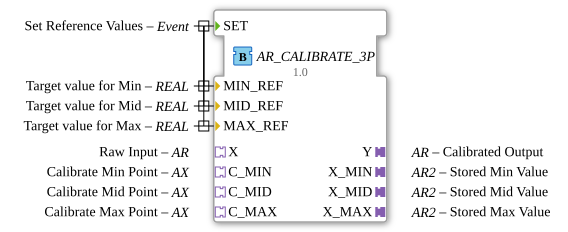

# AR_CALIBRATE_3P

* * * * * * * * * *

## Introduction

The **AR_CALIBRATE_3P** function block enables 3-point calibration of an analog input signal using adapters. It is specifically designed for joysticks that exhibit center drift and corrects this drift by linearizing between three reference points: minimum, mean, and maximum. The calibration points are saved and can be reset as needed.

## Interface Structure

### **Event Inputs**

| Name | Type | With | Comment |
| :--- | :--- | :--- | :--- |
| `SET` | `Event` | `MIN_REF`, `MID_REF`, `MAX_REF` | Sets the reference values for the calibration curve. Does not trigger a calculation, but only sets the target output values. |
| `C_MIN` | `Event` | | Atomic trigger for calibrating the minimum point (reads current raw value from `X`). |
| `C_MID` | `Event` | | Atomic trigger for calibrating the midpoint (reads current raw value from `X`). |
| `C_MAX` | `Event` | | Atomic trigger for calibrating the maximum point (reads current raw value from `X`). |

### **Event Outputs**

No explicit event outputs are available. Output is exclusively via the **Y** adapter.

### **Data Inputs**

| Name | Data Type | Default Value | Comment |
| :--- | :--- | :--- | :--- |
| `MIN_REF` | `REAL` | `0.0` | Target value for the smallest input value (Min). |
| `MID_REF` | `REAL` | `50.0` | Target value for the middle value (Mid). |
| `MAX_REF` | `REAL` | `100.0` | Target value for the largest input value (Max). |

### **Data Outputs**

No direct data outputs – all outputs are provided via **plugs** (output adapters).

### **Adapters**

| Direction | Name | Adapter Type | Comment |
| :--- | :--- | :--- | :--- |
| **Plug** (Output) | `Y` | `adapter::types::unidirectional::AR` | Calibrated output value (analog value plus event). |
| **Plug** (Output) | `X_MIN` | `adapter::types::bidirectional::AR2` | Stored minimum value (from the raw value). |
| **Plug** (Output) | `X_MID` | `adapter::types::bidirectional::AR2` | Stored average value (from the raw value). |
| **Plug** (Output) | `X_MAX` | `adapter::types::bidirectional::AR2` | Stored maximum value (from the raw value). |
| **Socket** (Input) | `X` | `adapter::types::unidirectional::AR` | Raw value from the sensor (analog value plus event). |

## Functionality

The calibration is based on piecewise linear interpolation between three stored raw values (`X_MIN`, `X_MID`, `X_MAX`) and the corresponding reference values (`MIN_REF`, `MID_REF`, `MAX_REF`).

1. **Calibration of the Points:**  
   An event at one of the calibration inputs (`C_MIN`, `C_MID`, `C_MAX`) saves the currently applied raw value (`X.D1`) to the corresponding stored value (`X_MIN.DO1`, `X_MID.DO1`, `X_MAX.DO1`).

2. **Calculation of the Calibrated Value:**  
   As soon as an event arrives from the raw value adapter (`X.E1`), the function block becomes active and executes the **REQ** algorithm. The raw value `X.D1` is then linearly mapped:

   - If the raw value is below the stored mean `X_MID.DI1`, the lower branch of the characteristic curve is used:  
     `Y.D1 = MIN_REF + (X.D1 – X_MIN.DI1) * (MID_REF – MIN_REF) / (X_MID.DI1 – X_MIN.DI1)`  
     If the intervals are invalid (division by zero or negative range), `MIN_REF` is used.

   - If the raw value is above or equal to `X_MID.DI1`, the upper branch is calculated:  
     `Y.D1 = MID_REF + (X.D1 – X_MID.DI1) * (MAX_REF – MID_REF) / (X_MAX.DI1 – X_MID.DI1)`  
     Here too, invalid intervals result in `MID_REF` being output.

3. **Clipping:**  
   The calculated output value is clipped to the interval `[MIN_REF, MAX_REF]` to ensure physically meaningful results.

4. **Output:**  
   The calibrated value is output via the adapter `Y` (event `Y.E1` and data `Y.D1`).

## Technical Features

- **Bidirectional Adapters for Calibration Points:** The stored raw values (`X_MIN`, `X_MID`, `X_MAX`) are bidirectional adapters of type `AR2`. They can be both written to (during calibration) and read from (during calculation). This ensures that the calibration points are permanently retained.
- **Atomic Event Triggering:** Calibration of the three points is triggered directly by specific event inputs (`C_MIN`, `C_MID`, `C_MAX`), eliminating intermediate AX adapters and data guards.
- **Protection Against Invalid Intervals:** The algorithms check whether the ranges of the stored raw values are positive. If not (e.g., if the system is not yet calibrated), safe default values are output.
- **No Self-Calibration:** The function block does not store a history – the system must explicitly set the calibration points by triggering the calibration events.

## State Overview

| State | Description |
| :--- | :--- |
| **IDLE** | Waiting state. Transitions: For `SET` → IDLE; for `X_MIN.EI1`, `X_MID.EI1`, `X_MAX.EI1` → IDLE; for `C_MIN` → CAL_MIN; for `C_MID` → CAL_MID; for `C_MAX` → CAL_MAX; for `X.E1` → REQ. |
| **REQ** | Calculates the calibrated output value. Returns to IDLE immediately after execution. |
| **CAL_MIN** | Stores the current raw value as minimum (`X_MIN.DO1 := X.D1`). Returns to IDLE automatically. |
| **CAL_MID** | Stores the current raw value as average (`X_MID.DO1 := X.D1`). Returns to IDLE automatically. |
| **CAL_MAX** | Stores the current raw value as maximum (`X_MAX.DO1 := X.D1`). Returns to IDLE automatically. |

**Transition Conditions:**

- `X.E1` → Start of calculation
- `C_MIN` → Calibration of the minimum point
- `C_MID` → Calibration of the midpoint
- `C_MAX` → Calibration of the maximum point
- `SET`, `X_MIN.EI1`, `X_MID.EI1`, `X_MAX.EI1` → No state change (remains in IDLE)

## Application Scenarios

- **Joystick Calibration:** A joystick with an analog output (e.g., 0–10 V) exhibits component-related deviations at center and end positions. The operator moves the joystick to the three positions (Min, Mid, Max) and triggers the calibration events via pushbuttons. `Y` then delivers a linearized value normalized to target limits.
- **Analog Potentiometer:** A sliding potentiometer affected by wear can be corrected via 3-point calibration.
