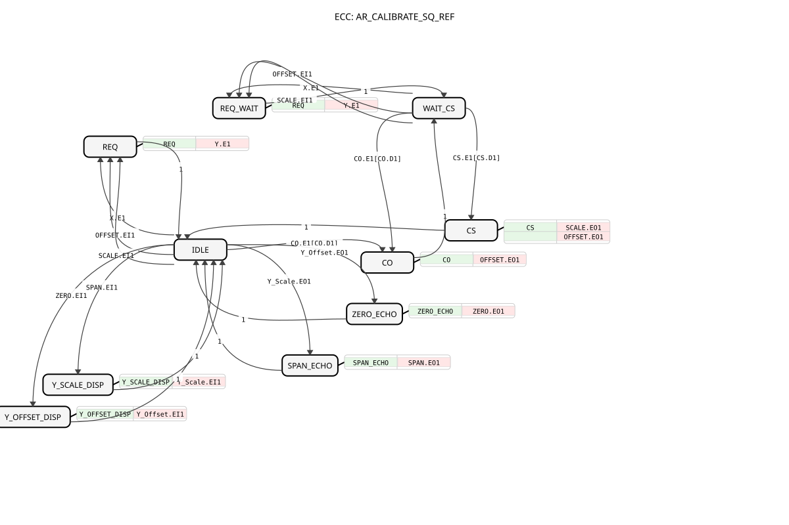

# AR_CALIBRATE_SQ_REF





* * * * * * * * * *
## Introduction
The `AR_CALIBRATE_SQ_REF` function block implements a sequential two‑point calibration routine (offset first, then scale) for analog measurement signals. It is designed as an adapter‑based component that works with live reference values (`Y_Offset`, `Y_Scale`) provided via bidirectional AR2 sockets, which are persisted through additional AR2 plugs (`ZERO`, `SPAN`). The block enforces the correct calibration order using an ECC state machine, ensuring that the scale step can only be performed after a valid offset calibration.

The overall formula is:

```
Y = (X + OFFSET) * SCALE
```

The block provides a continuously calculated, calibrated output `Y` from raw input `X`, while storing the calibration parameters (`OFFSET`, `SCALE`) and the reference target values in a persistent way (via dedicated adapter plugs).

## Interface Structure
The block uses only adapter interfaces – no direct event or data inputs/outputs are exposed. All communication is done through the plugs and sockets listed below. The event and data items available on each adapter are grouped accordingly.

### **Event Inputs**
| Event | Description |
|-------|-------------|
| `X.E1` | Raw input sample ready. Triggers the calculation of the calibrated output. |
| `CO.E1` | Offset calibration trigger. Must be accompanied by `CO.D1` (guard) equal to `TRUE`. |
| `CS.E1` | Scale calibration trigger. Must be accompanied by `CS.D1` (guard) equal to `TRUE`. Only reachable after the offset calibration has been performed. |
| `OFFSET.EI1` | Input event from the `OFFSET` adapter plug indicating that the stored offset value has been updated externally. |
| `SCALE.EI1` | Input event from the `SCALE` adapter plug indicating that the stored scale value has been updated externally. |
| `ZERO.EI1` | Input event from the `ZERO` adapter plug indicating that the persisted low‑point reference value has been loaded or updated. |
| `SPAN.EI1` | Input event from the `SPAN` adapter plug indicating that the persisted high‑point reference value has been loaded or updated. |
| `Y_Offset.EO1` | Input event from the live `Y_Offset` socket – arrives when a new offset target is written from the external side. |
| `Y_Scale.EO1` | Input event from the live `Y_Scale` socket – arrives when a new scale target is written from the external side. |

### **Event Outputs**
| Event | Description |
|-------|-------------|
| `Y.E1` | Output event indicating that a new calibrated output value is available on `Y.D1`. |
| `OFFSET.EO1` | Output event to the `OFFSET` adapter plug, used to write the newly calculated offset value. |
| `SCALE.EO1` | Output event to the `SCALE` adapter plug, used to write the newly calculated scale value. |
| `ZERO.EO1` | Output event to the `ZERO` adapter plug, used to persist the live offset target value. |
| `SPAN.EO1` | Output event to the `SPAN` adapter plug, used to persist the live scale target value. |
| `Y_Offset.EI1` | Output event back through the `Y_Offset` socket, echoing the persisted/restored offset target for display purposes. |
| `Y_Scale.EI1` | Output event back through the `Y_Scale` socket, echoing the persisted/restored scale target for display purposes. |

### **Data Inputs**
| Data | Description |
|------|-------------|
| `X.D1` | Raw input value (REAL) from the unidirectional adapter `X`. |
| `OFFSET.DI1` | Current offset value read from the `OFFSET` adapter plug. |
| `SCALE.DI1` | Current scale value read from the `SCALE` adapter plug. |
| `ZERO.DI1` | Persisted low‑point target reference (desired output at the low calibration point). |
| `SPAN.DI1` | Persisted high‑point target reference (desired output at the high calibration point). |
| `Y_Offset.DO1` | Live offset target value arriving from the external side via the `Y_Offset` socket. |
| `Y_Scale.DO1` | Live scale target value arriving from the external side via the `Y_Scale` socket. |
| `CO.D1` | Guard value for the offset calibration transition – must be `TRUE` to allow the transition. |
| `CS.D1` | Guard value for the scale calibration transition – must be `TRUE` to allow the transition. |

### **Data Outputs**
| Data | Description |
|------|-------------|
| `Y.D1` | Calibrated output value (REAL) calculated as `(X.D1 + OFFSET.DI1) * SCALE.DI1`. |
| `OFFSET.DO1` | New offset value written to the `OFFSET` adapter plug. |
| `SCALE.DO1` | New scale value written to the `SCALE` adapter plug. |
| `ZERO.DO1` | Offset target value written to the `ZERO` adapter plug for persistence. |
| `SPAN.DO1` | Scale target value written to the `SPAN` adapter plug for persistence. |
| `Y_Offset.DI1` | Echo of the persisted/restored offset target value sent back through the `Y_Offset` socket. |
| `Y_Scale.DI1` | Echo of the persisted/restored scale target value sent back through the `Y_Scale` socket. |

### **Adapters**
| Name | Type | Direction | Comment |
|------|------|-----------|---------|
| `Y` | `adapter::types::unidirectional::AR` | Plug | Calibrated Output – provides the calculation result. |
| `OFFSET` | `adapter::types::bidirectional::AR2` | Plug | Stored offset value (initial 0.0) – can be read and written. |
| `SCALE` | `adapter::types::bidirectional::AR2` | Plug | Stored scale value (initial 1.0) – can be read and written. |
| `ZERO` | `adapter::types::bidirectional::AR2` | Plug | Persisted low‑point target reference (Y_Offset / Nullpunkt). |
| `SPAN` | `adapter::types::bidirectional::AR2` | Plug | Persisted high‑point target reference (Y_Scale / Spanne). |
| `X` | `adapter::types::unidirectional::AR` | Socket | Raw Input – measurement value to be calibrated. |
| `CO` | `adapter::types::unidirectional::AX` | Socket | Calibrate Offset – trigger for the offset step. |
| `CS` | `adapter::types::unidirectional::AX` | Socket | Calibrate Scale – trigger for the scale step. |
| `Y_Offset` | `adapter::types::bidirectional::AR2` | Socket | Live target output Y at low calibration point – written externally, echoed back for display. |
| `Y_Scale` | `adapter::types::bidirectional::AR2` | Socket | Live target output Y at high calibration point – written externally, echoed back for display. |

## Functionality
The block performs a **sequential two‑point calibration**:

1. **Offset Calibration (CO step):**
   - Store the current raw input `X.D1` as `X_LOW_INT`.
   - Store the desired low‑point output `ZERO.DI1` as `Y_LOW_INT`.
   - Calculate the offset so that after the calibration the output equals the low‑point target:
     - If `SCALE.DI1` is non‑zero: `OFFSET := ZERO.DI1 / SCALE.DI1 - X.D1`
     - Otherwise: `OFFSET := ZERO.DI1 - X.D1`
   - Write the new offset to the `OFFSET` plug.

2. **Scale Calibration (CS step):**
   - This step is only reachable after the offset step has been performed (ECC‑enforced via the `WAIT_CS` state).
   - Using the stored low‑point values (`X_LOW_INT`, `Y_LOW_INT`) and the current raw input `X.D1` and high‑point target `SPAN.DI1`:
     - If `(X.D1 - X_LOW_INT) != 0.0`, compute `SCALE := (SPAN.DI1 - Y_LOW_INT) / (X.D1 - X_LOW_INT)`.
     - If the new scale is non‑zero, recompute the offset to keep the low point exact:
       `OFFSET := Y_LOW_INT / SCALE - X_LOW_INT`.
   - Write both updated parameters to their respective plugs.

The continuous output calculation is performed on every `X.E1` event:

```
Y.D1 = (X.D1 + OFFSET.DI1) * SCALE.DI1
```

**Reference target handling:**
- `Y_Offset` and `Y_Scale` are live sockets. The external side (e.g. a VT/web reader) sends a new target value via `EO1`/`DO1`. The block reacts by immediately writing that value to the `ZERO` or `SPAN` plug (which can be connected to a persistence adapter such as `INI_AR2` or `NVS_AR2`).
- Whenever a persisted value arrives (via `ZERO.EI1` or `SPAN.EI1`), the block echoes it back through `Y_Offset.EI1`/`Y_Scale.EI1` so that the external display can show the current (possibly boot‑restored) targets.
- The calibration algorithms (`CO`, `CS`) always use the round‑tripped values `ZERO.DI1` / `SPAN.DI1` instead of the raw incoming values, ensuring consistency with what is actually persisted.

## Technical Features
- **Adapter‑based interface** – no direct I/O; all communication through the listed plugs and sockets.
- **ECC‑enforced execution order** – the state machine ensures that the scale step can only be performed after the offset step (state `WAIT_CS`). Offset calibration can be repeated at any time.
- **Bidirectional persistence** – `OFFSET`, `SCALE`, `ZERO`, and `SPAN` are plugs of type `AR2` and can be connected to external storage.
- **Live target update & echo** – new targets are immediately captured and persisted; persisted values are echoed back to the source for display.
- **Real data type** – all numerical values are `REAL`.
- **Algorithm / state structure** – all logic is implemented in structured text (ST) inside the ECC.

## State Overview
The ECC contains the following states:

| State | Activity | Transitions |
|-------|----------|-------------|
| `IDLE` | Wait for input. | Triggered by `X.E1`, `CO.E1[CO.D1]`, `OFFSET.EI1`, `SCALE.EI1`, `Y_Offset.EO1`, `Y_Scale.EO1`, `ZERO.EI1`, `SPAN.EI1`. |
| `REQ` | Calculate and output `Y` (algorithm `REQ`, output `Y.E1`). | Always returns to `IDLE`. |
| `CO` | Offset calibration (algorithm `CO`, output `OFFSET.EO1`). | Always moves to `WAIT_CS`. |
| `WAIT_CS` | Wait for scale calibration or re‑calibration of offset. | Triggered by `CS.E1[CS.D1]` → `CS`; by `CO.E1[CO.D1]` → re‑enter `CO`; by `X.E1` → `REQ_WAIT`; by `OFFSET.EI1`/`SCALE.EI1` → `REQ_WAIT`. |
| `CS` | Scale calibration (algorithm `CS`, outputs `SCALE.EO1` and `OFFSET.EO1`). | Always returns to `IDLE`. |
| `REQ_WAIT` | Calculate output (same as `REQ`) while waiting for calibration. | Always returns to `WAIT_CS`. |
| `ZERO_ECHO` | Persist live `Y_Offset` value to `ZERO` (algorithm `ZERO_ECHO`, output `ZERO.EO1`). | Returns to `IDLE`. |
| `SPAN_ECHO` | Persist live `Y_Scale` value to `SPAN` (algorithm `SPAN_ECHO`, output `SPAN.EO1`). | Returns to `IDLE`. |
| `Y_OFFSET_DISP` | Echo persisted `ZERO` value back out via `Y_Offset.EI1` (algorithm `Y_OFFSET_DISP`). | Returns to `IDLE`. |
| `Y_SCALE_DISP` | Echo persisted `SPAN` value back out via `Y_Scale.EI1` (algorithm `Y_SCALE_DISP`). | Returns to `IDLE`. |

The state diagram enforces that after `CO` the block is in `WAIT_CS` – the only state from which `CS` can be reached. Normal output calculation (`REQ` / `REQ_WAIT`) can occur in all states, giving continuous calibrated values.

## Application Scenarios
- **Measurement systems with two‑point calibration** – e.g., pressure, temperature, or load sensors where a low and a high reference must be set sequentially.
- **Industrial control panels** – where calibration parameters need to be stored in non‑volatile memory and displayed on a human‑machine interface.
- **Automated calibration routines** – the ECC‑enforced order prevents incorrect calibration sequences.
- **Remote calibration with live updates** – the `Y_Offset`/`Y_Scale` sockets allow an external tool to provide new targets on the fly, which are then persisted and echoed back for confirmation.

## Comparison with Similar Blocks
A closely related block is `AR_CALIBRATE_SQ` (without `_REF`). The main difference is that in `AR_CALIBRATE_SQ_REF` the reference target values (`Y_Offset`, `Y_Scale`) are **not** static inputs but **live bidirectional sockets**. This enables:
- Direct writing of targets from external sources (e.g., web interfaces).
- Automatic persistence of those targets via the `ZERO`/`SPAN` plugs.
- Echo of the persisted values back to the display, allowing boot‑restored defaults to be shown.

The core calibration algorithm itself is identical to `AR_CALIBRATE_SQ`, but the interface and the way reference values are managed differ, making this block suitable for more interactive or remote‑operated applications.

## Conclusion
`AR_CALIBRATE_SQ_REF` is a robust, adapter‑based function block for sequential two‑point calibration with a strong focus on persistence and live update of reference values. Its ECC‑enforced state machine guarantees a safe calibration order, and the bidirectional adapter interfaces provide a clean separation between the calibration logic and the external storage/display components. The block is especially useful in modern industrial environments where calibration values need to be modified and displayed through web or visualization tools without sacrificing data integrity.