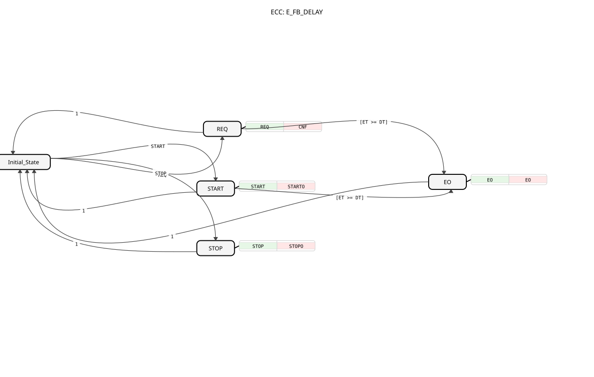

# E_FB_DELAY

* * * * * * * * * *

## Introduction

The **E_FB_DELAY** function block is a basic IEC 61499 FB designed to propagate an event after a predefined delay time. It provides a cyclic interface (similar to a `TON` timer) allowing external logic to start, stop, and poll the elapsed time while the delay is active. When the delay time is reached, an output event `EO` is emitted, indicating that the desired time has elapsed. The FB is particularly useful in scenarios where a timed response or a scheduled action is required, and it can be driven by an external cyclic trigger (e.g., an `E_CYCLE` block) to keep the elapsed time up-to-date.

## Interface Structure

### **Event Inputs**

- **REQ** (`Event`): Normal execution request. When the timer is armed (`Q = TRUE`), this event causes the FB to update the elapsed time (`ET`) by reading the system monotonic clock.
- **START** (`Event`): Starts the delayed event propagation. When this event is received, the FB records the current time, sets the output `Q` to `TRUE`, and resets `ET` to zero.
- **STOP** (`Event`): Stops the delayed event propagation. It cancels the active timer without generating an `EO` event; the output `Q` is cleared and `ET` is reset to zero.

### **Event Outputs**

- **CNF** (`Event`): Execution confirmation. Emitted whenever the `REQ` algorithm completes (i.e., after an execution request).
- **STARTO** (`Event`): Confirmation that the timer has been started. Emitted after the `START` algorithm executes.
- **STOPO** (`Event`): Confirmation that the timer has been stopped. Emitted after the `STOP` algorithm executes.
- **EO** (`Event`): Delayed event. Emitted when the elapsed time (`ET`) reaches or exceeds the delay time (`DT`). This is the main output that signals the completion of the delay period.

### **Data Inputs**

- **DT** (`TIME`): Delay time. Must be greater than zero. This is the duration the FB waits before generating the `EO` event.

### **Data Outputs**

- **Q** (`BOOL`): Output indicating that the timer is currently armed (`TRUE` when the delay is in progress, `FALSE` otherwise).
- **PT** (`TIME`): Process time. Represents the total delay time configured (i.e., the value of `DT`). It is provided as an output for informational purposes.
- **ET** (`TIME`): Elapsed time. Shows how much time has passed since the timer was started. This value is only updated when the `REQ` event is triggered while the timer is armed.

### **Adapters**

No adapters are defined for this FB.

## Functionality

The E_FB_DELAY operates as a cyclic timer that can be started, polled, and stopped. The core logic is implemented as a basic FB with an ECC (Execution Control Chart) and four algorithms:

1. **START**:  
   - Records the current monotonic time into the internal variable `StartTime`.  
   - Sets `Q = TRUE` to indicate the timer is armed.  
   - Resets `ET = T#0s`.

2. **REQ**:  
   - If `Q = TRUE` (timer is armed), it reads the current monotonic time and calculates `ET = NOW_MONOTONIC() - StartTime`.  
   - If `Q = FALSE`, it performs no operation.  
   - This allows an external cyclic trigger (e.g., an `E_CYCLE` block) to refresh `ET` periodically.

3. **STOP**:  
   - Clears `Q = FALSE`.  
   - Resets `ET = T#0s`.  
   - No `EO` event is generated.

4. **EO**:  
   - Executed when the condition `[ET >= DT]` is true after a `REQ` or `START` event.  
   - Clears `Q = FALSE`.  
   - Resets `ET = T#0s`.  
   - This prevents the condition from remaining true, so an `EO` event is fired only once per active delay period.

The ECC defines the state transitions that drive these algorithms. The block begins in `Initial_State`. From there:

- `REQ` → goes to `REQ` state, executes algorithm `REQ`, outputs `CNF`, then either transitions to `EO` (if `ET >= DT`) or back to `Initial_State`.
- `START` → goes to `START` state, executes algorithm `START`, outputs `STARTO`, then checks `ET >= DT`; if true, moves to `EO`, otherwise returns to `Initial_State`.
- `STOP` → goes to `STOP` state, executes algorithm `STOP`, outputs `STOPO`, and returns to `Initial_State`.
- From `EO` state (which executes `EO` and outputs the `EO` event), it always returns to `Initial_State`.

The block is intended to be driven cyclically: while a delay is active, the application should send `REQ` events (e.g., from a periodic cyclic function block) to update `ET`. When `ET` reaches `DT`, the FB will generate an `EO` event automatically. The `START` event can be used to (re)arm the timer, and `STOP` can cancel it prematurely.

## Technical Features

- **Monotonic Clock Usage**: The FB uses `NOW_MONOTONIC()` to obtain a monotonic time source, ensuring that the elapsed time is not affected by system clock adjustments.
- **Single-Shot Delay**: The `EO` event is generated exactly once per `START` cycle. After `EO` is emitted, the timer is automatically disarmed and `ET` reset, so subsequent `REQ` events will not re-trigger `EO`.
- **Cyclic Polling Support**: The `REQ` event allows an external cyclic trigger to update `ET` continuously. This makes the block suitable for applications where the delay time must be monitored in real time.
- **Simple Interface**: The block exposes only the essential inputs and outputs, making it easy to integrate into larger IEC 61499 systems.
- **No Persistence**: The FB is stateless between activations (except for the `StartTime` internal variable), but after a `START`/`STOP`/`EO` sequence, all state variables are reset.

## State Overview

The ECC contains five states:

1. **Initial_State**: The idle state where no timer is active. The block remains here until a `START`, `STOP`, or `REQ` event is received.
2. **REQ**: A transient state triggered by the `REQ` event. Executes the `REQ` algorithm and outputs `CNF`. After that, it either transitions to `EO` (if the delay time has elapsed) or returns to `Initial_State`.
3. **START**: A transient state triggered by the `START` event. Executes the `START` algorithm and outputs `STARTO`. Then it checks if the delay time has already been reached (unlikely since the timer was just started) and transitions to `EO` if so, otherwise returns to `Initial_State`.
4. **STOP**: A transient state triggered by the `STOP` event. Executes the `STOP` algorithm and outputs `STOPO`, then returns to `Initial_State`.
5. **EO**: A transient state that is entered when the condition `[ET >= DT]` is satisfied. Executes the `EO` algorithm, outputs the `EO` event, and then returns to `Initial_State`.

The transitions are summarized as follows:

- `Initial_State` → `REQ` (on `REQ`)
- `Initial_State` → `START` (on `START`)
- `Initial_State` → `STOP` (on `STOP`)
- `REQ` → `EO` (if `[ET >= DT]`)
- `REQ` → `Initial_State` (always, after executing `REQ` and `CNF`, if condition not met)
- `START` → `EO` (if `[ET >= DT]` – normally false immediately after start)
- `START` → `Initial_State` (always, after executing `START` and `STARTO`, if condition not met)
- `STOP` → `Initial_State` (always, after executing `STOP` and `STOPO`)
- `EO` → `Initial_State` (always, after executing `EO`)

## Application Scenarios

- **Timed Output Generation**: Trigger an action (e.g., a valve open/close, a light, a data acquisition) after a configurable delay.
- **Synchronization with Cyclic Tasks**: When integrated with a cyclic execution framework (e.g., an `E_CYCLE` block that sends `REQ` periodically), the FB provides an accurate timer that can be polled without blocking the system.
- **Timeout Monitoring**: Use `START` to arm a watchdog, poll `ET` via `REQ` to monitor progress, and receive `EO` if the timeout occurs. `STOP` can be used to cancel the watchdog when the expected action happens earlier.
- **Sequence Control**: In a sequential logic, the block can be used to enforce a minimum dwell time in a state before allowing a transition to the next step.

## Comparison with Similar Blocks

Compared to the standard IEC 61499 **TON** (Timer On-Delay) function block, **E_FB_DELAY** offers a more explicit cyclic interface:

- It requires an external `REQ` event to update `ET`, while a `TON` block typically updates its elapsed time automatically within its own execution context.
- The `REQ` mechanism gives the developer control over when time evaluation occurs, which can be beneficial in deterministic or event-driven systems.
- The block provides separate output events for start/stop confirmation (`STARTO`, `STOPO`) and the actual delay completion (`EO`), whereas a `TON` block typically outputs a boolean `Q` and an elapsed time `ET` but no explicit event for "delay reached".
- The use of `NOW_MONOTONIC()` and the internal `StartTime` variable ensures high accuracy and independence from system time adjustments.

In essence, **E_FB_DELAY** is a more event-oriented timer that fits well into the IEC 61499 event-driven model, while a `TON` block is more oriented toward continuous monitoring.

## Conclusion

The **E_FB_DELAY** function block provides a robust and flexible way to implement delayed event propagation in IEC 61499 applications. Its cyclic interface, combined with explicit start/stop controls and a single-shot delay output, makes it suitable for a wide range of timing requirements. The block is implemented as a basic FB with a clear ECC, making it easy to analyze, test, and maintain. Its use of a monotonic clock ensures reliable timing, and its design aligns with the event-driven philosophy of the 4diac IDE and the IEC 61499 standard.
