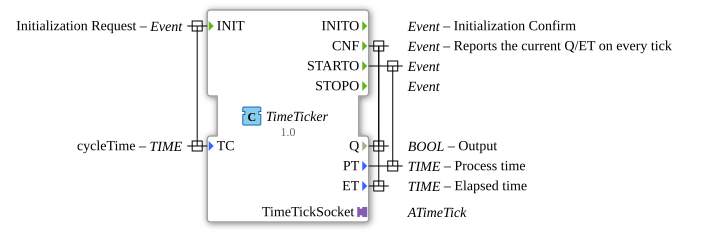

# TimeTicker

* * * * * * * * * *
## Introduction

TimeTicker is a composite function block that wraps an `E_CYCLE` block and combines it with an `ATimeTick` adapter. It generates periodic time-tick events and exposes them through an adapter interface together with status and timing information. The block is intended for applications that need a configurable, event-driven time tick source with process time, elapsed time, and output state.

## Interface Structure

### **Event Inputs**

| Name | Type | Associated Data | Comment |
|------|------|-----------------|---------|
| INIT | EInit | TC | Initialization Request |

### **Event Outputs**

| Name | Type | Associated Data | Comment |
|------|------|-----------------|---------|
| INITO | EInit | - | Initialization Confirm |
| CNF | Event | Q, ET | Reports the current Q/ET on every tick |
| STARTO | Event | PT | Start signal passed through from the adapter |
| STOPO | Event | - | Stop signal passed through from the adapter |

### **Data Inputs**

| Name | Type | Initial Value | Comment |
|------|------|---------------|---------|
| TC | TIME | T#200ms | cycleTime |

### **Data Outputs**

| Name | Type | Comment |
|------|------|---------|
| Q | BOOL | Output |
| PT | TIME | Process time |
| ET | TIME | Elapsed time |

### **Adapters**

| Name | Type | Kind | Role |
|------|------|------|------|
| TimeTickSocket | adapter::events::TimeOut::ATimeTick | Plug | Carries the periodic tick dialog, including REQ/CNF events, start/stop signals, and Q/PT/ET data. |

## Functionality

TimeTicker uses an internal `E_CYCLE` function block to generate periodic events. The cycle time is provided through the `TC` input and is connected directly to the `DT` input of the internal `E_CYCLE`.

The block does not expose direct `START` and `STOP` event inputs. Instead, start and stop requests are received through the `ATimeTick` adapter via its `STARTO_IN` and `STOPO_IN` events. These events are forwarded to the `STARTO` and `STOPO` outputs and also control the internal `E_CYCLE`.

When the internal cycle is running, each generated `EO` event is sent to the adapter as `REQ`. The adapter or connected peer can then respond with `CNF`, which is forwarded to the external `CNF` event output together with the current `Q` and `ET` values. The `PT` value is associated with the `STARTO` event.

`INIT` is directly connected to `INITO`, so initialization is confirmed immediately. The `TC` value is associated with the `INIT` event, meaning the cycle time should be supplied when the block is initialized.

## Technical Features

- Composite function block wrapping an `E_CYCLE` timer block.
- Adapter-based interface using `adapter::events::TimeOut::ATimeTick`.
- Configurable cycle time through the `TC` data input, default `T#200ms`.
- No internal state machine; the behavior is determined by the internal `E_CYCLE` and the connected adapter.
- Event/data associations:
  - `CNF` carries `Q` and `ET`.
  - `STARTO` carries `PT`.
- Start and stop behavior is controlled entirely through the adapter.
- `Q`, `PT`, and `ET` are supplied by the connected adapter/peer and forwarded to the block outputs.

## State Overview

TimeTicker does not contain an explicit ECC state machine. Observable behavior depends on the internal `E_CYCLE` and the adapter connection.

| State | Trigger | Behavior |
|-------|---------|----------|
| Initializing | INIT | Initializes the block and emits INITO. |
| Idle | After INIT, before start | Internal E_CYCLE is stopped; no tick requests are generated. |
| Running | STARTO_IN from adapter | STARTO is emitted and E_CYCLE is started. Periodic EO events generate REQ/CNF cycles. |
| Stopped | STOPO_IN from adapter | STOPO is emitted and E_CYCLE is stopped. Further tick generation is suppressed. |

## Application Scenarios

- Periodic time-tick generation for timeout-monitoring adapters.
- Watchdog or heartbeat signaling with status output `Q` and elapsed time `ET`.
- Synchronous periodic request/confirm dialogs through an `ATimeTick` adapter.
- Integration into IEC 61499 applications that require a configurable, event-driven tick source.
- Measurement and forwarding of process time `PT` in cyclic control or supervision tasks.

## Comparison with Similar Blocks

| Feature | E_CYCLE | TimeTicker |
|---------|---------|------------|
| Cycle time input | DT | TC |
| Start/stop control | Direct START/STOP events | Via ATimeTick adapter events |
| Periodic event output | EO | CNF, generated after REQ/CNF dialog |
| Additional data outputs | None | Q, PT, ET |
| Adapter interface | No | Yes, via ATimeTick plug |

Compared to a raw `E_CYCLE`, TimeTicker provides a cleaner adapter-based interface and adds status, process time, and elapsed time outputs. It still relies on `E_CYCLE` for the actual cycle generation.

## Conclusion

TimeTicker is a compact composite block that adapts the standard `E_CYCLE` behavior into an adapter-driven tick source. It is especially useful when periodic time events need to be combined with status information, process time, and elapsed time, and when the surrounding application is built around IEC 61499 adapters.