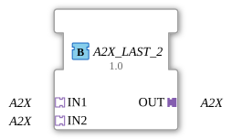

# A2X_LAST_2

## Introduction

The A2X_LAST_2 function block merges two A2X adapter signals (**IN1**, **IN2**) into one shared output (**OUT**). Unlike the single-channel [`AX_LAST_2`](AX_LAST_2.md), A2X carries two independent channels (**UP** and **DOWN**), which are therefore also merged independently by last-writer-wins: whichever socket last wrote on UP wins for UP; whichever last wrote on DOWN wins for DOWN - regardless of what happens on the other channel.

## Interface Structure

### **Adapters**

**Input adapters (Sockets):**

- **IN1**: A2X adapter (unidirectional) - first signal source (UP + DOWN)
- **IN2**: A2X adapter (unidirectional) - second signal source (UP + DOWN)

**Output adapter (Plug):**

- **OUT**: A2X adapter (unidirectional) - merged signal (UP + DOWN)

## How it works

The block is implemented as a Basic FB with a 5-state ECC (START, PASS1_UP, PASS2_UP, PASS1_DOWN, PASS2_DOWN) that serves both channels through the same ECC - since only one event is processed per FB invocation, UP and DOWN processing never collide. When an event arrives at IN1.UP or IN2.UP, that UP value is copied to OUT.UP and OUT.E_UP is fired. Symmetrically, an event at IN1.DOWN/IN2.DOWN copies the DOWN value to OUT.DOWN and fires OUT.E_DOWN. The two channels therefore have independent "winners" - IN1 might currently dominate the UP channel while IN2 dominates the DOWN channel.

## Technical Details

- Two independent last-writer-wins merges (UP and DOWN) in one block
- Extends the generic single-channel LAST_2 pattern to the 2-channel A2X adapter type
- One shared ECC for both channels, since only one event is processed per invocation - no state conflict possible
- No signal delay: the value is passed through in the same cycle the triggering event arrives

## Application Scenarios

- Merging two equally-valid A2X signal sources (e.g. two operator stations for an up/down control) into one downstream adapter path
- Arbitrating between two independent up/down sources where UP and DOWN may come from different origins

## ⚖️ Comparison with Similar Blocks

A2X_LAST_2 is the two-channel variant of the generic [`AX_LAST_2`](AX_LAST_2.md) pattern, applied to the A2X adapter type with its two independent UP/DOWN channels. For mixed operation between a data adapter and a pure event adapter, use [`AX_AE_MERGE`](AX_AE_MERGE.md) instead.
