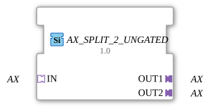

# AX_SPLIT_2_UNGATED

> ℹ️ **UNGATED variant:** This block is the ungated version of [`AX_SPLIT_2`](AX_SPLIT_2.md). It suppresses **no** unchanged repeats – every newly computed result is forwarded unconditionally, even without a value change. This matters for consumers that need a periodic cadence regardless of value change (e.g. derivative/frequency calculations that would otherwise fail to decay toward zero). Any change-detection/gating statements further down this page do **not** apply to this block.

* * * * * * * * * *
## Introduction

The AX_SPLIT_2_UNGATED function block serves as a generic building block for distributing an AX signal to two separate outputs. The block enables the splitting of an incoming AX signal to two independent output channels.

## Interface Structure

### **Event Inputs**

No direct event inputs available

### **Event Outputs**

No direct event outputs available

### **Data Inputs**

No direct data inputs available

### **Data Outputs**

No direct data outputs available

### **Adapters**

**Input Adapters:**

- **IN**: AX adapter (unidirectional) - Receives the incoming AX signal

**Output Adapters:**

- **OUT1**: AX adapter (unidirectional) - First output channel for the distributed signal
- **OUT2**: AX adapter (unidirectional) - Second output channel for the distributed signal

## Functionality

The AX_SPLIT_2_UNGATED function block receives an AX signal via the IN adapter and simultaneously distributes this signal to both output adapters OUT1 and OUT2. OUT2. This is a 1:2 distribution, where the incoming signal is passed on to both outputs without modification.

## Technical Features

- Generic implementation for AX signals
- Unidirectional signal transmission
- No signal delay between input and output
- Simultaneous activation of both outputs

## State Overview

The function block operates statelessly – with every incoming signal via the IN adapter, both output adapters are immediately activated.

## Application Scenarios

- Signal distribution in control systems
- Parallel supply of multiple components with the same signal
- Branching of AX communication paths
- Redundant signal routing

## ⚖️ Comparison with Similar Function Blocks

Compared to other distribution blocks, AX_SPLIT_2_UNGATED offers a specific 1:2 split for AX signals. Other splitter blocks may support different numbers of outputs or other signal types.

Comparison with [E_SPLIT](../../../../../StandardLibraries/events/E_SPLIT.md)

## 🛠️ Related exercises

- [Uebung_002_AX](https://docs.ms-muc-docs.de/projects/visual-programming-languages-docs/en/latest/Uebungen/test_AX/Uebungen_doc/Uebung_002_AX/)
- [Uebung_004b_AX](https://docs.ms-muc-docs.de/projects/visual-programming-languages-docs/en/latest/Uebungen/test_AX/Uebungen_doc/Uebung_004b_AX/)
- [Uebung_004b_AX_ASR](https://docs.ms-muc-docs.de/projects/visual-programming-languages-docs/en/latest/Uebungen/test_AX/Uebungen_doc/Uebung_004b_AX_ASR/)
- [Uebung_004b_AX_ASR_X](https://docs.ms-muc-docs.de/projects/visual-programming-languages-docs/en/latest/Uebungen/test_AX/Uebungen_doc/Uebung_004b_AX_ASR_X/)
- [Uebung_006a3_sub_AX](https://docs.ms-muc-docs.de/projects/visual-programming-languages-docs/en/latest/Uebungen/test_AX/Uebungen_doc/Uebung_006a3_sub_AX/)
- [Uebung_007a3_AX](https://docs.ms-muc-docs.de/projects/visual-programming-languages-docs/en/latest/Uebungen/test_AX/Uebungen_doc/Uebung_007a3_AX/)
- [Uebung_008_AX](https://docs.ms-muc-docs.de/projects/visual-programming-languages-docs/en/latest/Uebungen/test_AX/Uebungen_doc/Uebung_008_AX/)
- [Uebung_010c2_AX](https://docs.ms-muc-docs.de/projects/visual-programming-languages-docs/en/latest/Uebungen/test_AX/Uebungen_doc/Uebung_010c2_AX/)
- [Uebung_010c3_sub_AX](https://docs.ms-muc-docs.de/projects/visual-programming-languages-docs/en/latest/Uebungen/test_AX/Uebungen_doc/Uebung_010c3_sub_AX/)
- [Uebung_010c4_sub_AX](https://docs.ms-muc-docs.de/projects/visual-programming-languages-docs/en/latest/Uebungen/test_AX/Uebungen_doc/Uebung_010c4_sub_AX/)
- [Uebung_010c_AX](https://docs.ms-muc-docs.de/projects/visual-programming-languages-docs/en/latest/Uebungen/test_AX/Uebungen_doc/Uebung_010c_AX/)
- [Uebung_020c3_AX](https://docs.ms-muc-docs.de/projects/visual-programming-languages-docs/en/latest/Uebungen/test_AX/Uebungen_doc/Uebung_020c3_AX/)
- [Uebung_020e2_AX](https://docs.ms-muc-docs.de/projects/visual-programming-languages-docs/en/latest/Uebungen/test_AX/Uebungen_doc/Uebung_020e2_AX/)
- [Uebung_020f2_AX](https://docs.ms-muc-docs.de/projects/visual-programming-languages-docs/en/latest/Uebungen/test_AX/Uebungen_doc/Uebung_020f2_AX/)
- [Uebung_020j2_AX_sub](https://docs.ms-muc-docs.de/projects/visual-programming-languages-docs/en/latest/Uebungen/test_AX/Uebungen_doc/Uebung_020j2_AX_sub/)
- [Exercise_020j_AX](https://docs.ms-muc-docs.de/projects/visual-programming-languages-docs/en/latest/Uebungen/test_AX/Uebungen_doc/Uebung_020j_AX/)
- [Exercise_035a2_AX](https://docs.ms-muc-docs.de/projects/visual-programming-languages-docs/en/latest/Uebungen/test_AX/Uebungen_doc/Uebung_035a2_AX/)
- [Exercise_035a3_AX](https://docs.ms-muc-docs.de/projects/visual-programming-languages-docs/en/latest/Uebungen/test_AX/Uebungen_doc/Uebung_035a3_AX/)
- [Exercise_094a_AX](https://docs.ms-muc-docs.de/projects/visual-programming-languages-docs/en/latest/Uebungen/test_AX/Uebungen_doc/Uebung_094a_AX/)
- [Exercise_160_AX](https://docs.ms-muc-docs.de/projects/visual-programming-languages-docs/en/latest/Uebungen/test_AX/Uebungen_doc/Uebung_160_AX/)
- [Exercise_160b2_AX](https://docs.ms-muc-docs.de/projects/visual-programming-languages-docs/en/latest/Uebungen/test_AX/Uebungen_doc/Uebung_160b2_AX/)
- [Exercise_160b_AX](https://docs.ms-muc-docs.de/projects/visual-programming-languages-docs/en/latest/Uebungen/test_AX/Uebungen_doc/Uebung_160b_AX/)

## Change Detection

This block performs **no** change detection. Every newly computed result is written to the output and its adapter event fired unconditionally, regardless of whether the value differs from the previous run.

## Conclusion

The AX_SPLIT_2_UNGATED function block provides a simple and efficient solution for distributing AX signals to two outputs. Its generic nature and unidirectional architecture make it a versatile building block. in distributed automation systems.
