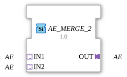

# AE_MERGE_2

* * * * * * * * * *

## Introduction

The function block **AE_MERGE_2** merges two unidirectional AE adapters (pure event, no payload data) into one common output adapter. It is the reverse of [AE_SPLIT_2](AE_SPLIT_2.md): instead of distributing one event to two outputs, it merges two independent event sources into a common output. The block is implemented as a generic FB (`GenericClassName: 'GEN_AE_MERGE'`).

## Interface Structure

### **Event Inputs**

None. Events are received exclusively via the adapter sockets.

### **Event Outputs**

None. Events are forwarded exclusively via the adapter plug.

### **Data Inputs**

None.

### **Data Outputs**

None.

### **Adapters**

| Role | Name | Type | Description |
| ------- | ------ | ----- | -------------- |
| Socket (Input 1) | `IN1` | `adapter::types::unidirectional::AE` | First event source. |
| Socket (Input 2) | `IN2` | `adapter::types::unidirectional::AE` | Second event source. |
| Plug (Output) | `OUT` | `adapter::types::unidirectional::AE` | Merged event. |

## Functionality

Whenever an event arrives at `IN1` **or** `IN2`, it is forwarded unchanged to `OUT`. Since `AE` carries no data value, there is nothing to arbitrate when merging beyond the event itself – every single incoming event appears at the output immediately, regardless of which socket it came from. The order in which both sockets are checked for a simultaneous arrival is `IN1` before `IN2` in the implementation, which can matter if both events arrive within the same execution cycle.

## Technical Features

- **Generic type**: Implemented via the generic base class `CGenUnidirectMergeBase` (N sockets, 1 plug) – the same C++ base underlying `GEN_ASR_MERGE` and `GEN_ASRT_MERGE`. The number of input sockets is fixed at compile time via the generic suffix (`_2`).
- **No states / algorithms**: Since `AE` carries no data value, there is no change detection and no ECC – the block is pure event forwarding.
- **No data loss on simultaneous events**: Unlike a plain data connection (which only allows one source), every event from `IN1` and `IN2` can be forwarded independently; no event is "lost" just because the other socket fired shortly before.

## State Overview

The function block has **no state machine**. Its behavior is purely combinational: every incoming event at `IN1` or `IN2` is forwarded to `OUT` immediately.

## Application Scenarios

- **Event merging**: Two independent event sources (e.g. two buttons or two sensor triggers) should trigger the same follow-up action, without wiring the downstream logic twice.
- **Redundant trigger paths**: An event can be triggered via two independent sources (e.g. a manual and an automatic path) that both feed into the same output.
- **Simplifying networks** that would otherwise need two separate event connections to the same destination.

## Comparison with Similar Components

- **[AE_SPLIT_2](AE_SPLIT_2.md)**: the reverse direction – distributes one incoming event to two outputs, instead of merging two inputs.
- **[ASR_MERGE_2](ASR_MERGE_2.md)**: the same merge logic for the set/reset event adapter `ASR` (2 events instead of 1).
- **[ASRT_MERGE_2](ASRT_MERGE_2.md)**: the same merge logic for the set/reset/toggle event adapter `ASRT` (3 events instead of 1).

## Conclusion

**AE_MERGE_2** is a minimal generic function block for merging two pure event sources into a common AE adapter output. Its lack of logic ensures minimal latency, while the generic implementation keeps it consistent with the other `GEN_*_MERGE` blocks in the family.
