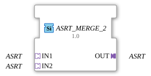

# ASRT_MERGE_2

* * * * * * * * * *

## Introduction

The function block **ASRT_MERGE_2** merges two unidirectional ASRT adapters (a set/reset/toggle event triple, no payload data) into one common output adapter. `ASRT` extends `ASR` with a third event `TOGGLE` (see `AX_T_FF_SR`). The block is the reverse of [ASRT_SPLIT_2](ASRT_SPLIT_2.md) and is implemented as a generic FB (`GenericClassName: 'GEN_ASRT_MERGE'`).

## Interface Structure

### **Event Inputs**

None. Events are received exclusively via the adapter sockets.

### **Event Outputs**

None. Events are forwarded exclusively via the adapter plug.

### **Data Inputs**

None.

### **Data Outputs**

None.

### **Adapters**

| Role | Name | Type | Description |
| ------- | ------ | ----- | -------------- |
| Socket (Input 1) | `IN1` | `adapter::types::unidirectional::ASRT` | First SET/RESET/TOGGLE source. |
| Socket (Input 2) | `IN2` | `adapter::types::unidirectional::ASRT` | Second SET/RESET/TOGGLE source. |
| Plug (Output) | `OUT` | `adapter::types::unidirectional::ASRT` | Merged SET/RESET/TOGGLE signal. |

## Functionality

Whenever a `SET`, `RESET`, or `TOGGLE` event arrives at `IN1` **or** `IN2`, it is forwarded to `OUT` as the matching event type. All three event types are handled independently – which event arrives on which socket has no effect on the other two event types or on the other socket. Since `ASRT` carries no data value, there is nothing to arbitrate beyond the respective event type itself.

## Technical Features

- **Generic type**: Implemented via the generic base class `CGenUnidirectMergeBase` (N sockets, 1 plug) – the same C++ base underlying `GEN_AE_MERGE` and `GEN_ASR_MERGE`.
- **Three independent event channels**: `SET`, `RESET`, and `TOGGLE` are checked and forwarded separately.
- **No states / algorithms**: Since `ASRT` carries no data value, there is no change detection and no ECC.

## State Overview

The function block has **no state machine**. Its behavior is purely combinational: every incoming `SET`, `RESET`, or `TOGGLE` event at `IN1` or `IN2` is forwarded to `OUT` immediately as the matching event type.

## Application Scenarios

- **Merging redundant set/reset/toggle sources**: e.g. two operator stations that should both drive the same `AX_T_FF_SR`-controlled element via a common ASRT adapter.
- **Simplifying networks** that would otherwise need three separate event connection pairs (SET, RESET, TOGGLE) per source to the same destination.

## Comparison with Similar Components

- **[ASRT_SPLIT_2](ASRT_SPLIT_2.md)**: the reverse direction – distributes one incoming set/reset/toggle signal to two outputs, instead of merging two inputs.
- **[ASR_MERGE_2](ASR_MERGE_2.md)**: the same merge logic for the set/reset event adapter `ASR` (no `TOGGLE`).
- **[AE_MERGE_2](AE_MERGE_2.md)**: the same merge logic for the pure event adapter `AE` (1 event instead of SET/RESET/TOGGLE).

## Conclusion

**ASRT_MERGE_2** is a minimal generic function block for merging two set/reset/toggle event sources into a common ASRT adapter output, completing the `GEN_*_MERGE` family for all three unidirectional event adapters (`AE`, `ASR`, `ASRT`).
