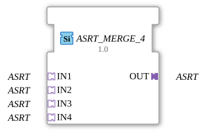

# ASRT_MERGE_4

* * * * * * * * * *

## Introduction

The function block **ASRT_MERGE_4** merges 4 unidirectional ASRT adapters (set/reset/toggle event adapter, no payload data) into one common output adapter. It is the 4-input variant of [ASRT_MERGE_2](ASRT_MERGE_2.md) and, like it, is implemented as a generic FB (`GenericClassName: 'GEN_ASRT_MERGE'`) — the same C++ base (`CGenUnidirectMergeBase`), just with 4 instead of 2 sockets.

## Interface Structure

### **Event Inputs**

None. Events are received exclusively via the adapter sockets.

### **Event Outputs**

None. Events are forwarded exclusively via the adapter plug.

### **Data Inputs**

None.

### **Data Outputs**

None.

### **Adapters**

| Role | Name | Type | Description |
| ------- | ------ | ----- | -------------- |
| Socket (Input 1) | `IN1` | `adapter::types::unidirectional::ASRT` | Source 1. |
| Socket (Input 2) | `IN2` | `adapter::types::unidirectional::ASRT` | Source 2. |
| Socket (Input 3) | `IN3` | `adapter::types::unidirectional::ASRT` | Source 3. |
| Socket (Input 4) | `IN4` | `adapter::types::unidirectional::ASRT` | Source 4. |
| Plug (Output) | `OUT` | `adapter::types::unidirectional::ASRT` | Merged signal. |

## Functionality

Whenever `SET` or `RESET` or `TOGGLE` arrives at any of the 4 sockets (`IN1`, `IN2`, `IN3`, `IN4`), it is forwarded unchanged to `OUT` as the matching event type. All event types are handled independently, and all 4 sockets are treated equally — the order in which sockets are checked follows `IN1` … `IN4`, which only matters if several events arrive within the same execution cycle. Since `ASRT` carries no data value, there is nothing to arbitrate beyond the respective event type itself.

## Technical Features

- **Generic type**: Implemented via the generic base class `CGenUnidirectMergeBase` (N sockets, 1 plug); the number of input sockets is fixed at compile time via the generic suffix (`_4`).
- **No states / algorithms**: Since `ASRT` carries no data value, there is no change detection and no ECC.
- **Arbitrary input count**: The same implementation covers ASRT_MERGE_2 through ASRT_MERGE_7; for other input counts see `ASRT_MERGE_2`, `ASRT_MERGE_3`, `ASRT_MERGE_5`, `ASRT_MERGE_6`, `ASRT_MERGE_7`.

## State Overview

The function block has **no state machine**. Its behavior is purely combinational: every incoming event at any of the 4 sockets is forwarded to `OUT` immediately.

## Application Scenarios

- **Merging several equivalent signal sources** (e.g. 4 redundant or alternative trigger paths) into a common ASRT adapter output.
- **Simplifying networks** that would otherwise need 4 separate event connections to the same destination.

## Comparison with Similar Components

- **[ASRT_SPLIT_2](ASRT_SPLIT_2.md)**: the reverse direction for 2 outputs (for ASRT, ASRT_SPLIT_3 through ASRT_SPLIT_9 are also available).
- **`ASRT_MERGE_2`, `ASRT_MERGE_3`, `ASRT_MERGE_5`, `ASRT_MERGE_6`, `ASRT_MERGE_7`**: the same generic implementation with a different input count.
- [AE_MERGE_4](AE_MERGE_4.md), [ASR_MERGE_4](ASR_MERGE_4.md): the same merge logic for the other unidirectional event adapters.

## Conclusion

`ASRT_MERGE_4` provides a generically implemented merge of 4 `ASRT` event sources into a common adapter output, completing the `GEN_ASRT_MERGE` family with the 4-input variant.
