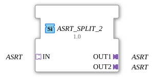

# ASRT_SPLIT_2

* * * * * * * * * *

## Introduction

The function block **ASRT_SPLIT_2** distributes an incoming unidirectional ASRT adapter (a set/reset/toggle event triple, no payload data) to two identical output adapters. `ASRT` extends `ASR` with a third event `TOGGLE` (see `AX_T_FF_SR`). It is implemented as a generic FB (`GenericClassName: 'GEN_ASRT_SPLIT'`) and completes the `SPLIT` family alongside [AE_SPLIT_2](AE_SPLIT_2.md) and [ASR_SPLIT_2](ASR_SPLIT_2.md).

## Interface Structure

### **Event Inputs**

None. Events are received exclusively via the adapter socket.

### **Event Outputs**

None. Events are forwarded exclusively via the adapter plugs.

### **Data Inputs**

None.

### **Data Outputs**

None.

### **Adapters**

| Role | Name | Type | Description |
| ------- | ------ | ----- | -------------- |
| Socket (Input) | `IN` | `adapter::types::unidirectional::ASRT` | Receives a SET, RESET, or TOGGLE event, which is distributed to both outputs. |
| Plug (Output 1) | `OUT1` | `adapter::types::unidirectional::ASRT` | First output for the duplicated event. |
| Plug (Output 2) | `OUT2` | `adapter::types::unidirectional::ASRT` | Second output for the duplicated event. |

## Functionality

As soon as a `SET`, `RESET`, or `TOGGLE` event arrives at adapter socket `IN`, it is forwarded **immediately and in parallel** as a matching event to both output plugs `OUT1` and `OUT2`. The block performs no logic, filtering, or delay – it acts as a pure splitter at the adapter level, regardless of which of the three event types arrives.

## Technical Features

- **Generic type**: Implemented via the generic base class `CGenUnidirectSplitBase` (1 socket, N plugs) – the same C++ base underlying `GEN_AE_SPLIT` and `GEN_ASR_SPLIT`.
- **Three independent event channels**: `SET`, `RESET`, and `TOGGLE` are checked separately and each distributed to both outputs.
- **No states / algorithms**: Since `ASRT` carries no data value, there is no change detection and no ECC.

## State Overview

The function block has **no state machine**. Its behavior is purely combinational: every incoming `SET`, `RESET`, or `TOGGLE` event at socket `IN` is duplicated to both outputs immediately.

## Application Scenarios

- **Event distribution**: A set/reset/toggle signal (e.g. driven by `AX_T_FF_SR`) needs to be processed by two independent subsystems.
- **Parallel wiring**: Splitting an ASRT signal to simultaneously drive two actuators.

## Comparison with Similar Components

- **[ASRT_MERGE_2](ASRT_MERGE_2.md)**: the reverse direction – merges two incoming set/reset/toggle signals into one common output, instead of distributing one signal.
- **[ASR_SPLIT_2](ASR_SPLIT_2.md)**: the same distribution logic for the set/reset event adapter `ASR` (no `TOGGLE`).
- **[AE_SPLIT_2](AE_SPLIT_2.md)**: the same distribution logic for the pure event adapter `AE` (1 event instead of SET/RESET/TOGGLE).

## Conclusion

**ASRT_SPLIT_2** is a minimal generic function block for distributing a set/reset/toggle event to two ASRT adapter outputs, closing the last remaining gap in the `GEN_*_SPLIT` family for all three unidirectional event adapters (`AE`, `ASR`, `ASRT`).
