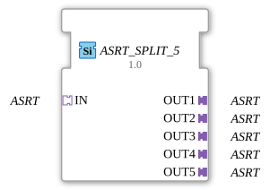

# ASRT_SPLIT_5

* * * * * * * * * *

## Introduction

The function block **ASRT_SPLIT_5** distributes an incoming unidirectional ASRT adapter (set/reset/toggle event adapter, no payload data) to 5 identical output adapters. It is the 5-output variant of [ASRT_SPLIT_2](ASRT_SPLIT_2.md) and, like it, is implemented as a generic FB (`GenericClassName: 'GEN_ASRT_SPLIT'`) — the same C++ base (`CGenUnidirectSplitBase`), just with 5 instead of 2 plugs.

## Interface Structure

### **Event Inputs**

None. Events are received exclusively via the adapter socket.

### **Event Outputs**

None. Events are forwarded exclusively via the adapter plugs.

### **Data Inputs**

None.

### **Data Outputs**

None.

### **Adapters**

| Role | Name | Type | Description |
| ------- | ------ | ----- | -------------- |
| Socket (Input) | `IN` | `adapter::types::unidirectional::ASRT` | Receives `SET` or `RESET` or `TOGGLE`, distributed to all 5 outputs. |
| Plug (Output 1) | `OUT1` | `adapter::types::unidirectional::ASRT` | Output 1 for the duplicated event. |
| Plug (Output 2) | `OUT2` | `adapter::types::unidirectional::ASRT` | Output 2 for the duplicated event. |
| Plug (Output 3) | `OUT3` | `adapter::types::unidirectional::ASRT` | Output 3 for the duplicated event. |
| Plug (Output 4) | `OUT4` | `adapter::types::unidirectional::ASRT` | Output 4 for the duplicated event. |
| Plug (Output 5) | `OUT5` | `adapter::types::unidirectional::ASRT` | Output 5 for the duplicated event. |

## Functionality

As soon as `SET` or `RESET` or `TOGGLE` arrives at adapter socket `IN`, it is forwarded **immediately and in parallel** as a matching event to all 5 output plugs (`OUT1`, `OUT2`, `OUT3`, `OUT4`, `OUT5`). The block performs no logic, filtering, or delay – it acts as a pure splitter at the adapter level.

## Technical Features

- **Generic type**: Implemented via the generic base class `CGenUnidirectSplitBase` (1 socket, N plugs); the number of output plugs is fixed at compile time via the generic suffix (`_5`).
- **No states / algorithms**: Since `ASRT` carries no data value, there is no change detection and no ECC.
- **Arbitrary output count**: The same implementation covers ASRT_SPLIT_2 through ASRT_SPLIT_9; for other output counts see `ASRT_SPLIT_2`, `ASRT_SPLIT_3`, `ASRT_SPLIT_4`, `ASRT_SPLIT_6`, `ASRT_SPLIT_7`, `ASRT_SPLIT_8`, `ASRT_SPLIT_9`.

## State Overview

The function block has **no state machine**. Its behavior is purely combinational: every incoming event at socket `IN` is duplicated to all 5 outputs immediately.

## Application Scenarios

- **Event distribution**: A signal needs to be processed by 5 independent subsystems.
- **Parallel wiring**: Splitting a ASRT signal to simultaneously drive several actuators.

## Comparison with Similar Components

- **[ASRT_MERGE_2](ASRT_MERGE_2.md)**: the reverse direction for 2 inputs (for ASRT, ASRT_MERGE_3 through ASRT_MERGE_7 are also available).
- **`ASRT_SPLIT_2`, `ASRT_SPLIT_3`, `ASRT_SPLIT_4`, `ASRT_SPLIT_6`, `ASRT_SPLIT_7`, `ASRT_SPLIT_8`, `ASRT_SPLIT_9`**: the same generic implementation with a different output count.

## Conclusion

`ASRT_SPLIT_5` provides a generically implemented distribution of a `ASRT` event to 5 adapter outputs, completing the `GEN_ASRT_SPLIT` family with the 5-output variant.
