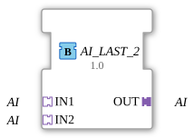

# AI_LAST_2

## Introduction

The AI_LAST_2 function block merges two same-type INT adapter signals (**IN1**, **IN2**) into one shared output (**OUT**), using a **last-writer-wins** rule: whichever of the two sockets last wrote an event wins, and its data value is passed through to OUT immediately and unchanged. This is explicitly not a naive merge (e.g. averaging or OR-ing) - it is pure arbitration by write order.

## Interface Structure

### **Adapters**

**Input adapters (Sockets):**

- **IN1**: INT adapter (unidirectional) - first signal source
- **IN2**: INT adapter (unidirectional) - second signal source

**Output adapter (Plug):**

- **OUT**: INT adapter (unidirectional) - merged signal

## How it works

The block is implemented as a simple Basic FB with a 3-state ECC (START, PASS1, PASS2). When an event arrives at IN1, the ECC moves to PASS1: IN1's current data value is copied to OUT and the adapter event is fired on OUT. When an event arrives at IN2, the same happens symmetrically via PASS2. After each pass-through the ECC immediately returns to START, ready for the next event from either input.

## Technical Details

- Last-writer-wins semantics instead of a naive data combination
- Simple Basic FB (3-state ECC), no extra buffering needed
- No signal delay: the value is passed through in the same cycle the triggering event arrives
- Both inputs are equal - there is no fixed priority other than write order

## Application Scenarios

- Merging two equally-valid INT signal sources into one downstream adapter path (e.g. two redundant sensors, or a manual and an automatic setpoint source)
- Arbitrating between two operator stations that may both write the same INT value
- Simplifying networks that would otherwise need an inline `F_SEL`/`E_RS` construct

## ⚖️ Comparison with Similar Blocks

AI_LAST_2 is the inverse of [`AI_SPLIT_2`](AI_SPLIT_2.md): AI_SPLIT_2 distributes 1 input to 2 outputs, AI_LAST_2 merges 2 inputs into 1 output. For mixed operation between a data adapter and a pure event adapter (e.g. AX + AE), use [`AX_AE_MERGE`](../BOOL/AX_AE_MERGE.md) instead, which merges only the event without altering the data value.
