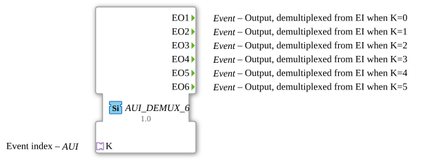

# AUI_DEMUX_6

* * * * * * * * * *
## Introduction

The **AUI_DEMUX_6** is an event demultiplexer function block that routes an incoming event to one of six possible output channels based on a selector index. Unlike the conventional `E_DEMUX_6` block, which requires separate Event Input (`EI`) and control data input (`K`) pins, this variant encapsulates both the event trigger and the selector index within a single **AUI adapter socket**. The adapter delivers the activation event and the selector value together, making the block highly suitable for adapter-based composition patterns and hierarchical application design.

The block is implemented as a generic function block (`GEN_E_DEMUX`), allowing flexible reuse across different data types for the selector index.

## Interface Structure

The block exposes six event outputs and one adapter socket. There are no direct event inputs, data inputs, or data outputs — all inbound information flows through the AUI adapter.

### **Event Inputs**

No explicit event inputs are declared. The triggering event is received via the AUI adapter socket.

### **Event Outputs**

| Output | Description |
|--------|-------------|
| `EO1` | Demultiplexed output, activated when selector index = 0 |
| `EO2` | Demultiplexed output, activated when selector index = 1 |
| `EO3` | Demultiplexed output, activated when selector index = 2 |
| `EO4` | Demultiplexed output, activated when selector index = 3 |
| `EO5` | Demultiplexed output, activated when selector index = 4 |
| `EO6` | Demultiplexed output, activated when selector index = 5 |

### **Data Inputs**

No data inputs are present. The selector value is supplied through the AUI adapter.

### **Data Outputs**

No data outputs are present.

### **Adapters**

| Adapter | Type | Direction | Description |
|---------|------|-----------|-------------|
| `K` | `adapter::types::unidirectional::AUI` | Socket | Provides the triggering event and the selector index used to determine the active output channel. The selector value is carried as data alongside the event within the adapter connection. |

## Functionality

The block operates as a 1-to-6 event demultiplexer. Upon receiving an event via the `K` AUI adapter socket, the block reads the accompanying selector value (the index carried by the adapter). The selector determines which of the six event outputs is fired:

- Index `0` → `EO1`
- Index `1` → `EO2`
- Index `2` → `EO3`
- Index `3` → `EO4`
- Index `4` → `EO5`
- Index `5` → `EO6`

Only one output event is generated per incoming event. If the selector value is outside the valid range `0..5`, no output is triggered. Since the selector and event arrive together via the adapter, the block guarantees synchronous handling of control and event data, eliminating the risk of race conditions between separate input pins.

## Technical Features

- **Generic implementation**: Declared as a generic function block (`GEN_E_DEMUX`), allowing the selector data type to be instantiated appropriately for the application context.
- **Adapter-based interface**: Replaces the conventional separate event input and data input with a single AUI socket, simplifying connection diagrams and improving encapsulation.
- **Six-way demultiplexing**: Supports up to six distinct output channels.
- **Unidirectional AUI**: The adapter socket `K` is of unidirectional type, meaning the block acts purely as a sink for the event and selector data.
- **Deterministic behavior**: Exactly one output event is generated per incoming event, based on the current selector value.
- **Zero internal state retention**: The block does not store the selector value between events; each incoming event is evaluated independently.

## State Overview

The block follows the typical demultiplexer state machine found in IEC 61499 event demultiplexers:

- **Start state**: The block is idle, waiting for an event to arrive on the AUI adapter.
- **Dispatch state**: Upon receiving the event, the selector value is evaluated and the corresponding output event is triggered.
- **Return state**: The block returns to the idle state, ready to process the next event.

There is no persistent internal state; the behaviour is fully event-driven and combinatorial with respect to the selector value.

## Application Scenarios

The `AUI_DEMUX_6` block is well suited for the following use cases:

- **Adapter-based control routing**: In applications where subsystems communicate through AUI adapters, this block can route events from one source to six different target components based on a control index carried in the same adapter connection.
- **Mode selection**: Selecting one of six operational modes by routing a "start" or "execute" event to the appropriate mode handler.
- **Data stream distribution**: Distributing data-triggered events (e.g. processing requests) to different processing units based on a priority or category index.
- **Hierarchical function block design**: Within composite FBs, the AUI socket keeps the internal interface clean and reduces the number of wires needed on the FB boundary.
- **Retrofitting existing designs**: The block provides a drop-in replacement for `E_DEMUX_6` in applications that already use AUI adapter architectures.

## Comparison with Similar Blocks

| Feature | `AUI_DEMUX_6` | `E_DEMUX_6` | `E_DEMUX` (generic) |
|---------|--------------|-------------|----------------------|
| Event input | Via AUI adapter | Separate `EI` pin | Separate `EI` pin |
| Selector input | Via AUI adapter (data channel) | Separate `K` data pin | Separate `K` data pin |
| Number of outputs | 6 (`EO1`–`EO6`) | 6 (`EO1`–`EO6`) | Configurable (3, 4, 6, etc.) |
| Adapter interface | Yes | No | No |
| Generic type | Yes (`GEN_E_DEMUX`) | No | Yes |
| Encapsulation | High — single connection | Low — two separate pins | Low — two separate pins |
| Suitability for adapter-based architectures | Excellent | Limited | Limited |

Compared to the standard `E_DEMUX_6`, the AUI variant offers superior encapsulation by bundling event and selector data into a single connection. The trade-off is that it requires the surrounding system to support AUI adapter connections.

## Conclusion

The **AUI_DEMUX_6** function block provides a clean, adapter-based approach to event demultiplexing in IEC 61499 applications. By integrating the event trigger and selector index into a single AUI socket, it simplifies interface design, enhances modularity, and supports generic instantiation. Its six output channels cover a wide range of routing and mode-selection use cases, making it a valuable building block for modern, adapter-oriented 4diac applications.