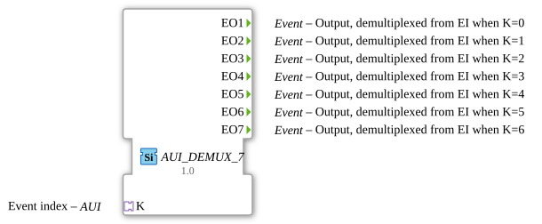

# AUI_DEMUX_7

* * * * * * * * * *
## Introduction

AUI_DEMUX_7 is an event demultiplexer function block that routes a single incoming event to exactly one of seven mutually exclusive event outputs. It is an adapter-based variant of the standard `E_DEMUX_7` block: instead of exposing a separate event input (EI) and a data input (K), both the triggering event and the selector value are transported together through a unidirectional AUI adapter socket. This design reduces wiring complexity in modular IEC 61499 applications and enables clean encapsulation of event-triggered selection logic.

The block implements the generic class `GEN_E_DEMUX`, meaning that its behaviour follows the established demultiplexer pattern while its interface is expressed through the AUI adapter mechanism.

## Interface Structure

The interface of AUI_DEMUX_7 consists exclusively of event outputs and one adapter socket. There are no plain data inputs or data outputs; all control information enters the block through the adapter.

### **Event Inputs**

This block has no dedicated event inputs. The incoming event is carried by the AUI adapter `K`. The event arrives through the adapter's internal event channel and is demultiplexed internally.

### **Event Outputs**

| Name | Description |
|------|-------------|
| EO1 | Output event, triggered when the selector K equals 0. |
| EO2 | Output event, triggered when the selector K equals 1. |
| EO3 | Output event, triggered when the selector K equals 2. |
| EO4 | Output event, triggered when the selector K equals 3. |
| EO5 | Output event, triggered when the selector K equals 4. |
| EO6 | Output event, triggered when the selector K equals 5. |
| EO7 | Output event, triggered when the selector K equals 6. |

### **Data Inputs**

None. All input data is encapsulated within the adapter.

### **Data Outputs**

None.

### **Adapters**

| Direction | Name | Type | Description |
|-----------|------|------|-------------|
| Socket (Required) | K | `adapter::types::unidirectional::AUI` | Carries the input event and the demultiplexer selection value in one channel. The AUI adapter provides an event interface combined with associated data. |

The adapter type `adapter::types::unidirectional::AUI` is part of the standard adapter library for unidirectional communication in 4diac. It bundles an event input together with the selector data, so the event and its associated select value arrive coherently.

## Functionality

AUI_DEMUX_7 implements a 1-to-7 event demultiplexer. The functional behaviour is as follows:

1. An external module triggers an event on the AUI adapter connected to the socket `K`.
2. Simultaneously with that event, the adapter carries a selector value K (an integer in the range 0 to 6).
3. The block evaluates the selector value:
   - If K = 0 → the event is emitted on **EO1**.
   - If K = 1 → the event is emitted on **EO2**.
   - If K = 2 → the event is emitted on **EO3**.
   - If K = 3 → the event is emitted on **EO4**.
   - If K = 4 → the event is emitted on **EO5**.
   - If K = 5 → the event is emitted on **EO6**.
   - If K = 6 → the event is emitted on **EO7**.
4. Exactly one output is activated per input event. All other outputs remain inactive.

If the selector value is outside the valid range 0–6, no output is triggered (the event is dropped), or the behaviour follows the generic `GEN_E_DEMUX` specification.

The block is generic in the IEC 61499 sense: the attribute `eclipse4diac::core::GenericClassName` is set to `'GEN_E_DEMUX'`, which allows the 4diac runtime to treat this block as a specialisation of the generic demultiplexer implementation.

## Technical Features

- **Adapter-based event transport:** The input event and selector travel together via a single AUI socket, avoiding the need for a separate event input and data input wiring.
- **Generic FB mechanism:** Declared as `GEN_E_DEMUX` through the `eclipse4diac::core::GenericClassName` attribute, enabling reuse of the generic demultiplexer behaviour.
- **Unidirectional adapter:** The AUI type is unidirectional, meaning the adapter only carries data from the plug to the socket (or vice versa, depending on orientation), simplifying the connection semantics.
- **Standard compliance:** The block is aligned with IEC 61499-1 (Annex A) identification and uses the standard 4diac adapter namespace `adapter::events::unidirectional`.
- **No external dependencies:** The block has no plain data outputs and no additional event outputs besides the seven demultiplexed channels.
- **License:** Distributed under the Eclipse Public License 2.0 (EPL-2.0).

## State Overview

The internal execution control chart (ECC) of the generic `GEM_E_DEMUX` implementation follows a typical pattern for demultiplexers. Although this adapter variant does not expose its ECC in the Type definition (it relies on the generic class), the expected state behaviour is:

| State | Description |
|-------|-------------|
| IDLE | Waiting for an incoming event on the adapter's event channel. No output is active. |
| DECODE | The selector value K is read from the adapter and evaluated. This state is transient. |
| OUTPUT_1 … OUTPUT_7 | One of these states is entered depending on the decoded K value. In each state, the corresponding event output (EO1 … EO7) is issued. |

The transition from IDLE to DECODE is triggered by the adapter event. From DECODE, a conditional transition selects the matching output state based on K. After emitting the output event, the ECC returns to IDLE.

If K is outside the supported range, the ECC falls back to IDLE without emitting any event (or emits a default behaviour according to the generic implementation).

## Application Scenarios

- **Event routing in modular automation systems:** When a single controller produces an event that must be forwarded to exactly one of seven downstream function blocks, AUI_DEMUX_7 provides a clean routing mechanism.
- **Mode-dependent processing chains:** The selector K can represent an operating mode (e.g., 0 = startup, 1 = normal, 2 = maintenance, …, 6 = error handling). The incoming event is then irrevocably channelled to the chain responsible for that mode.
- **Adapter-based subsystem interfaces:** In component-based designs where subsystems communicate via adapters, the AUI socket allows the demultiplexer to be plugged directly into a pre-existing adapter-based bus without additional event/data wiring.
- **Test and simulation environments:** Using the generic class mechanism, the block can be replaced or extended without changing its interface, which is useful for hardware-in-the-loop test benches.

## Comparison with Similar Blocks

| Feature | AUI_DEMUX_7 | E_DEMUX_7 (standard) | E_DEMUX (generic, fewer outputs) |
|---------|-------------|----------------------|----------------------------------|
| Input event | Via AUI adapter | Dedicated event input EI | Dedicated event input EI |
| Selector | Via AUI adapter (data channel) | Plain data input K | Plain data input K |
| Number of outputs | 7 | 7 | Variable (typically 2–N) |
| Interface style | Adapter-based, unidirectional | Event + data pins | Event + data pins |
| Wiring effort | Lower (single adapter connection) | Requires two connections (event + data) | Requires two connections |
| Reusability | High (generic mechanism) | Medium (fixed interface) | Medium (parameterised) |

Compared to the classic `E_DEMUX_7`, the AUI variant reduces the external wiring footprint: only a single adapter connection is required at the input side. The disadvantage is that the selector value is no longer directly visible as a block pin, which can make debugging slightly less straightforward unless the adapter data is monitored.

## Conclusion

AUI_DEMUX_7 is a compact and reusable event demultiplexer that combines an event input and a selector data input into a single AUI adapter connection. It is a generic, adapter-based specialisation of the well-known `E_DEMUX_7` and is suitable for IEC 61499 applications that favour modular, adapter-oriented design patterns. With seven mutually exclusive event outputs, it supports straightforward 1-to-N event routing, while its generic-class declaration ensures flexibility for different runtime implementations. The block is fully EPL-2.0 licensed and integrates seamlessly into the 4diac ecosystem.